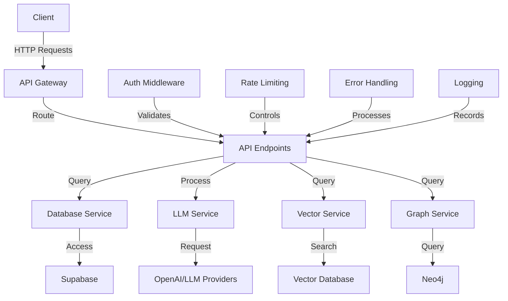

# API Endpoints and Integration Design

## Overview

This document outlines the API architecture, endpoints, and integration patterns for the CyberInsightHub platform. The API layer serves as the bridge between the frontend user interface and the backend systems, including Supabase, LLM services, and the knowledge graph.

## API Architecture



## Core API Layer Design

The API is built using Next.js API routes with the following structure:

```
src/
├── app/
│   ├── api/
│   │   ├── auth/
│   │   │   ├── login/route.ts
│   │   │   ├── logout/route.ts
│   │   │   └── register/route.ts
│   │   ├── reports/
│   │   │   ├── route.ts
│   │   │   ├── [id]/route.ts
│   │   │   ├── [id]/sections/route.ts
│   │   │   ├── [id]/entities/route.ts
│   │   │   └── search/route.ts
│   │   ├── chat/
│   │   │   ├── route.ts
│   │   │   └── sessions/route.ts
│   │   ├── dashboard/
│   │   │   ├── stats/route.ts
│   │   │   └── trends/route.ts
│   │   ├── analysis/
│   │   │   ├── entities/route.ts
│   │   │   ├── trends/route.ts
│   │   │   └── visualization/route.ts
│   │   ├── admin/
│   │   │   ├── reports/route.ts
│   │   │   ├── users/route.ts
│   │   │   ├── enrichment/route.ts
│   │   │   └── llm/route.ts
│   │   └── webhooks/
│   │       ├── supabase/route.ts
│   │       └── llm/route.ts
```

### Middleware Setup

```typescript
// middleware.ts
import { NextResponse } from 'next/server';
import type { NextRequest } from 'next/server';
import { createMiddlewareClient } from '@supabase/auth-helpers-nextjs';

export async function middleware(req: NextRequest) {
  const res = NextResponse.next();
  const supabase = createMiddlewareClient({ req, res });
  
  // Authentication check
  const {
    data: { session },
  } = await supabase.auth.getSession();
  
  // API path check
  const isApiRoute = req.nextUrl.pathname.startsWith('/api/');
  const isAuthRoute = req.nextUrl.pathname.startsWith('/api/auth');
  const isPublicRoute = req.nextUrl.pathname.startsWith('/api/public');
  
  // Allow authentication routes and public routes
  if (isAuthRoute || isPublicRoute) {
    return res;
  }
  
  // For API routes that require authentication
  if (isApiRoute && !session) {
    return NextResponse.json(
      { error: 'Unauthorized', message: 'Authentication required' },
      { status: 401 }
    );
  }
  
  // Add user info to headers for downstream handling
  if (session) {
    const requestHeaders = new Headers(req.headers);
    requestHeaders.set('x-user-id', session.user.id);
    requestHeaders.set('x-user-role', session.user.user_metadata.role || 'user');
    
    return NextResponse.next({
      request: {
        headers: requestHeaders,
      },
    });
  }
  
  return res;
}

export const config = {
  matcher: ['/api/:path*'],
};
```

### API Response Standard

```typescript
// lib/api-response.ts
export type ApiResponse<T> = {
  data?: T;
  error?: {
    code: string;
    message: string;
    details?: any;
  };
  meta?: {
    page?: number;
    pageSize?: number;
    totalCount?: number;
    totalPages?: number;
  };
};

export function successResponse<T>(data: T, meta?: ApiResponse<T>['meta']): ApiResponse<T> {
  return {
    data,
    meta,
  };
}

export function errorResponse(
  code: string,
  message: string,
  details?: any
): ApiResponse<never> {
  return {
    error: {
      code,
      message,
      details,
    },
  };
}
```

## Authentication and Authorization API

### Registration Endpoint

```typescript
// app/api/auth/register/route.ts
import { NextRequest, NextResponse } from 'next/server';
import { createRouteHandlerClient } from '@supabase/auth-helpers-nextjs';
import { cookies } from 'next/headers';
import { z } from 'zod';
import { successResponse, errorResponse } from '@/lib/api-response';

// Input validation schema
const registerSchema = z.object({
  email: z.string().email('Invalid email address'),
  password: z.string().min(8, 'Password must be at least 8 characters'),
  full_name: z.string().min(2, 'Full name is required'),
  organization: z.string().optional(),
  job_title: z.string().optional(),
});

export async function POST(req: NextRequest) {
  try {
    const body = await req.json();
    
    // Validate input
    const validation = registerSchema.safeParse(body);
    if (!validation.success) {
      return NextResponse.json(
        errorResponse('validation_error', 'Invalid input', validation.error.format()),
        { status: 400 }
      );
    }
    
    const { email, password, full_name, organization, job_title } = validation.data;
    
    // Create Supabase client
    const supabase = createRouteHandlerClient({ cookies });
    
    // Register user with Supabase Auth
    const { data: authData, error: authError } = await supabase.auth.signUp({
      email,
      password,
      options: {
        data: {
          full_name,
          organization,
          job_title,
          role: 'user', // Default role
        },
      },
    });
    
    if (authError) {
      return NextResponse.json(
        errorResponse('auth_error', authError.message),
        { status: 400 }
      );
    }
    
    // Create user profile in the database
    if (authData.user) {
      const { error: profileError } = await supabase.from('users').insert({
        id: authData.user.id,
        email,
        full_name,
        organization,
        job_title,
        created_at: new Date().toISOString(),
      });
      
      if (profileError) {
        // Rollback auth user if profile creation fails
        await supabase.auth.admin.deleteUser(authData.user.id);
        
        return NextResponse.json(
          errorResponse('profile_error', 'Failed to create user profile', profileError),
          { status: 500 }
        );
      }
    }
    
    return NextResponse.json(
      successResponse({ 
        message: 'Registration successful',
        userId: authData.user?.id,
        email,
      }),
      { status: 201 }
    );
  } catch (error) {
    console.error('Registration error:', error);
    return NextResponse.json(
      errorResponse('server_error', 'An unexpected error occurred'),
      { status: 500 }
    );
  }
}
```

### Login Endpoint

```typescript
// app/api/auth/login/route.ts
import { NextRequest, NextResponse } from 'next/server';
import { createRouteHandlerClient } from '@supabase/auth-helpers-nextjs';
import { cookies } from 'next/headers';
import { z } from 'zod';
import { successResponse, errorResponse } from '@/lib/api-response';

// Input validation schema
const loginSchema = z.object({
  email: z.string().email('Invalid email address'),
  password: z.string().min(1, 'Password is required'),
});

export async function POST(req: NextRequest) {
  try {
    const body = await req.json();
    
    // Validate input
    const validation = loginSchema.safeParse(body);
    if (!validation.success) {
      return NextResponse.json(
        errorResponse('validation_error', 'Invalid input', validation.error.format()),
        { status: 400 }
      );
    }
    
    const { email, password } = validation.data;
    
    // Create Supabase client
    const supabase = createRouteHandlerClient({ cookies });
    
    // Authenticate user
    const { data, error } = await supabase.auth.signInWithPassword({
      email,
      password,
    });
    
    if (error) {
      return NextResponse.json(
        errorResponse('auth_error', error.message),
        { status: 401 }
      );
    }
    
    // Update last sign-in timestamp
    if (data.user) {
      await supabase
        .from('users')
        .update({ last_sign_in: new Date().toISOString() })
        .eq('id', data.user.id);
    }
    
    return NextResponse.json(
      successResponse({
        message: 'Login successful',
        user: {
          id: data.user.id,
          email: data.user.email,
          role: data.user.user_metadata.role,
        },
      })
    );
  } catch (error) {
    console.error('Login error:', error);
    return NextResponse.json(
      errorResponse('server_error', 'An unexpected error occurred'),
      { status: 500 }
    );
  }
}
```

### Logout Endpoint

```typescript
// app/api/auth/logout/route.ts
import { NextRequest, NextResponse } from 'next/server';
import { createRouteHandlerClient } from '@supabase/auth-helpers-nextjs';
import { cookies } from 'next/headers';
import { successResponse, errorResponse } from '@/lib/api-response';

export async function POST(req: NextRequest) {
  try {
    // Create Supabase client
    const supabase = createRouteHandlerClient({ cookies });
    
    // Sign out the user
    const { error } = await supabase.auth.signOut();
    
    if (error) {
      return NextResponse.json(
        errorResponse('auth_error', error.message),
        { status: 400 }
      );
    }
    
    return NextResponse.json(
      successResponse({ message: 'Logout successful' })
    );
  } catch (error) {
    console.error('Logout error:', error);
    return NextResponse.json(
      errorResponse('server_error', 'An unexpected error occurred'),
      { status: 500 }
    );
  }
}
```

## Reports API

### List Reports Endpoint

```typescript
// app/api/reports/route.ts
import { NextRequest, NextResponse } from 'next/server';
import { createRouteHandlerClient } from '@supabase/auth-helpers-nextjs';
import { cookies } from 'next/headers';
import { successResponse, errorResponse } from '@/lib/api-response';

export async function GET(req: NextRequest) {
  try {
    const supabase = createRouteHandlerClient({ cookies });
    
    // Get query parameters
    const url = new URL(req.url);
    const page = parseInt(url.searchParams.get('page') || '1');
    const pageSize = parseInt(url.searchParams.get('pageSize') || '10');
    const search = url.searchParams.get('search') || '';
    const publisher = url.searchParams.get('publisher') || '';
    const year = url.searchParams.get('year') || '';
    const type = url.searchParams.get('type') || '';
    
    // Build query
    let query = supabase
      .from('reports')
      .select('*', { count: 'exact' });
    
    // Apply filters
    if (search) {
      query = query.ilike('title', `%${search}%`);
    }
    
    if (publisher) {
      query = query.eq('publisher', publisher);
    }
    
    if (year) {
      query = query.eq('publish_year', year);
    }
    
    if (type) {
      query = query.eq('report_type', type);
    }
    
    // Apply pagination
    const from = (page - 1) * pageSize;
    const to = from + pageSize - 1;
    
    query = query
      .order('publish_year', { ascending: false })
      .order('title')
      .range(from, to);
    
    // Execute query
    const { data, error, count } = await query;
    
    if (error) {
      return NextResponse.json(
        errorResponse('database_error', error.message),
        { status: 400 }
      );
    }
    
    return NextResponse.json(
      successResponse(data, {
        page,
        pageSize,
        totalCount: count || 0,
        totalPages: count ? Math.ceil(count / pageSize) : 0,
      })
    );
  } catch (error) {
    console.error('List reports error:', error);
    return NextResponse.json(
      errorResponse('server_error', 'An unexpected error occurred'),
      { status: 500 }
    );
  }
}

export async function POST(req: NextRequest) {
  // Create report endpoint - requires admin rights
  const headers = req.headers;
  const userRole = headers.get('x-user-role');
  
  if (userRole !== 'admin') {
    return NextResponse.json(
      errorResponse('forbidden', 'Admin rights required for this operation'),
      { status: 403 }
    );
  }
  
  // Implementation for creating a report manually
  // ...
}
```

### Get Report Details Endpoint

```typescript
// app/api/reports/[id]/route.ts
import { NextRequest, NextResponse } from 'next/server';
import { createRouteHandlerClient } from '@supabase/auth-helpers-nextjs';
import { cookies } from 'next/headers';
import { successResponse, errorResponse } from '@/lib/api-response';

export async function GET(
  req: NextRequest,
  { params }: { params: { id: string } }
) {
  try {
    const { id } = params;
    const supabase = createRouteHandlerClient({ cookies });
    
    // Get report details
    const { data: report, error: reportError } = await supabase
      .from('reports')
      .select('*')
      .eq('id', id)
      .single();
    
    if (reportError) {
      return NextResponse.json(
        errorResponse('database_error', reportError.message),
        { status: reportError.code === 'PGRST116' ? 404 : 400 }
      );
    }
    
    // Get report sections
    const { data: sections, error: sectionsError } = await supabase
      .from('report_sections')
      .select('*')
      .eq('report_id', id)
      .order('section_number');
    
    if (sectionsError) {
      return NextResponse.json(
        errorResponse('database_error', sectionsError.message),
        { status: 400 }
      );
    }
    
    // Get report entities
    const { data: entities, error: entitiesError } = await supabase
      .from('report_entities')
      .select('*')
      .eq('report_id', id)
      .order('mentioned_count', { ascending: false })
      .limit(50);
    
    if (entitiesError) {
      return NextResponse.json(
        errorResponse('database_error', entitiesError.message),
        { status: 400 }
      );
    }
    
    // Get report statistics
    const { data: stats, error: statsError } = await supabase
      .from('report_stats')
      .select('*')
      .eq('report_id', id);
    
    if (statsError) {
      return NextResponse.json(
        errorResponse('database_error', statsError.message),
        { status: 400 }
      );
    }
    
    return NextResponse.json(
      successResponse({
        ...report,
        sections: sections || [],
        entities: entities || [],
        stats: stats || [],
      })
    );
  } catch (error) {
    console.error('Get report error:', error);
    return NextResponse.json(
      errorResponse('server_error', 'An unexpected error occurred'),
      { status: 500 }
    );
  }
}

export async function PATCH(
  req: NextRequest,
  { params }: { params: { id: string } }
) {
  // Update report endpoint - requires admin rights
  // ...
}

export async function DELETE(
  req: NextRequest,
  { params }: { params: { id: string } }
) {
  // Delete report endpoint - requires admin rights
  // ...
}
```

### Search Reports Endpoint

```typescript
// app/api/reports/search/route.ts
import { NextRequest, NextResponse } from 'next/server';
import { createRouteHandlerClient } from '@supabase/auth-helpers-nextjs';
import { cookies } from 'next/headers';
import { successResponse, errorResponse } from '@/lib/api-response';

export async function GET(req: NextRequest) {
  try {
    const supabase = createRouteHandlerClient({ cookies });
    
    // Get query parameters
    const url = new URL(req.url);
    const query = url.searchParams.get('q') || '';
    const limit = parseInt(url.searchParams.get('limit') || '10');
    
    if (!query) {
      return NextResponse.json(
        errorResponse('validation_error', 'Search query is required'),
        { status: 400 }
      );
    }
    
    // Vector search if query is substantial
    if (query.length > 3) {
      // Generate embedding for the query
      const embeddingResponse = await fetch('https://api.openai.com/v1/embeddings', {
        method: 'POST',
        headers: {
          'Content-Type': 'application/json',
          'Authorization': `Bearer ${process.env.OPENAI_API_KEY}`
        },
        body: JSON.stringify({
          model: 'text-embedding-ada-002',
          input: query
        })
      });
      
      const embeddingData = await embeddingResponse.json();
      const embedding = embeddingData.data[0].embedding;
      
      // Perform vector search
      const { data: vectorResults, error: vectorError } = await supabase.rpc(
        'match_documents',
        {
          query_embedding: embedding,
          match_threshold: 0.7,
          match_count: limit
        }
      );
      
      if (vectorError) {
        return NextResponse.json(
          errorResponse('search_error', vectorError.message),
          { status: 400 }
        );
      }
      
      return NextResponse.json(successResponse(vectorResults));
    } else {
      // Perform text search for short queries
      const { data: textResults, error: textError } = await supabase
        .from('reports')
        .select(`
          id,
          title,
          publisher,
          publish_year,
          summary
        `)
        .or(`
          title.ilike.%${query}%,
          summary.ilike.%${query}%
        `)
        .limit(limit);
      
      if (textError) {
        return NextResponse.json(
          errorResponse('search_error', textError.message),
          { status: 400 }
        );
      }
      
      return NextResponse.json(successResponse(textResults));
    }
  } catch (error) {
    console.error('Search error:', error);
    return NextResponse.json(
      errorResponse('server_error', 'An unexpected error occurred'),
      { status: 500 }
    );
  }
}
```

## Chat API

### Chat Message Endpoint

```typescript
// app/api/chat/route.ts
import { NextRequest, NextResponse } from 'next/server';
import { createRouteHandlerClient } from '@supabase/auth-helpers-nextjs';
import { cookies } from 'next/headers';
import { successResponse, errorResponse } from '@/lib/api-response';
import { OpenAI } from 'openai';
import { buildChatContext } from '@/lib/chat-context';

// Initialize OpenAI client
const openai = new OpenAI({
  apiKey: process.env.OPENAI_API_KEY,
});

export async function POST(req: NextRequest) {
  try {
    const body = await req.json();
    const { message, context = [], history = [] } = body;
    
    const supabase = createRouteHandlerClient({ cookies });
    const userId = req.headers.get('x-user-id');
    
    if (!userId) {
      return NextResponse.json(
        errorResponse('auth_error', 'User ID not found'),
        { status: 401 }
      );
    }
    
    if (!message) {
      return NextResponse.json(
        errorResponse('validation_error', 'Message is required'),
        { status: 400 }
      );
    }
    
    // Create a new chat session if not continuing an existing one
    let sessionId = body.sessionId;
    
    if (!sessionId) {
      const { data: session, error: sessionError } = await supabase
        .from('chat_sessions')
        .insert({
          user_id: userId,
          title: message.substring(0, 50) + (message.length > 50 ? '...' : ''),
          created_at: new Date().toISOString(),
          updated_at: new Date().toISOString(),
          report_context: context,
        })
        .select()
        .single();
      
      if (sessionError) {
        return NextResponse.json(
          errorResponse('database_error', sessionError.message),
          { status: 400 }
        );
      }
      
      sessionId = session.id;
    } else {
      // Update existing session
      await supabase
        .from('chat_sessions')
        .update({
          updated_at: new Date().toISOString(),
          report_context: context,
        })
        .eq('id', sessionId)
        .eq('user_id', userId);
    }
    
    // Save the user message
    const { data: userMessage, error: userMessageError } = await supabase
      .from('chat_messages')
      .insert({
        session_id: sessionId,
        role: 'user',
        content: message,
        created_at: new Date().toISOString(),
      })
      .select()
      .single();
    
    if (userMessageError) {
      return NextResponse.json(
        errorResponse('database_error', userMessageError.message),
        { status: 400 }
      );
    }
    
    // Build context for LLM from report references
    const chatContext = await buildChatContext(supabase, context, message);
    
    // Prepare messages for LLM
    const systemPrompt = `You are CyberInsightHub, an expert cybersecurity analyst assistant.
    Answer questions about cybersecurity trends, threats, and vulnerabilities based on the provided context.
    
    GUIDELINES:
    1. Only use information from the provided context.
    2. If the answer isn't in the context, say so clearly.
    3. Always cite your sources using [Report Name (Publisher, Year)] format.
    4. When presenting statistics or claims, always include the source.
    5. Maintain a neutral, analytical tone.
    6. Present information from multiple sources when available.
    7. Highlight conflicting information across reports when relevant.
    
    AVAILABLE CONTEXT:
    ${chatContext.contextText}`;
    
    const messages = [
      { role: 'system', content: systemPrompt },
      ...history.map((msg: any) => ({
        role: msg.role,
        content: msg.content,
      })),
      { role: 'user', content: message },
    ];
    
    // Call LLM
    const completion = await openai.chat.completions.create({
      model: process.env.OPENAI_MODEL || 'gpt-4-turbo',
      messages: messages as any,
      temperature: 0.3,
      max_tokens: 1500,
    });
    
    const assistantResponse = completion.choices[0].message.content;
    
    // Process citations in the response
    const citations = extractCitations(assistantResponse, chatContext.sources);
    
    // Save the assistant message
    const { data: assistantMessage, error: assistantMessageError } = await supabase
      .from('chat_messages')
      .insert({
        session_id: sessionId,
        role: 'assistant',
        content: assistantResponse,
        created_at: new Date().toISOString(),
        citations: citations,
        tokens_used: completion.usage?.total_tokens || 0,
      })
      .select()
      .single();
    
    if (assistantMessageError) {
      return NextResponse.json(
        errorResponse('database_error', assistantMessageError.message),
        { status: 400 }
      );
    }
    
    return NextResponse.json(
      successResponse({
        id: assistantMessage.id,
        sessionId,
        content: assistantResponse,
        citations,
        created_at: assistantMessage.created_at,
      })
    );
  } catch (error) {
    console.error('Chat error:', error);
    return NextResponse.json(
      errorResponse('server_error', 'An unexpected error occurred'),
      { status: 500 }
    );
  }
}

// Extract citations from LLM response
function extractCitations(text: string, sources: any[]) {
  const citationRegex = /\[(.*?)\]/g;
  const citations = [];
  let match;
  
  while ((match = citationRegex.exec(text)) !== null) {
    const citationText = match[1];
    const source = sources.find((s) => {
      const sourceText = `${s.title} (${s.publisher}, ${s.year})`;
      return citationText.includes(sourceText);
    });
    
    if (source) {
      citations.push({
        text: match[0],
        report_id: source.id,
        report_title: source.title,
        section_id: source.section_id,
      });
    }
  }
  
  return citations;
}
```

### Chat Sessions Endpoint

```typescript
// app/api/chat/sessions/route.ts
import { NextRequest, NextResponse } from 'next/server';
import { createRouteHandlerClient } from '@supabase/auth-helpers-nextjs';
import { cookies } from 'next/headers';
import { successResponse, errorResponse } from '@/lib/api-response';

export async function GET(req: NextRequest) {
  try {
    const supabase = createRouteHandlerClient({ cookies });
    const userId = req.headers.get('x-user-id');
    
    if (!userId) {
      return NextResponse.json(
        errorResponse('auth_error', 'User ID not found'),
        { status: 401 }
      );
    }
    
    // Get query parameters
    const url = new URL(req.url);
    const limit = parseInt(url.searchParams.get('limit') || '10');
    
    // Get user's chat sessions
    const { data: sessions, error } = await supabase
      .from('chat_sessions')
      .select(`
        id,
        title,
        created_at,
        updated_at,
        report_context
      `)
      .eq('user_id', userId)
      .order('updated_at', { ascending: false })
      .limit(limit);
    
    if (error) {
      return NextResponse.json(
        errorResponse('database_error', error.message),
        { status: 400 }
      );
    }
    
    return NextResponse.json(successResponse(sessions));
  } catch (error) {
    console.error('Chat sessions error:', error);
    return NextResponse.json(
      errorResponse('server_error', 'An unexpected error occurred'),
      { status: 500 }
    );
  }
}
```

### Chat Session Messages Endpoint

```typescript
// app/api/chat/sessions/[id]/messages/route.ts
import { NextRequest, NextResponse } from 'next/server';
import { createRouteHandlerClient } from '@supabase/auth-helpers-nextjs';
import { cookies } from 'next/headers';
import { successResponse, errorResponse } from '@/lib/api-response';

export async function GET(
  req: NextRequest,
  { params }: { params: { id: string } }
) {
  try {
    const { id } = params;
    const supabase = createRouteHandlerClient({ cookies });
    const userId = req.headers.get('x-user-id');
    
    if (!userId) {
      return NextResponse.json(
        errorResponse('auth_error', 'User ID not found'),
        { status: 401 }
      );
    }
    
    // Verify ownership of the session
    const { data: session, error: sessionError } = await supabase
      .from('chat_sessions')
      .select('user_id')
      .eq('id', id)
      .single();
    
    if (sessionError) {
      return NextResponse.json(
        errorResponse('database_error', sessionError.message),
        { status: sessionError.code === 'PGRST116' ? 404 : 400 }
      );
    }
    
    if (session.user_id !== userId) {
      return NextResponse.json(
        errorResponse('forbidden', 'You do not have access to this chat session'),
        { status: 403 }
      );
    }
    
    // Get messages for the session
    const { data: messages, error: messagesError } = await supabase
      .from('chat_messages')
      .select('*')
      .eq('session_id', id)
      .order('created_at');
    
    if (messagesError) {
      return NextResponse.json(
        errorResponse('database_error', messagesError.message),
        { status: 400 }
      );
    }
    
    return NextResponse.json(successResponse(messages));
  } catch (error) {
    console.error('Get session messages error:', error);
    return NextResponse.json(
      errorResponse('server_error', 'An unexpected error occurred'),
      { status: 500 }
    );
  }
}
```

## Dashboard API

### Dashboard Stats Endpoint

```typescript
// app/api/dashboard/stats/route.ts
import { NextRequest, NextResponse } from 'next/server';
import { createRouteHandlerClient } from '@supabase/auth-helpers-nextjs';
import { cookies } from 'next/headers';
import { successResponse, errorResponse } from '@/lib/api-response';

export async function GET(req: NextRequest) {
  try {
    const supabase = createRouteHandlerClient({ cookies });
    
    // Get total reports count
    const { count: totalReports, error: countError } = await supabase
      .from('reports')
      .select('*', { count: 'exact', head: true });
    
    if (countError) {
      return NextResponse.json(
        errorResponse('database_error', countError.message),
        { status: 400 }
      );
    }
    
    // Get current year
    const currentYear = new Date().getFullYear();
    
    // Get reports count for current year
    const { count: reportsThisYear, error: yearCountError } = await supabase
      .from('reports')
      .select('*', { count: 'exact', head: true })
      .eq('publish_year', currentYear);
    
    if (yearCountError) {
      return NextResponse.json(
        errorResponse('database_error', yearCountError.message),
        { status: 400 }
      );
    }
    
    // Get reports count for previous year
    const { count: reportsLastYear, error: lastYearCountError } = await supabase
      .from('reports')
      .select('*', { count: 'exact', head: true })
      .eq('publish_year', currentYear - 1);
    
    if (lastYearCountError) {
      return NextResponse.json(
        errorResponse('database_error', lastYearCountError.message),
        { status: 400 }
      );
    }
    
    // Calculate year-over-year change
    const yearOverYearChange = reportsLastYear
      ? Math.round(((reportsThisYear - reportsLastYear) / reportsLastYear) * 100)
      : 0;
    
    // Get threat actor count
    const { data: threatActors, error: threatActorError } = await supabase
      .from('report_entities')
      .select('entity_name', { count: 'exact' })
      .eq('entity_type', 'threatactor')
      .is('entity_subtype', null);
    
    if (threatActorError) {
      return NextResponse.json(
        errorResponse('database_error', threatActorError.message),
        { status: 400 }
      );
    }
    
    // Get active vulnerabilities
    const { data: vulnerabilities, error: vulnerabilityError } = await supabase
      .from('report_entities')
      .select('entity_name', { count: 'exact' })
      .eq('entity_type', 'vulnerability');
    
    if (vulnerabilityError) {
      return NextResponse.json(
        errorResponse('database_error', vulnerabilityError.message),
        { status: 400 }
      );
    }
    
    // Get recent reports
    const { data: recentReports, error: recentReportsError } = await supabase
      .from('reports')
      .select('id, title, publisher, publish_year, summary, created_at')
      .order('created_at', { ascending: false })
      .limit(5);
    
    if (recentReportsError) {
      return NextResponse.json(
        errorResponse('database_error', recentReportsError.message),
        { status: 400 }
      );
    }
    
    // Get threat data for chart
    const { data: threatData, error: threatDataError } = await supabase.rpc(
      'get_threat_trends_by_year',
      { limit_years: 3, limit_threats: 10 }
    );
    
    if (threatDataError) {
      return NextResponse.json(
        errorResponse('database_error', threatDataError.message),
        { status: 400 }
      );
    }
    
    // Get industry threats
    const { data: industryThreats, error: industryThreatsError } = await supabase.rpc(
      'get_threats_by_industry',
      { limit_industries: 5, limit_threats: 5 }
    );
    
    if (industryThreatsError) {
      return NextResponse.json(
        errorResponse('database_error', industryThreatsError.message),
        { status: 400 }
      );
    }
    
    return NextResponse.json(
      successResponse({
        totalReports,
        reportsThisYear,
        yearOverYearChange,
        threatActorCount: threatActors?.length || 0,
        activeVulnerabilities: vulnerabilities?.length || 0,
        recentReports: recentReports || [],
        threatData: threatData || [],
        industryThreats: industryThreats || [],
      })
    );
  } catch (error) {
    console.error('Dashboard stats error:', error);
    return NextResponse.json(
      errorResponse('server_error', 'An unexpected error occurred'),
      { status: 500 }
    );
  }
}
```

## Analysis API

### Entity Analysis Endpoint

```typescript
// app/api/analysis/entities/route.ts
import { NextRequest, NextResponse } from 'next/server';
import { createRouteHandlerClient } from '@supabase/auth-helpers-nextjs';
import { cookies } from 'next/headers';
import { neo4jDriver } from '@/lib/neo4j';
import { successResponse, errorResponse } from '@/lib/api-response';

export async function GET(req: NextRequest) {
  try {
    // Get query parameters
    const url = new URL(req.url);
    const entityType = url.searchParams.get('type') || 'threatactor';
    const limit = parseInt(url.searchParams.get('limit') || '10');
    const includeRelationships = url.searchParams.get('relationships') === 'true';
    
    // Get entity data from Neo4j
    const session = neo4jDriver.session();
    
    try {
      const result = await session.run(`
        MATCH (e:Entity)
        WHERE e.type = $entityType
        WITH e
        OPTIONAL MATCH (e)<-[r:MENTIONS]-(report:Report)
        WITH e, count(r) as mentionCount
        RETURN e.id as id, 
               e.name as name, 
               e.type as type, 
               e.subtype as subtype,
               e.attributes as attributes,
               mentionCount,
               labels(e) as labels
        ORDER BY mentionCount DESC
        LIMIT $limit
      `, {
        entityType,
        limit: neo4j.int(limit)
      });
      
      const entities = result.records.map(record => ({
        id: record.get('id'),
        name: record.get('name'),
        type: record.get('type'),
        subtype: record.get('subtype'),
        attributes: record.get('attributes'),
        mentionCount: record.get('mentionCount').toNumber(),
        labels: record.get('labels')
      }));
      
      // If relationships are requested, get them
      let relationships = [];
      
      if (includeRelationships && entities.length > 0) {
        const entityIds = entities.map(e => e.id);
        
        const relationshipResult = await session.run(`
          MATCH (e:Entity)-[r]-(related:Entity)
          WHERE e.id IN $entityIds AND type(r) <> 'HAS_REFERENCE'
          RETURN e.id as sourceId,
                 related.id as targetId,
                 related.name as targetName,
                 related.type as targetType,
                 type(r) as relationType,
                 r.confidence as confidence
          LIMIT 100
        `, {
          entityIds
        });
        
        relationships = relationshipResult.records.map(record => ({
          sourceId: record.get('sourceId'),
          targetId: record.get('targetId'),
          targetName: record.get('targetName'),
          targetType: record.get('targetType'),
          type: record.get('relationType'),
          confidence: record.get('confidence')
        }));
      }
      
      return NextResponse.json(
        successResponse({
          entities,
          relationships: includeRelationships ? relationships : undefined
        })
      );
    } finally {
      await session.close();
    }
  } catch (error) {
    console.error('Entity analysis error:', error);
    return NextResponse.json(
      errorResponse('server_error', 'An unexpected error occurred'),
      { status: 500 }
    );
  }
}

export async function POST(req: NextRequest) {
  try {
    const body = await req.json();
    const { entityId, relatedEntityId, relationType } = body;
    
    if (!entityId || !relatedEntityId || !relationType) {
      return NextResponse.json(
        errorResponse('validation_error', 'Missing required parameters'),
        { status: 400 }
      );
    }
    
    // Create relationship in Neo4j
    const session = neo4jDriver.session();
    
    try {
      const result = await session.run(`
        MATCH (e1:Entity {id: $entityId})
        MATCH (e2:Entity {id: $relatedEntityId})
        MERGE (e1)-[r:${relationType}]->(e2)
        ON CREATE SET r.created = datetime(), r.confidence = 1.0
        ON MATCH SET r.updated = datetime()
        RETURN e1.name as sourceName, e2.name as targetName, type(r) as relationType
      `, {
        entityId,
        relatedEntityId
      });
      
      if (result.records.length === 0) {
        return NextResponse.json(
          errorResponse('not_found', 'One or both entities not found'),
          { status: 404 }
        );
      }
      
      const record = result.records[0];
      
      return NextResponse.json(
        successResponse({
          sourceName: record.get('sourceName'),
          targetName: record.get('targetName'),
          relationType: record.get('relationType'),
          message: 'Relationship created successfully'
        })
      );
    } finally {
      await session.close();
    }
  } catch (error) {
    console.error('Create relationship error:', error);
    return NextResponse.json(
      errorResponse('server_error', 'An unexpected error occurred'),
      { status: 500 }
    );
  }
}
```

### Trend Analysis Endpoint

```typescript
// app/api/analysis/trends/route.ts
import { NextRequest, NextResponse } from 'next/server';
import { createRouteHandlerClient } from '@supabase/auth-helpers-nextjs';
import { cookies } from 'next/headers';
import { successResponse, errorResponse } from '@/lib/api-response';

export async function GET(req: NextRequest) {
  try {
    const supabase = createRouteHandlerClient({ cookies });
    
    // Get query parameters
    const url = new URL(req.url);
    const entityType = url.searchParams.get('type') || 'all';
    const timeRange = parseInt(url.searchParams.get('timeRange') || '3');
    const limit = parseInt(url.searchParams.get('limit') || '10');
    
    // Get current year
    const currentYear = new Date().getFullYear();
    const startYear = currentYear - timeRange;
    
    // Build SQL query
    let sqlQuery = `
      WITH yearly_entities AS (
        SELECT
          e.entity_name,
          e.entity_type,
          r.publish_year,
          COUNT(DISTINCT r.id) as report_count
        FROM
          report_entities e
          JOIN reports r ON e.report_id = r.id
        WHERE
          r.publish_year >= ${startYear}
    `;
    
    if (entityType !== 'all') {
      sqlQuery += ` AND e.entity_type = '${entityType}'`;
    }
    
    sqlQuery += `
        GROUP BY
          e.entity_name, e.entity_type, r.publish_year
      ),
      entity_trends AS (
        SELECT
          entity_name,
          entity_type,
          publish_year,
          report_count,
          LAG(report_count, 1, 0) OVER (
            PARTITION BY entity_name, entity_type
            ORDER BY publish_year
          ) as previous_year_count
        FROM
          yearly_entities
      ),
      current_year_entities AS (
        SELECT
          entity_name,
          entity_type,
          report_count as current_year_count,
          previous_year_count,
          CASE
            WHEN previous_year_count = 0 THEN NULL
            ELSE ((report_count - previous_year_count)::float / previous_year_count) * 100
          END as growth_rate
        FROM
          entity_trends
        WHERE
          publish_year = ${currentYear}
      ),
      multiyear_totals AS (
        SELECT
          entity_name,
          entity_type,
          SUM(report_count) as total_mentions
        FROM
          yearly_entities
        GROUP BY
          entity_name, entity_type
      )
      SELECT
        e.entity_name,
        e.entity_type,
        e.current_year_count,
        e.previous_year_count,
        e.growth_rate,
        t.total_mentions
      FROM
        current_year_entities e
        JOIN multiyear_totals t ON e.entity_name = t.entity_name AND e.entity_type = t.entity_type
      WHERE
        e.current_year_count > 0
      ORDER BY
        CASE WHEN e.growth_rate IS NULL THEN 0 ELSE 1 END DESC,
        e.growth_rate DESC,
        t.total_mentions DESC
      LIMIT ${limit}
    `;
    
    // Execute the query
    const { data, error } = await supabase.rpc('execute_sql_query', {
      sql: sqlQuery
    });
    
    if (error) {
      return NextResponse.json(
        errorResponse('database_error', error.message),
        { status: 400 }
      );
    }
    
    // Get trend data by year for the top entities
    const entityNames = data.map((entity: any) => entity.entity_name);
    
    const trendSqlQuery = `
      SELECT
        e.entity_name,
        r.publish_year,
        COUNT(DISTINCT r.id) as report_count
      FROM
        report_entities e
        JOIN reports r ON e.report_id = r.id
      WHERE
        e.entity_name = ANY($1)
        AND r.publish_year >= ${startYear}
      GROUP BY
        e.entity_name, r.publish_year
      ORDER BY
        e.entity_name, r.publish_year
    `;
    
    const { data: trendData, error: trendError } = await supabase.rpc(
      'execute_sql_query_with_params',
      {
        sql: trendSqlQuery,
        params: [entityNames]
      }
    );
    
    if (trendError) {
      return NextResponse.json(
        errorResponse('database_error', trendError.message),
        { status: 400 }
      );
    }
    
    return NextResponse.json(
      successResponse({
        trending: data,
        trendData,
        timeRange,
        entityType
      })
    );
  } catch (error) {
    console.error('Trend analysis error:', error);
    return NextResponse.json(
      errorResponse('server_error', 'An unexpected error occurred'),
      { status: 500 }
    );
  }
}
```

### Visualization Generation Endpoint

```typescript
// app/api/analysis/visualization/route.ts
import { NextRequest, NextResponse } from 'next/server';
import { createRouteHandlerClient } from '@supabase/auth-helpers-nextjs';
import { cookies } from 'next/headers';
import { OpenAI } from 'openai';
import { successResponse, errorResponse } from '@/lib/api-response';

// Initialize OpenAI client
const openai = new OpenAI({
  apiKey: process.env.OPENAI_API_KEY,
});

export async function POST(req: NextRequest) {
  try {
    const body = await req.json();
    const { type, data, parameters = {} } = body;
    
    if (!type || !data) {
      return NextResponse.json(
        errorResponse('validation_error', 'Missing required parameters'),
        { status: 400 }
      );
    }
    
    // Validate visualization type
    const validTypes = ['bar', 'line', 'pie', 'scatter', 'heatmap', 'network'];
    
    if (!validTypes.includes(type)) {
      return NextResponse.json(
        errorResponse('validation_error', `Invalid visualization type. Must be one of: ${validTypes.join(', ')}`),
        { status: 400 }
      );
    }
    
    // For network graphs, generate a force-directed graph specification
    if (type === 'network') {
      // Ensure data has nodes and links
      if (!data.nodes || !data.links) {
        return NextResponse.json(
          errorResponse('validation_error', 'Network data must contain nodes and links arrays'),
          { status: 400 }
        );
      }
      
      const networkSpec = {
        type: 'network',
        data: {
          nodes: data.nodes,
          links: data.links
        },
        options: {
          width: parameters.width || 800,
          height: parameters.height || 600,
          nodeSize: parameters.nodeSize || 10,
          nodeColor: parameters.nodeColor || '#1f77b4',
          linkColor: parameters.linkColor || '#999',
          linkWidth: parameters.linkWidth || 1,
          charge: parameters.charge || -100,
          distance: parameters.distance || 100,
          colorMap: parameters.colorMap || {}
        }
      };
      
      return NextResponse.json(successResponse(networkSpec));
    }
    
    // For standard charts, use LLM to generate optimal visualization
    const prompt = `Generate a visualization specification for the following data:
    
Data type: ${type}
Data: ${JSON.stringify(data, null, 2)}
Parameters: ${JSON.stringify(parameters, null, 2)}

Create a visualization specification that:
1. Optimally represents the data using the specified chart type
2. Has appropriate axes, labels, and color schemes
3. Is optimized for data insight and clarity
4. Includes appropriate titles and annotations

Return ONLY a JSON object with the visualization specification.`;

    const completion = await openai.chat.completions.create({
      model: process.env.OPENAI_MODEL || 'gpt-4-turbo',
      messages: [{ role: 'user', content: prompt }],
      temperature: 0.2,
      response_format: { type: 'json_object' }
    });

    const visualizationSpec = JSON.parse(completion.choices[0].message.content);
    
    return NextResponse.json(successResponse(visualizationSpec));
  } catch (error) {
    console.error('Visualization generation error:', error);
    return NextResponse.json(
      errorResponse('server_error', 'An unexpected error occurred'),
      { status: 500 }
    );
  }
}
```

## Admin API

### Report Management Endpoint

```typescript
// app/api/admin/reports/route.ts
import { NextRequest, NextResponse } from 'next/server';
import { createRouteHandlerClient } from '@supabase/auth-helpers-nextjs';
import { cookies } from 'next/headers';
import { successResponse, errorResponse } from '@/lib/api-response';

export async function GET(req: NextRequest) {
  // Admin authorization check
  const userRole = req.headers.get('x-user-role');
  
  if (userRole !== 'admin') {
    return NextResponse.json(
      errorResponse('forbidden', 'Admin rights required for this operation'),
      { status: 403 }
    );
  }
  
  try {
    const supabase = createRouteHandlerClient({ cookies });
    
    // Get query parameters
    const url = new URL(req.url);
    const page = parseInt(url.searchParams.get('page') || '1');
    const pageSize = parseInt(url.searchParams.get('pageSize') || '10');
    const status = url.searchParams.get('status') || '';
    
    // Build query
    let query = supabase
      .from('reports')
      .select('*', { count: 'exact' });
    
    if (status) {
      query = query.eq('processed_status', status);
    }
    
    // Apply pagination
    const from = (page - 1) * pageSize;
    const to = from + pageSize - 1;
    
    query = query
      .order('created_at', { ascending: false })
      .range(from, to);
    
    // Execute query
    const { data, error, count } = await query;
    
    if (error) {
      return NextResponse.json(
        errorResponse('database_error', error.message),
        { status: 400 }
      );
    }
    
    return NextResponse.json(
      successResponse(data, {
        page,
        pageSize,
        totalCount: count || 0,
        totalPages: count ? Math.ceil(count / pageSize) : 0,
      })
    );
  } catch (error) {
    console.error('Admin reports error:', error);
    return NextResponse.json(
      errorResponse('server_error', 'An unexpected error occurred'),
      { status: 500 }
    );
  }
}
```

### Report Upload Endpoint

```typescript
// app/api/admin/reports/upload/route.ts
import { NextRequest, NextResponse } from 'next/server';
import { createRouteHandlerClient } from '@supabase/auth-helpers-nextjs';
import { cookies } from 'next/headers';
import { v4 as uuidv4 } from 'uuid';
import { successResponse, errorResponse } from '@/lib/api-response';

export async function POST(req: NextRequest) {
  // Admin authorization check
  const userRole = req.headers.get('x-user-role');
  const userId = req.headers.get('x-user-id');
  
  if (userRole !== 'admin') {
    return NextResponse.json(
      errorResponse('forbidden', 'Admin rights required for this operation'),
      { status: 403 }
    );
  }
  
  try {
    const supabase = createRouteHandlerClient({ cookies });
    
    // Get form data
    const formData = await req.formData();
    const file = formData.get('file') as File;
    
    if (!file) {
      return NextResponse.json(
        errorResponse('validation_error', 'File is required'),
        { status: 400 }
      );
    }
    
    // Get metadata
    const title = formData.get('title') as string;
    const publisher = formData.get('publisher') as string;
    const publish_year = parseInt(formData.get('publish_year') as string);
    const report_type = formData.get('report_type') as string;
    const is_public = formData.get('is_public') === 'true';
    
    // Validate required fields
    if (!title || !publisher || !publish_year || !report_type) {
      return NextResponse.json(
        errorResponse('validation_error', 'Missing required metadata fields'),
        { status: 400 }
      );
    }
    
    // Generate a unique filename
    const fileExtension = file.name.split('.').pop();
    const fileName = `${uuidv4()}.${fileExtension}`;
    const filePath = `${publisher.toLowerCase().replace(/\s+/g, '-')}/${publish_year}/${fileName}`;
    
    // Upload file to Supabase Storage
    const { error: uploadError } = await supabase
      .storage
      .from('raw_reports')
      .upload(filePath, file);
    
    if (uploadError) {
      return NextResponse.json(
        errorResponse('storage_error', uploadError.message),
        { status: 400 }
      );
    }
    
    // Create report record in database
    const { data: report, error: reportError } = await supabase
      .from('reports')
      .insert({
        title,
        publisher,
        publish_year,
        report_type,
        is_public,
        file_path: filePath,
        file_size: file.size,
        file_type: file.type,
        processed_status: 'pending',
        uploaded_by: userId,
        uploaded_at: new Date().toISOString(),
      })
      .select()
      .single();
    
    if (reportError) {
      // If report creation fails, delete the uploaded file
      await supabase
        .storage
        .from('raw_reports')
        .remove([filePath]);
      
      return NextResponse.json(
        errorResponse('database_error', reportError.message),
        { status: 400 }
      );
    }
    
    // Trigger processing job
    const { error: jobError } = await supabase.rpc('trigger_report_processing', {
      report_id: report.id
    });
    
    if (jobError) {
      console.error('Failed to trigger processing job:', jobError);
      // Continue anyway since the report is uploaded and can be processed later
    }
    
    return NextResponse.json(
      successResponse({
        id: report.id,
        title: report.title,
        message: 'Report uploaded successfully and queued for processing'
      }),
      { status: 201 }
    );
  } catch (error) {
    console.error('Report upload error:', error);
    return NextResponse.json(
      errorResponse('server_error', 'An unexpected error occurred'),
      { status: 500 }
    );
  }
}
```

### Report Processing Endpoint

```typescript
// app/api/admin/reports/[id]/process/route.ts
import { NextRequest, NextResponse } from 'next/server';
import { createRouteHandlerClient } from '@supabase/auth-helpers-nextjs';
import { cookies } from 'next/headers';
import { successResponse, errorResponse } from '@/lib/api-response';

export async function POST(
  req: NextRequest,
  { params }: { params: { id: string } }
) {
  // Admin authorization check
  const userRole = req.headers.get('x-user-role');
  
  if (userRole !== 'admin') {
    return NextResponse.json(
      errorResponse('forbidden', 'Admin rights required for this operation'),
      { status: 403 }
    );
  }
  
  try {
    const { id } = params;
    const supabase = createRouteHandlerClient({ cookies });
    
    // Check if report exists
    const { data: report, error: reportError } = await supabase
      .from('reports')
      .select('id, title, processed_status')
      .eq('id', id)
      .single();
    
    if (reportError) {
      return NextResponse.json(
        errorResponse('database_error', reportError.message),
        { status: reportError.code === 'PGRST116' ? 404 : 400 }
      );
    }
    
    // Update report status to 'processing'
    const { error: updateError } = await supabase
      .from('reports')
      .update({
        processed_status: 'processing',
      })
      .eq('id', id);
    
    if (updateError) {
      return NextResponse.json(
        errorResponse('database_error', updateError.message),
        { status: 400 }
      );
    }
    
    // Trigger processing job
    const { error: jobError } = await supabase.rpc('trigger_report_processing', {
      report_id: id
    });
    
    if (jobError) {
      // Revert status if job triggering fails
      await supabase
        .from('reports')
        .update({
          processed_status: report.processed_status,
        })
        .eq('id', id);
      
      return NextResponse.json(
        errorResponse('processing_error', jobError.message),
        { status: 400 }
      );
    }
    
    return NextResponse.json(
      successResponse({
        id,
        message: 'Report processing started successfully',
      })
    );
  } catch (error) {
    console.error('Report processing error:', error);
    return NextResponse.json(
      errorResponse('server_error', 'An unexpected error occurred'),
      { status: 500 }
    );
  }
}
```

### Enrichment Configuration Endpoint

```typescript
// app/api/admin/enrichment/route.ts
import { NextRequest, NextResponse } from 'next/server';
import { createRouteHandlerClient } from '@supabase/auth-helpers-nextjs';
import { cookies } from 'next/headers';
import { successResponse, errorResponse } from '@/lib/api-response';

export async function GET(req: NextRequest) {
  // Admin authorization check
  const userRole = req.headers.get('x-user-role');
  
  if (userRole !== 'admin') {
    return NextResponse.json(
      errorResponse('forbidden', 'Admin rights required for this operation'),
      { status: 403 }
    );
  }
  
  try {
    const supabase = createRouteHandlerClient({ cookies });
    
    // Get enrichment configuration
    const { data, error } = await supabase
      .from('system_config')
      .select('*')
      .eq('config_key', 'enrichment_services')
      .single();
    
    if (error) {
      if (error.code === 'PGRST116') {
        // Config doesn't exist yet, return default
        return NextResponse.json(
          successResponse({
            config_key: 'enrichment_services',
            config_value: {
              general: {
                enabled: true,
                maxConcurrentJobs: 5,
                defaultBatchSize: 10,
                enrichNewEntities: true
              },
              diffbot: {
                enabled: false,
                apiKey: '',
                options: { limit: 1 }
              },
              virusTotal: {
                enabled: false,
                apiKey: '',
                options: {}
              },
              mitreCve: {
                enabled: true,
                options: { updateFrequency: 'daily' }
              },
              alienVault: {
                enabled: false,
                apiKey: '',
                options: {}
              },
              newsApi: {
                enabled: false,
                apiKey: '',
                options: { sources: [] }
              },
              scheduling: {
                entities: {
                  threatactors: { frequency: 'daily', time: '00:00' },
                  vulnerabilities: { frequency: 'daily', time: '02:00' }
                },
                reports: {
                  newReports: { enabled: true },
                  allReports: { frequency: 'weekly', time: '01:00', day: 'Sunday' }
                }
              }
            }
          })
        );
      }
      
      return NextResponse.json(
        errorResponse('database_error', error.message),
        { status: 400 }
      );
    }
    
    return NextResponse.json(successResponse(data));
  } catch (error) {
    console.error('Get enrichment config error:', error);
    return NextResponse.json(
      errorResponse('server_error', 'An unexpected error occurred'),
      { status: 500 }
    );
  }
}

export async function PUT(req: NextRequest) {
  // Admin authorization check
  const userRole = req.headers.get('x-user-role');
  
  if (userRole !== 'admin') {
    return NextResponse.json(
      errorResponse('forbidden', 'Admin rights required for this operation'),
      { status: 403 }
    );
  }
  
  try {
    const supabase = createRouteHandlerClient({ cookies });
    const body = await req.json();
    
    // Validate config structure
    if (!body.config_value || typeof body.config_value !== 'object') {
      return NextResponse.json(
        errorResponse('validation_error', 'Invalid configuration format'),
        { status: 400 }
      );
    }
    
    // Update or insert configuration
    const { data, error } = await supabase
      .from('system_config')
      .upsert({
        config_key: 'enrichment_services',
        config_value: body.config_value,
        updated_at: new Date().toISOString()
      }, {
        onConflict: 'config_key'
      })
      .select()
      .single();
    
    if (error) {
      return NextResponse.json(
        errorResponse('database_error', error.message),
        { status: 400 }
      );
    }
    
    // If a service was enabled/disabled, trigger scheduler update
    await supabase.rpc('update_enrichment_schedulers');
    
    return NextResponse.json(
      successResponse({
        ...data,
        message: 'Enrichment configuration updated successfully'
      })
    );
  } catch (error) {
    console.error('Update enrichment config error:', error);
    return NextResponse.json(
      errorResponse('server_error', 'An unexpected error occurred'),
      { status: 500 }
    );
  }
}
```

## OpenAPI Specification

The API is documented using OpenAPI 3.0:

```yaml
openapi: 3.0.0
info:
  title: CyberInsightHub API
  description: API for CyberInsightHub, a platform for aggregating and analyzing cybersecurity reports
  version: 1.0.0
servers:
  - url: https://api.cyberinsighthub.com/api
    description: Production server
  - url: https://staging.cyberinsighthub.com/api
    description: Staging server
  - url: http://localhost:3000/api
    description: Development server

paths:
  /auth/register:
    post:
      summary: Register a new user
      tags:
        - Authentication
      requestBody:
        required: true
        content:
          application/json:
            schema:
              type: object
              required:
                - email
                - password
                - full_name
              properties:
                email:
                  type: string
                  format: email
                password:
                  type: string
                  minLength: 8
                full_name:
                  type: string
                organization:
                  type: string
                job_title:
                  type: string
      responses:
        '201':
          description: User registered successfully
        '400':
          description: Invalid input
        '500':
          description: Server error

  /auth/login:
    post:
      summary: Authenticate a user
      tags:
        - Authentication
      requestBody:
        required: true
        content:
          application/json:
            schema:
              type: object
              required:
                - email
                - password
              properties:
                email:
                  type: string
                  format: email
                password:
                  type: string
      responses:
        '200':
          description: Login successful
        '401':
          description: Authentication failed
        '500':
          description: Server error

  /auth/logout:
    post:
      summary: Log out the current user
      tags:
        - Authentication
      responses:
        '200':
          description: Logout successful
        '500':
          description: Server error

  /reports:
    get:
      summary: List reports
      tags:
        - Reports
      parameters:
        - name: page
          in: query
          schema:
            type: integer
            default: 1
        - name: pageSize
          in: query
          schema:
            type: integer
            default: 10
        - name: search
          in: query
          schema:
            type: string
        - name: publisher
          in: query
          schema:
            type: string
        - name: year
          in: query
          schema:
            type: string
        - name: type
          in: query
          schema:
            type: string
      responses:
        '200':
          description: List of reports
        '400':
          description: Invalid query parameters
        '500':
          description: Server error

  /reports/{id}:
    get:
      summary: Get report details
      tags:
        - Reports
      parameters:
        - name: id
          in: path
          required: true
          schema:
            type: string
            format: uuid
      responses:
        '200':
          description: Report details
        '404':
          description: Report not found
        '500':
          description: Server error

  /reports/search:
    get:
      summary: Search reports
      tags:
        - Reports
      parameters:
        - name: q
          in: query
          required: true
          schema:
            type: string
        - name: limit
          in: query
          schema:
            type: integer
            default: 10
      responses:
        '200':
          description: Search results
        '400':
          description: Invalid query
        '500':
          description: Server error

  /chat:
    post:
      summary: Send a chat message
      tags:
        - Chat
      requestBody:
        required: true
        content:
          application/json:
            schema:
              type: object
              required:
                - message
              properties:
                message:
                  type: string
                sessionId:
                  type: string
                  format: uuid
                context:
                  type: array
                  items:
                    type: string
                history:
                  type: array
                  items:
                    type: object
      responses:
        '200':
          description: Assistant response
        '400':
          description: Invalid input
        '500':
          description: Server error

  /chat/sessions:
    get:
      summary: List chat sessions
      tags:
        - Chat
      parameters:
        - name: limit
          in: query
          schema:
            type: integer
            default: 10
      responses:
        '200':
          description: List of chat sessions
        '500':
          description: Server error

  /chat/sessions/{id}/messages:
    get:
      summary: Get messages for a chat session
      tags:
        - Chat
      parameters:
        - name: id
          in: path
          required: true
          schema:
            type: string
            format: uuid
      responses:
        '200':
          description: List of messages
        '403':
          description: Forbidden
        '404':
          description: Session not found
        '500':
          description: Server error

  /dashboard/stats:
    get:
      summary: Get dashboard statistics
      tags:
        - Dashboard
      responses:
        '200':
          description: Dashboard statistics
        '500':
          description: Server error

  /analysis/entities:
    get:
      summary: Get entity analysis
      tags:
        - Analysis
      parameters:
        - name: type
          in: query
          schema:
            type: string
            default: threatactor
        - name: limit
          in: query
          schema:
            type: integer
            default: 10
        - name: relationships
          in: query
          schema:
            type: boolean
            default: false
      responses:
        '200':
          description: Entity analysis results
        '500':
          description: Server error
    post:
      summary: Create entity relationship
      tags:
        - Analysis
      requestBody:
        required: true
        content:
          application/json:
            schema:
              type: object
              required:
                - entityId
                - relatedEntityId
                - relationType
              properties:
                entityId:
                  type: string
                relatedEntityId:
                  type: string
                relationType:
                  type: string
      responses:
        '200':
          description: Relationship created
        '400':
          description: Invalid input
        '404':
          description: Entity not found
        '500':
          description: Server error

  /analysis/trends:
    get:
      summary: Get trend analysis
      tags:
        - Analysis
      parameters:
        - name: type
          in: query
          schema:
            type: string
            default: all
        - name: timeRange
          in: query
          schema:
            type: integer
            default: 3
        - name: limit
          in: query
          schema:
            type: integer
            default: 10
      responses:
        '200':
          description: Trend analysis results
        '500':
          description: Server error

  /analysis/visualization:
    post:
      summary: Generate visualization
      tags:
        - Analysis
      requestBody:
        required: true
        content:
          application/json:
            schema:
              type: object
              required:
                - type
                - data
              properties:
                type:
                  type: string
                  enum: [bar, line, pie, scatter, heatmap, network]
                data:
                  type: object
                parameters:
                  type: object
      responses:
        '200':
          description: Visualization specification
        '400':
          description: Invalid input
        '500':
          description: Server error

  /admin/reports:
    get:
      summary: List reports (admin)
      tags:
        - Admin
      parameters:
        - name: page
          in: query
          schema:
            type: integer
            default: 1
        - name: pageSize
          in: query
          schema:
            type: integer
            default: 10
        - name: status
          in: query
          schema:
            type: string
      responses:
        '200':
          description: List of reports
        '403':
          description: Forbidden
        '500':
          description: Server error

  /admin/reports/upload:
    post:
      summary: Upload a new report
      tags:
        - Admin
      requestBody:
        required: true
        content:
          multipart/form-data:
            schema:
              type: object
              required:
                - file
                - title
                - publisher
                - publish_year
                - report_type
              properties:
                file:
                  type: string
                  format: binary
                title:
                  type: string
                publisher:
                  type: string
                publish_year:
                  type: integer
                report_type:
                  type: string
                is_public:
                  type: boolean
                  default: true
      responses:
        '201':
          description: Report uploaded
        '400':
          description: Invalid input
        '403':
          description: Forbidden
        '500':
          description: Server error

  /admin/reports/{id}/process:
    post:
      summary: Process a report
      tags:
        - Admin
      parameters:
        - name: id
          in: path
          required: true
          schema:
            type: string
            format: uuid
      responses:
        '200':
          description: Processing started
        '403':
          description: Forbidden
        '404':
          description: Report not found
        '500':
          description: Server error

  /admin/enrichment:
    get:
      summary: Get enrichment configuration
      tags:
        - Admin
      responses:
        '200':
          description: Enrichment configuration
        '403':
          description: Forbidden
        '500':
          description: Server error
    put:
      summary: Update enrichment configuration
      tags:
        - Admin
      requestBody:
        required: true
        content:
          application/json:
            schema:
              type: object
              required:
                - config_value
              properties:
                config_value:
                  type: object
      responses:
        '200':
          description: Configuration updated
        '400':
          description: Invalid input
        '403':
          description: Forbidden
        '500':
          description: Server error

components:
  securitySchemes:
    cookieAuth:
      type: apiKey
      in: cookie
      name: sb-auth-token
    bearerAuth:
      type: http
      scheme: bearer

security:
  - cookieAuth: []
  - bearerAuth: []
```

## API Rate Limiting

```typescript
// middleware/rate-limit.ts
import { NextResponse } from 'next/server';
import type { NextRequest } from 'next/server';
import { Redis } from '@upstash/redis';

// Initialize Redis client
const redis = new Redis({
  url: process.env.UPSTASH_REDIS_URL!,
  token: process.env.UPSTASH_REDIS_TOKEN!,
});

// Rate limit configuration
const RATE_LIMIT_WINDOW = 60; // 1 minute
const STANDARD_RATE_LIMIT = 60; // 60 requests per minute
const CHAT_RATE_LIMIT = 10; // 10 requests per minute for chat endpoints
const ADMIN_RATE_LIMIT = 120; // 120 requests per minute for admin users

export async function rateLimit(req: NextRequest) {
  // Skip rate limiting for non-API routes
  if (!req.nextUrl.pathname.startsWith('/api/')) {
    return NextResponse.next();
  }
  
  // Get client IP
  const ip = req.ip || req.headers.get('x-forwarded-for') || 'unknown';
  
  // Get user role from headers
  const userRole = req.headers.get('x-user-role') || 'anonymous';
  
  // Determine rate limit based on endpoint and role
  let rateLimit = STANDARD_RATE_LIMIT;
  
  if (req.nextUrl.pathname.startsWith('/api/chat/')) {
    rateLimit = CHAT_RATE_LIMIT;
  }
  
  if (userRole === 'admin') {
    rateLimit = ADMIN_RATE_LIMIT;
  }
  
  // Generate rate limit key
  const key = `rate-limit:${ip}:${req.nextUrl.pathname}`;
  
  // Get current count
  const count = await redis.get(key) as number | null;
  
  // If key doesn't exist, set it with expiry
  if (count === null) {
    await redis.set(key, 1, { ex: RATE_LIMIT_WINDOW });
    return NextResponse.next();
  }
  
  // Increment count
  const newCount = await redis.incr(key) as number;
  
  // Check if rate limit exceeded
  if (newCount > rateLimit) {
    return NextResponse.json(
      {
        error: {
          code: 'rate_limit_exceeded',
          message: 'Rate limit exceeded. Please try again later.',
        },
      },
      {
        status: 429,
        headers: {
          'X-RateLimit-Limit': String(rateLimit),
          'X-RateLimit-Remaining': '0',
          'X-RateLimit-Reset': String(Math.floor(Date.now() / 1000) + RATE_LIMIT_WINDOW),
          'Retry-After': String(RATE_LIMIT_WINDOW),
        },
      }
    );
  }
  
  // Set rate limit headers
  const response = NextResponse.next();
  response.headers.set('X-RateLimit-Limit', String(rateLimit));
  response.headers.set('X-RateLimit-Remaining', String(rateLimit - newCount));
  
  return response;
}
```

## Webhook Handling

### Supabase Webhooks Endpoint

```typescript
// app/api/webhooks/supabase/route.ts
import { NextRequest, NextResponse } from 'next/server';
import { createRouteHandlerClient } from '@supabase/auth-helpers-nextjs';
import { cookies } from 'next/headers';

// Webhook secret for verification
const WEBHOOK_SECRET = process.env.SUPABASE_WEBHOOK_SECRET;

export async function POST(req: NextRequest) {
  try {
    // Verify webhook signature
    const signature = req.headers.get('x-supabase-webhook-signature');
    
    if (!signature || !WEBHOOK_SECRET) {
      return NextResponse.json({ error: 'Unauthorized' }, { status: 401 });
    }
    
    // TODO: Implement proper signature verification
    
    // Get webhook payload
    const payload = await req.json();
    const { type, table, record, old_record } = payload;
    
    // Process based on event type
    if (type === 'INSERT' && table === 'reports') {
      // New report added, queue for processing
      const supabase = createRouteHandlerClient({ cookies });
      
      await supabase.rpc('trigger_report_processing', {
        report_id: record.id
      });
    }
    
    if (type === 'UPDATE' && table === 'reports') {
      // Report updated
      if (record.processed_status === 'complete' && old_record.processed_status !== 'complete') {
        // Report processing completed, trigger enrichment
        const supabase = createRouteHandlerClient({ cookies });
        
        await supabase.rpc('trigger_report_enrichment', {
          report_id: record.id
        });
      }
    }
    
    return NextResponse.json({ success: true });
  } catch (error) {
    console.error('Webhook processing error:', error);
    return NextResponse.json({ error: 'Internal server error' }, { status: 500 });
  }
}
```

## API Integration Utilities

### API Client

```typescript
// lib/api-client.ts
import { ApiResponse } from './api-response';

export class ApiClient {
  private baseUrl: string;
  
  constructor(baseUrl: string = '/api') {
    this.baseUrl = baseUrl;
  }
  
  // GET request
  async get<T>(endpoint: string, params?: Record<string, any>): Promise<ApiResponse<T>> {
    const url = new URL(`${window.location.origin}${this.baseUrl}${endpoint}`);
    
    if (params) {
      Object.entries(params).forEach(([key, value]) => {
        if (value !== undefined && value !== null) {
          url.searchParams.append(key, String(value));
        }
      });
    }
    
    const response = await fetch(url.toString(), {
      method: 'GET',
      headers: {
        'Content-Type': 'application/json',
      },
      credentials: 'include',
    });
    
    return await response.json();
  }
  
  // POST request
  async post<T>(endpoint: string, data?: any): Promise<ApiResponse<T>> {
    const response = await fetch(`${this.baseUrl}${endpoint}`, {
      method: 'POST',
      headers: {
        'Content-Type': 'application/json',
      },
      body: data ? JSON.stringify(data) : undefined,
      credentials: 'include',
    });
    
    return await response.json();
  }
  
  // PUT request
  async put<T>(endpoint: string, data: any): Promise<ApiResponse<T>> {
    const response = await fetch(`${this.baseUrl}${endpoint}`, {
      method: 'PUT',
      headers: {
        'Content-Type': 'application/json',
      },
      body: JSON.stringify(data),
      credentials: 'include',
    });
    
    return await response.json();
  }
  
  // PATCH request
  async patch<T>(endpoint: string, data: any): Promise<ApiResponse<T>> {
    const response = await fetch(`${this.baseUrl}${endpoint}`, {
      method: 'PATCH',
      headers: {
        'Content-Type': 'application/json',
      },
      body: JSON.stringify(data),
      credentials: 'include',
    });
    
    return await response.json();
  }
  
  // DELETE request
  async delete<T>(endpoint: string): Promise<ApiResponse<T>> {
    const response = await fetch(`${this.baseUrl}${endpoint}`, {
      method: 'DELETE',
      headers: {
        'Content-Type': 'application/json',
      },
      credentials: 'include',
    });
    
    return await response.json();
  }
  
  // Upload file
  async uploadFile<T>(endpoint: string, formData: FormData): Promise<ApiResponse<T>> {
    const response = await fetch(`${this.baseUrl}${endpoint}`, {
      method: 'POST',
      body: formData,
      credentials: 'include',
    });
    
    return await response.json();
  }
}

// Create singleton instance
export const apiClient = new ApiClient();
```

### Chat Context Builder

```typescript
// lib/chat-context.ts
import { createRouteHandlerClient } from '@supabase/auth-helpers-nextjs';
import { cookies } from 'next/headers';
import { OpenAI } from 'openai';

// Initialize OpenAI client
const openai = new OpenAI({
  apiKey: process.env.OPENAI_API_KEY,
});

export async function buildChatContext(supabase: any, reportIds: string[], query: string) {
  // If no reports selected, return empty context
  if (!reportIds || reportIds.length === 0) {
    return {
      contextText: '',
      sources: []
    };
  }
  
  // Generate query embedding for semantic search
  const embeddingResponse = await openai.embeddings.create({
    model: 'text-embedding-ada-002',
    input: query,
  });
  
  const queryEmbedding = embeddingResponse.data[0].embedding;
  
  // Perform vector search within the selected reports
  const { data: sections, error } = await supabase.rpc(
    'match_sections_in_reports',
    {
      query_embedding: queryEmbedding,
      report_ids: reportIds,
      match_threshold: 0.7,
      match_count: 15
    }
  );
  
  if (error) {
    console.error('Vector search error:', error);
    return {
      contextText: '',
      sources: []
    };
  }
  
  // Process sections and format context
  const sources = sections.map((section: any) => ({
    id: section.report_id,
    section_id: section.section_id,
    title: section.report_title,
    publisher: section.publisher,
    year: section.year
  }));
  
  const contextText = sections.map((section: any) => {
    return `Source: ${section.report_title} (${section.publisher}, ${section.year})\n\n${section.content}\n\n`;
  }).join('---\n\n');
  
  return {
    contextText,
    sources
  };
}
```

## Error Handling

```typescript
// lib/error-handler.ts
import { errorResponse } from './api-response';

export class ApiError extends Error {
  code: string;
  status: number;
  details?: any;
  
  constructor(code: string, message: string, status = 400, details?: any) {
    super(message);
    this.name = 'ApiError';
    this.code = code;
    this.status = status;
    this.details = details;
  }
}

export const handleApiError = (error: unknown) => {
  console.error('API error:', error);
  
  if (error instanceof ApiError) {
    return errorResponse(error.code, error.message, error.details);
  }
  
  if (error instanceof Error) {
    return errorResponse('internal_error', error.message);
  }
  
  return errorResponse('unknown_error', 'An unexpected error occurred');
};

export const throwNotFoundError = (resource: string, id: string) => {
  throw new ApiError(
    'not_found',
    `${resource} with ID ${id} not found`,
    404
  );
};

export const throwValidationError = (message: string, details?: any) => {
  throw new ApiError(
    'validation_error',
    message,
    400,
    details
  );
};

export const throwAuthorizationError = (message = 'Unauthorized') => {
  throw new ApiError(
    'unauthorized',
    message,
    401
  );
};

export const throwForbiddenError = (message = 'Forbidden') => {
  throw new ApiError(
    'forbidden',
    message,
    403
  );
};
```

## API Logging

```typescript
// lib/api-logger.ts
import { NextRequest, NextResponse } from 'next/server';
import { v4 as uuidv4 } from 'uuid';

export async function logApiRequest(req: NextRequest, res: NextResponse) {
  const requestId = uuidv4();
  const startTime = Date.now();
  const method = req.method;
  const url = req.url;
  const userId = req.headers.get('x-user-id') || 'anonymous';
  
  // Clone response to read its status
  const response = res.clone();
  const status = response.status;
  
  // Calculate response time
  const responseTime = Date.now() - startTime;
  
  // Log request
  console.log(JSON.stringify({
    timestamp: new Date().toISOString(),
    requestId,
    method,
    url,
    userId,
    status,
    responseTime,
  }));
  
  // Add request ID to response headers
  response.headers.set('X-Request-ID', requestId);
  
  return response;
}
```

## API Versioning Strategy

The API follows semantic versioning with the following approach:

1. **Path-based versioning** for major changes
   - Example: `/api/v1/reports`, `/api/v2/reports`

2. **Header-based versioning** for minor changes
   - Using `X-API-Version` header

3. **Backwards compatibility** maintained within major versions

4. **Deprecation policy**
   - Deprecated endpoints marked with `X-Deprecated: true` header
   - Minimum 6-month deprecation period before removal
   - Deprecated endpoints documented with migration paths

## API Documentation and Testing

Documentation is provided through:

1. **OpenAPI specification** (Swagger)
2. **API documentation site**
3. **Postman collection**

Testing approach:

1. **Unit tests** for individual endpoints
2. **Integration tests** for API flows
3. **Load testing** for performance validation
4. **Security testing** for vulnerability detection