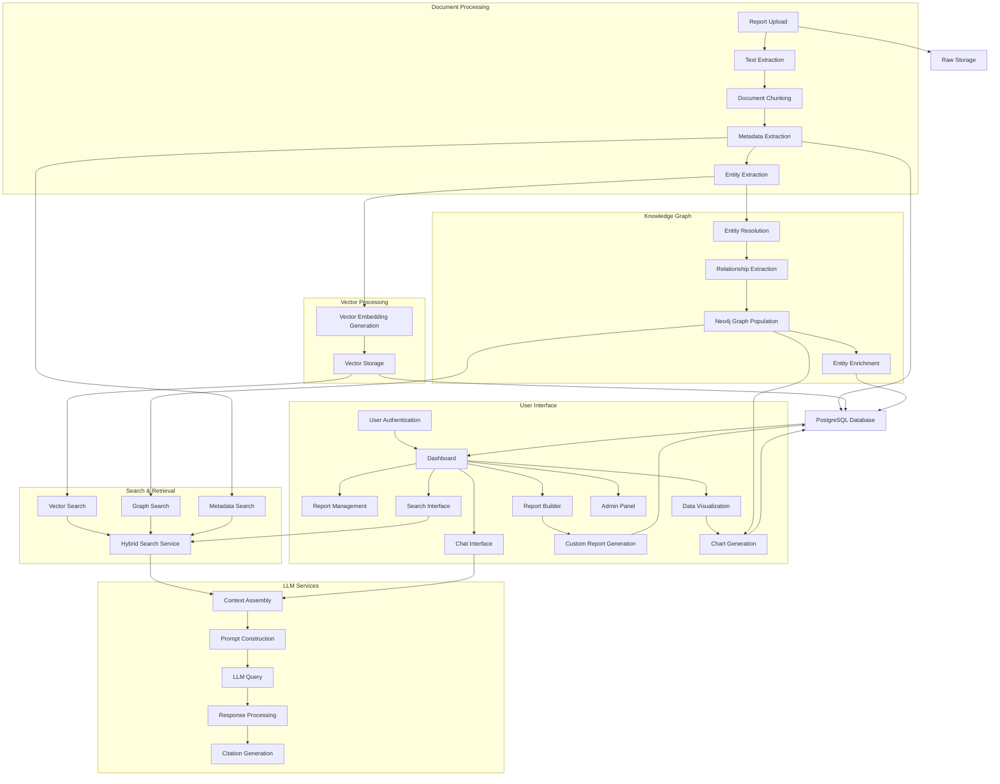

# CyberInsightHub Data Flow Architecture

This document outlines the complete data flow architecture for the CyberInsightHub system, showing how data moves between components, is transformed throughout the application lifecycle, and how different services interact with each other.

## System Overview Data Flow

The following diagram illustrates the high-level data flow through the entire CyberInsightHub system, from document ingestion to user interactions:

## Detailed Component Data Flows

### 1. Document Processing Flow

**Data Transformations**:
1. **Raw File → Text**: PDF/DOCX processing to extract plain text
2. **Text → Chunks**: Text segmentation into semantic sections
3. **Chunks → Entities**: Named entity recognition produces structured entities
4. **Metadata Extraction**: Document attributes like title, date, author, source

**Storage Operations**:
- Raw files stored in Supabase Storage `raw_reports` bucket
- Extracted text stored in `reports` table
- Chunks stored in `report_sections` table
- Entities stored in `report_entities` table
- Metadata stored in `reports` table

### 2. Vector Embedding Flow

**Data Transformations**:
1. **Text Chunks → Embedding Requests**: Prepare text for embedding API
2. **API Response → Vector Storage**: Format vectors for pgvector storage

**Storage Operations**:
- Vectors stored in `report_sections` table with pgvector extension
- Vector metadata (model, dimensions) stored with vectors

### 3. Knowledge Graph Construction Flow

**Data Transformations**:
1. **Raw Entities → Resolved Entities**: Deduplication and normalization
2. **Entities → Neo4j Nodes**: Formatting for graph database
3. **Text Context → Relationships**: Extracting connections between entities
4. **Diffbot Data → Entity Attributes**: Mapping external data to our schema

**Storage Operations**:
- Entities stored as nodes in Neo4j
- Relationships stored as edges in Neo4j
- Entity attributes stored as node properties
- Confidence scores stored with relationships

### 4. Search and Retrieval Flow

**Data Transformations**:
1. **User Query → Search Requests**: Query parsing for different search types
2. **Query Text → Vector**: Embedding generation for vector search
3. **Query → Filters**: Extracting metadata filters
4. **Multi-Source Results → Unified Results**: Results merging and ranking

**Storage Operations**:
- Vector similarity queries against pgvector indices
- Full-text search queries against PostgreSQL
- Property and pattern matching in Neo4j
- Search history stored in `user_searches` table

### 5. LLM Integration Flow

**Data Transformations**:
1. **User Message → Search Queries**: Extracting search terms from message
2. **Search Results → Context**: Selecting and formatting relevant passages
3. **Context + History → Prompt**: Structured prompt construction
4. **LLM Response → Cited Response**: Adding citation metadata

**Storage Operations**:
- Conversation history stored in `chat_conversations` table
- Message contents stored in `chat_messages` table
- Citations stored with responses
- Token usage logged for monitoring

### 6. Dashboard Data Flow

**Data Transformations**:
1. **Raw Metrics → Visualization Data**: Processing numbers into chart formats
2. **Entity Frequencies → Network Graphs**: Transforming entity data to visualizations
3. **Time Series Data → Trends**: Processing temporal data for trend visualization

**Storage Operations**:
- Pre-computed metrics stored in `report_stats` table
- User dashboard preferences stored in `user_preferences` table
- Generated visualizations cached in `generated_assets` storage

### 7. User Management Flow

**Data Transformations**:
1. **Credentials → JWT**: Authentication token generation
2. **JWT → User Context**: Extracting user identity and permissions
3. **Permissions → UI State**: Adapting UI based on permissions

**Storage Operations**:
- User accounts stored in Supabase Auth tables
- User preferences stored in `user_preferences` table
- Role assignments stored in `user_roles` table
- Access logs stored for auditing

### 8. Report Builder Flow

**Data Transformations**:
1. **User Selections → Report Structure**: Building report configuration
2. **Content Sources → Report Content**: Assembling content from various sources
3. **Template + Content → Generated Report**: Rendering final report

**Storage Operations**:
- Report configurations stored in `custom_reports` table
- Generated reports stored in `generated_assets` storage bucket
- Templates stored in `report_templates` table

## API Contract Specifications

### Authentication API

- **POST /api/auth/login**
  - Request: `{ email, password }`
  - Response: `{ user, session, token }`

- **POST /api/auth/register**
  - Request: `{ email, password, name }`
  - Response: `{ user, session }`

- **POST /api/auth/logout**
  - Request: `{ token }`
  - Response: `{ success }`

- **GET /api/auth/user**
  - Response: `{ user, permissions }`

### Reports API

- **POST /api/reports**
  - Request: `{ file, metadata }`
  - Response: `{ report_id, job_id, status }`

- **GET /api/reports**
  - Parameters: `{ page, limit, filters }`
  - Response: `{ reports[], total, page_count }`

- **GET /api/reports/:id**
  - Response: `{ report, sections[], metadata }`

- **GET /api/reports/:id/entities**
  - Parameters: `{ entity_types[], confidence }`
  - Response: `{ entities[] }`

### Search API

- **POST /api/search**
  - Request: `{ query, filters, page, limit }`
  - Response: `{ results[], total, page_count }`

- **POST /api/search/semantic**
  - Request: `{ text, filters, limit }`
  - Response: `{ results[] }`

- **POST /api/search/hybrid**
  - Request: `{ query, filters, weights, limit }`
  - Response: `{ results[] }`

### Chat API

- **POST /api/chat**
  - Request: `{ message, conversation_id, context_ids[] }`
  - Response: Stream of `{ content, citations[], finished }`

- **GET /api/chat/conversations**
  - Response: `{ conversations[] }`

- **GET /api/chat/conversations/:id**
  - Response: `{ messages[], metadata }`

### Knowledge Graph API

- **GET /api/graph/entities**
  - Parameters: `{ types[], limit }`
  - Response: `{ entities[] }`

- **GET /api/graph/entities/:id**
  - Response: `{ entity, attributes, relationships[] }`

- **GET /api/graph/search**
  - Parameters: `{ query, types[], limit }`
  - Response: `{ entities[], relationships[] }`

### Dashboard API

- **GET /api/dashboard**
  - Response: `{ stats, charts[], recent_reports[] }`

- **GET /api/dashboard/chart/:type**
  - Parameters: `{ period, filters }`
  - Response: `{ data, metadata }`

### Admin API

- **GET /api/admin/users**
  - Parameters: `{ page, limit, filters }`
  - Response: `{ users[], total, page_count }`

- **PUT /api/admin/users/:id**
  - Request: `{ role, permissions, status }`
  - Response: `{ user }`

- **GET /api/admin/jobs**
  - Parameters: `{ status, type, page, limit }`
  - Response: `{ jobs[], total, page_count }`

## Data Storage Schema

### PostgreSQL Tables

### Neo4j Graph Schema

## External Service Integrations

### OpenAI API Integration

**Services Used**:
- **text-embedding-3-large**: For generating document embeddings
- **gpt-4**: For chat completions and analysis

**Authentication**:
- API key stored in Supabase environment variables

**Data Flow**:
1. System makes API requests with document chunks or user queries
2. API returns embeddings or completions
3. System stores embeddings in pgvector or processes completions for user

### Diffbot API Integration

**Services Used**:
- **Knowledge Graph API**: For entity enrichment
- **Article API**: For additional context from web

**Authentication**:
- API key stored in Supabase environment variables

**Data Flow**:
1. Entity data sent to Diffbot for enrichment
2. Diffbot returns additional entity information
3. System integrates Diffbot data with existing entity records

### Additional External Services

- **VirusTotal API**: For malware and indicator enrichment
- **MITRE CVE Database**: For vulnerability information
- **AlienVault OTX**: For threat intelligence context
- **News APIs**: For current event correlation

## Cross-Cutting Concerns

### Error Handling

Error flows are implemented across all data paths:

1. **Input Validation Errors**: Returned as 400 Bad Request
2. **Authentication Errors**: Returned as 401 Unauthorized
3. **Permission Errors**: Returned as 403 Forbidden
4. **Resource Errors**: Returned as 404 Not Found
5. **Processing Errors**: Logged and returned as 500 Internal Server Error

### Logging and Monitoring

Data flows are logged at these key points:

1. **API Request/Response**: Timing, user ID, endpoint
2. **Processing Jobs**: Status changes, completion, errors
3. **LLM Interactions**: Prompts, responses, token usage
4. **User Actions**: Searches, report views, chat interactions

### Caching Strategy

Caching is implemented at these points:

1. **Frontend Caching**: Client-side caching of UI components
2. **API Response Caching**: Common queries and responses
3. **Search Results Caching**: Recent or common searches
4. **Embedding Caching**: To prevent duplicate API calls
5. **Visualization Caching**: Dashboard charts and graphs

## Data Flow for Key User Journeys

### Journey 1: Uploading and Processing a New Report

### Journey 2: Searching and Analyzing Reports

### Journey 3: Chatting with Report Knowledge

## Conclusion

This data flow architecture document provides a comprehensive view of how data moves through the CyberInsightHub system. It serves as a guide for implementation, ensuring that all components work together seamlessly and that data is transformed appropriately at each stage of processing.

Key points to remember during implementation:

1. All data flows should be secured with proper authentication and authorization
2. Error handling must be implemented at each transition point
3. Logging should capture key events in the data lifecycle
4. Performance monitoring should be implemented at critical flow points
5. Data quality should be validated at each transformation stage