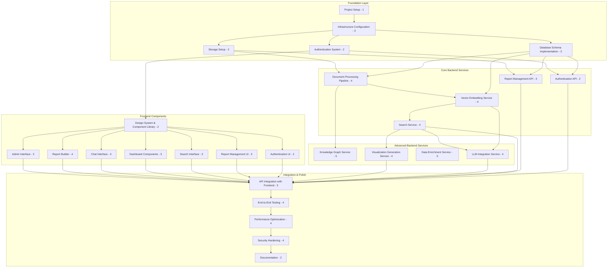

# CyberInsightHub Implementation Plan and Documentation Checklist

## Documentation Inventory

This is an inventory of all existing documentation for the CyberReportV2 project:

- [ ] **CyberReport2_PRD.md** - Product Requirements Document
- [ ] **Frontend Architecture and UI Components.md** - Next.js frontend specifications
- [ ] **API Endpoint and Integration Design.md** - API architecture 
- [ ] **Data Enrichment and Knowledge Graph Architecture.md** - Neo4j integration and external data sources
- [ ] **Database Schema and Vector Store Design.md** - Supabase PostgreSQL schema design
- [ ] **Document Processing Pipeline Architecture.md** - Report processing workflow
- [ ] **Deployment Architecture and Infrastructure.md** - Cloud infrastructure and hosting
- [ ] **Implementation and Roadmap Project Plan.md** - Development timeline
- [ ] **LLM Integration and Chat System Design.md** - OpenAI integration specifications
- [ ] **System Security Plan.md** - Security controls and compliance
- [ ] **secrets.md** - Credential management information

Sample data is available in the **Sample Annual Reports** folder with 12 cybersecurity reports in both Markdown and PDF formats.

## Implementation Checklist

This implementation plan is structured by logical task groups, with tasks organized by dependencies. Each task includes a complexity/risk rating (1-5) to help with resource allocation and risk management.

### 1. Foundation Layer

- [ ] **Project Setup** (Complexity: 1)
  - [ ] Initialize Git repository
  - [ ] Set up project structure
  - [ ] Establish coding standards document
  - [ ] Configure linting and formatting tools
  - [ ] Set up issue tracking system
  
  _After completing this task, mark it as complete and document the repository structure, coding standards, and development environment setup instructions for new developers._

- [ ] **Infrastructure Configuration** (Complexity: 3)
  - [ ] Create Supabase project
  - [ ] Set up project API keys and access control
  - [ ] Configure development, staging, and production environments
  - [ ] Set up CI/CD pipeline
  - [ ] Implement infrastructure as code (if applicable)
  
  _After completing this task, mark it as complete and document the infrastructure setup, access patterns, and CI/CD workflow for new developers._

- [ ] **Database Schema Implementation** (Complexity: 3)
  - [ ] Create users table
  - [ ] Create reports table
  - [ ] Create report_sections table
  - [ ] Create report_stats table
  - [ ] Create user_saved_items table
  - [ ] Create custom_reports table
  - [ ] Set up relationships between tables
  - [ ] Implement row-level security policies
  
  _After completing this task, mark it as complete and document the database schema, relationships, and security policies for new developers._

- [ ] **Authentication System** (Complexity: 2)
  - [ ] Configure Supabase Auth settings
  - [ ] Set up email/password authentication
  - [ ] Configure OAuth providers (Google, Microsoft)
  - [ ] Establish role-based access control
  - [ ] Implement user session management
  
  _After completing this task, mark it as complete and document the authentication flows, user roles, and permissions for new developers._

- [ ] **Storage Setup** (Complexity: 2)
  - [ ] Create raw_reports storage bucket
  - [ ] Create processed_reports storage bucket
  - [ ] Create generated_assets storage bucket
  - [ ] Configure access policies for buckets
  - [ ] Set up file type validation
  
  _After completing this task, mark it as complete and document the storage structure, access patterns, and file management for new developers._

### 2. Core Backend Services

- [ ] **Document Processing Pipeline** (Complexity: 4)
  - [ ] Implement PDF text extraction
  - [ ] Implement DOCX text extraction
  - [ ] Create section identification and chunking logic
  - [ ] Implement metadata extraction
  - [ ] Create processing job queue
  - [ ] Implement file validation and security checks
  
  _After completing this task, mark it as complete and document the document processing workflow, supported file types, and extraction capabilities for new developers._

- [ ] **Vector Embedding Service** (Complexity: 4)
  - [ ] Set up OpenAI API integration
  - [ ] Create embedding generation service
  - [ ] Implement pgvector extension in Supabase
  - [ ] Create batch processing for embeddings
  - [ ] Implement embedding storage and retrieval
  - [ ] Add embedding refresh mechanism
  
  _After completing this task, mark it as complete and document the embedding generation process, storage architecture, and querying patterns for new developers._

- [ ] **Search Service** (Complexity: 4)
  - [ ] Implement vector-based semantic search
  - [ ] Create metadata-based filtering
  - [ ] Implement hybrid search (combining vector and metadata)
  - [ ] Add relevance scoring and ranking
  - [ ] Create search results pagination
  - [ ] Implement search history tracking
  
  _After completing this task, mark it as complete and document the search architecture, query patterns, and performance considerations for new developers._

- [ ] **Authentication API** (Complexity: 2)
  - [ ] Create login endpoint
  - [ ] Create registration endpoint
  - [ ] Implement user profile management
  - [ ] Add password reset functionality
  - [ ] Create session management endpoints
  
  _After completing this task, mark it as complete and document the authentication API endpoints, request/response formats, and error handling for new developers._

- [ ] **Report Management API** (Complexity: 3)
  - [ ] Create report upload endpoint
  - [ ] Implement report listing and filtering
  - [ ] Create report detail endpoint
  - [ ] Add report section retrieval
  - [ ] Implement report statistics endpoint
  
  _After completing this task, mark it as complete and document the report management API endpoints, request/response formats, and data models for new developers._

### 3. Advanced Backend Services 

- [ ] **Knowledge Graph Service** (Complexity: 5)
  - [ ] Set up Neo4j database
  - [ ] Implement entity extraction from reports
  - [ ] Create relationship detection algorithms
  - [ ] Develop graph population service
  - [ ] Implement graph query API
  - [ ] Create visualization data endpoint
  
  _After completing this task, mark it as complete and document the knowledge graph architecture, entity models, relationship types, and query patterns for new developers._

- [ ] **LLM Integration Service** (Complexity: 4)
  - [ ] Set up OpenAI API for chat completion
  - [ ] Create context management system
  - [ ] Implement prompt engineering
  - [ ] Add citation generation
  - [ ] Create streaming response handling
  - [ ] Implement conversation history management
  
  _After completing this task, mark it as complete and document the LLM integration architecture, prompt templates, context management, and response handling for new developers._

- [ ] **Data Enrichment Service** (Complexity: 5)
  - [ ] Implement external API integrations
  - [ ] Create entity validation and resolution
  - [ ] Add scheduled enrichment jobs
  - [ ] Implement on-demand enrichment
  - [ ] Create enrichment storage service
  - [ ] Add confidence scoring for enriched data
  
  _After completing this task, mark it as complete and document the data enrichment sources, integration patterns, scheduling mechanisms, and data models for new developers._

- [ ] **Visualization Generation Service** (Complexity: 4)
  - [ ] Set up chart generation library
  - [ ] Create data transformation utilities
  - [ ] Implement chart type selection logic
  - [ ] Add color scheme and styling options
  - [ ] Create export functionality
  - [ ] Implement caching for generated visualizations
  
  _After completing this task, mark it as complete and document the visualization service architecture, chart types, data formats, and generation process for new developers._

### 4. Frontend Components

- [ ] **Design System & Component Library** (Complexity: 2)
  - [ ] Set up Next.js project with TypeScript
  - [ ] Configure Tailwind CSS
  - [ ] Implement component library (Shadcn UI)
  - [ ] Create shared layouts
  - [ ] Implement theme system (light/dark mode)
  - [ ] Create icon library integration
  
  _After completing this task, mark it as complete and document the design system structure, component usage patterns, and theming capabilities for new developers._

- [ ] **Authentication UI** (Complexity: 2)
  - [ ] Create login page
  - [ ] Implement registration page
  - [ ] Add password reset flow
  - [ ] Create profile management page
  - [ ] Implement session management
  
  _After completing this task, mark it as complete and document the authentication UI flows, form validation, and state management for new developers._

- [ ] **Report Management UI** (Complexity: 3)
  - [ ] Create report upload interface
  - [ ] Implement report listing page
  - [ ] Create report detail view
  - [ ] Add report section navigation
  - [ ] Implement metadata display
  
  _After completing this task, mark it as complete and document the report management UI components, state management, and user interactions for new developers._

- [ ] **Search Interface** (Complexity: 3)
  - [ ] Create search input component
  - [ ] Implement filter controls
  - [ ] Add search results display
  - [ ] Create pagination controls
  - [ ] Implement result highlighting
  
  _After completing this task, mark it as complete and document the search interface components, query building, and results handling for new developers._

- [ ] **Dashboard Components** (Complexity: 3)
  - [ ] Create dashboard layout
  - [ ] Implement stat card components
  - [ ] Add chart components
  - [ ] Create report listing widget
  - [ ] Implement trend indicators
  
  _After completing this task, mark it as complete and document the dashboard components, data fetching patterns, and state management for new developers._

- [ ] **Chat Interface** (Complexity: 4)
  - [ ] Create chat UI layout
  - [ ] Implement message components
  - [ ] Add context selection controls
  - [ ] Create typing indicators
  - [ ] Implement citation display
  - [ ] Add streaming response handling
  
  _After completing this task, mark it as complete and document the chat interface components, message handling, and streaming implementation for new developers._

- [ ] **Report Builder** (Complexity: 4)
  - [ ] Create drag-and-drop interface
  - [ ] Implement content block components
  - [ ] Add template selection
  - [ ] Create preview functionality
  - [ ] Implement export options
  - [ ] Add citation management
  
  _After completing this task, mark it as complete and document the report builder components, drag-and-drop implementation, and export capabilities for new developers._

- [ ] **Admin Interface** (Complexity: 3)
  - [ ] Create admin dashboard
  - [ ] Implement user management tools
  - [ ] Add system configuration controls
  - [ ] Create monitoring widgets
  - [ ] Implement API configuration tools
  
  _After completing this task, mark it as complete and document the admin interface components, configuration options, and access control for new developers._

### 5. Integration & Polish

- [ ] **API Integration with Frontend** (Complexity: 3)
  - [ ] Create API client services
  - [ ] Implement error handling
  - [ ] Add loading states
  - [ ] Create request/response types
  - [ ] Implement caching strategy
  
  _After completing this task, mark it as complete and document the API integration patterns, error handling, and state management for new developers._

- [ ] **End-to-End Testing** (Complexity: 4)
  - [ ] Set up testing framework
  - [ ] Create authentication tests
  - [ ] Implement report management tests
  - [ ] Add search functionality tests
  - [ ] Create chat interaction tests
  - [ ] Implement report builder tests
  
  _After completing this task, mark it as complete and document the testing approach, test cases, and running/debugging tests for new developers._

- [ ] **Performance Optimization** (Complexity: 4)
  - [ ] Implement code splitting
  - [ ] Add lazy loading
  - [ ] Optimize API requests
  - [ ] Implement query caching
  - [ ] Add image optimization
  - [ ] Create bundle size analysis
  
  _After completing this task, mark it as complete and document the performance optimization techniques, metrics, and monitoring approaches for new developers._

- [ ] **Security Hardening** (Complexity: 4)
  - [ ] Implement CSP headers
  - [ ] Add input sanitization
  - [ ] Create rate limiting
  - [ ] Implement session management security
  - [ ] Add secure headers
  - [ ] Create security scanning
  
  _After completing this task, mark it as complete and document the security measures, potential vulnerabilities, and security testing for new developers._

- [ ] **Documentation** (Complexity: 2)
  - [ ] Create API documentation
  - [ ] Write component documentation
  - [ ] Add setup instructions
  - [ ] Create user guides
  - [ ] Implement inline code documentation
  
  _After completing this task, mark it as complete and ensure all documentation is comprehensive, organized, and accessible for new developers._

## Implementation Diagram

## Critical Success Factors

- **Document Processing Accuracy** - The system's core value depends on accurate extraction and processing
- **Search Relevance** - User adoption requires high-quality search results
- **LLM Integration Quality** - Chat functionality must provide valuable insights, not just regurgitate text
- **Performance at Scale** - System must maintain performance with hundreds of reports
- **User Experience** - Interface must be intuitive and efficient for cybersecurity professionals

## Implementation Strategy for Maximum Efficiency

### 1. Parallel Development Streams

The implementation plan allows for three parallel development workstreams:

- **Backend Services Stream** - Focus on implementing the database, document processing, and API layer
- **Frontend Development Stream** - Build the UI components and pages
- **Integration Stream** - Connect frontend and backend, implement testing, and polish the application

### 2. Common Component Development

The following components should be prioritized as they form the foundation for multiple aspects of the system:

- **Document Processing Pipeline** - Critical for all data ingestion and serves as foundation for many other components
- **Vector Embedding Service** - Required for both search and LLM context building
- **Design System & Component Library** - Forms the basis for all frontend components
- **Authentication System** - Required for both frontend and backend security

### 3. Risk Mitigation for High-Complexity Tasks

For high-complexity tasks (rated 4-5), implement the following strategy:

- **Build Simplified Versions First** - Create functional but limited implementations to validate approach
- **Incremental Enhancement** - Add features in small, testable increments
- **Early Integration Testing** - Test high-risk components with dependent systems early to identify issues
- **Plan for Rewrites** - Allow time for potential partial rewrites of high-complexity components

## Developer Onboarding Notes

For each completed task, document the following for new developers:

1. **Purpose and Functionality** - What does this component do and why does it exist?
2. **Architecture and Design** - How is it structured and what design patterns are used?
3. **Dependencies** - What other components does it rely on?
4. **Usage Examples** - How should other parts of the system interact with this component?
5. **Testing Approach** - How can this component be tested?
6. **Known Limitations** - What are the current constraints or limitations?
7. **Future Improvements** - What enhancements are planned or recommended?