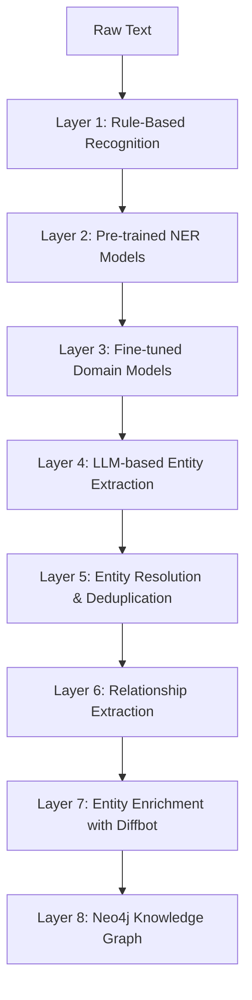
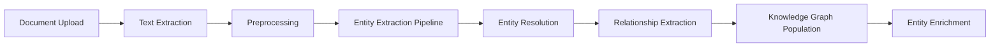

# CyberInsightHub Named Entity Recognition Strategy

This document outlines a comprehensive approach to Named Entity Recognition (NER) for the CyberInsightHub project, specifically designed to create a precise and powerful knowledge graph that can be enriched with Diffbot and other external data sources.

## Entity Types for Cybersecurity Domain

The NER system will identify and classify the following entity types from cybersecurity reports:

### Core Entity Types

1. **Threat Actors**
   - Nation-state groups (APT29, Lazarus Group)
   - Criminal organizations (REvil, DarkSide)
   - Hacktivist groups (Anonymous)
   - Individual threat actors (aliases, real names when known)

2. **Organizations**
   - Targeted companies and organizations
   - Security vendors and researchers
   - Government agencies
   - Regulatory bodies
   - Industry groups

3. **Malware and Tools**
   - Malware families (Emotet, Conti)
   - Exploit kits (BlackHole, RIG)
   - Attack frameworks (Cobalt Strike, Metasploit)
   - Custom tools used by threat actors

4. **Vulnerabilities**
   - CVE IDs
   - Zero-day vulnerabilities
   - Vulnerability types (buffer overflow, SQL injection)
   - Affected software/hardware

5. **Attack Techniques**
   - MITRE ATT&CK techniques
   - Novel techniques not yet classified
   - Social engineering approaches
   - Attack patterns and methodologies

6. **Infrastructure**
   - IP addresses
   - Domains
   - Command and control servers
   - Hosting providers
   - Geographic locations

### Extended Entity Types

7. **Time Periods and Events**
   - Attack timeframes
   - Security incidents
   - Conferences and disclosures
   - Patch release dates

8. **Industries and Sectors**
   - Targeted industries
   - Sector-specific threats
   - Regulatory frameworks by industry

9. **Technologies**
   - Affected platforms
   - Operating systems
   - Cloud services
   - Hardware devices
   - Software applications

10. **Countermeasures**
    - Security controls
    - Mitigation strategies
    - Detection methods
    - Response procedures

11. **Impact Metrics**
    - Financial impact
    - Operational impact
    - Data loss metrics
    - Recovery time objectives

12. **Abstract Concepts**
    - Attack motivations
    - Threat trends
    - Strategic approaches
    - Security paradigms

## Relationship Types

The NER system will also identify relationships between entities, including:

1. **Targets** (Threat Actor → Organization/Industry)
2. **Uses** (Threat Actor → Malware/Tool)
3. **Exploits** (Threat Actor/Malware → Vulnerability)
4. **Affects** (Malware/Attack → Technology)
5. **Employs** (Threat Actor → Attack Technique)
6. **Mitigates** (Countermeasure → Vulnerability/Attack)
7. **Attributes** (Security Vendor → Attribution to Threat Actor)
8. **Operates** (Threat Actor → Infrastructure)
9. **Reports** (Organization → Incident/Finding)
10. **Relates To** (Generic relationship for connected entities)
11. **Temporal Relationship** (Entity → Time Period/Event)
12. **Impacts** (Attack/Incident → Organization/Industry)

## Multi-Layered NER Architecture

To achieve high precision while capturing domain-specific entities, we will implement a multi-layered NER approach:



### Layer 1: Rule-Based Recognition

- **Purpose**: Identify high-confidence entities with deterministic patterns
- **Implementation**:
  - Regular expressions for CVEs, IPs, domains, dates
  - Dictionary lookups for known threat actors, malware families
  - Pattern matching for standardized formats (e.g., MITRE ATT&CK IDs)
- **Output**: High-precision entities with minimal false positives

### Layer 2: Pre-trained NER Models

- **Purpose**: Identify general entities (people, organizations, locations)
- **Implementation**:
  - spaCy's large English model (en_core_web_trf)
  - Hugging Face Transformers NER pipelines
  - Microsoft Recognizers-Text for dates, numbers, etc.
- **Output**: General entities with confidence scores

### Layer 3: Fine-tuned Domain Models

- **Purpose**: Identify cybersecurity-specific entities
- **Implementation**:
  - BERT/RoBERTa model fine-tuned on labeled cybersecurity corpus
  - Custom training data from cybersecurity reports
  - Active learning to improve over time
- **Output**: Domain-specific entities with confidence scores

### Layer 4: LLM-based Entity Extraction

- **Purpose**: Identify complex or novel entities and relationships
- **Implementation**:
  - GPT-4 with structured prompts for entity extraction
  - Few-shot examples for entity types
  - Chain-of-thought reasoning for complex entities
  - Confidence scoring based on multiple samplings
- **Output**: Complex entities and relationships

### Layer 5: Entity Resolution & Deduplication

- **Purpose**: Combine and normalize entities across layers
- **Implementation**:
  - Fuzzy matching for similar entity names
  - Alias resolution (e.g., APT29 = Cozy Bear)
  - Hierarchical clustering for entity groups
  - Confidence scoring based on multiple detections
- **Output**: Unified entities with confidence scores and source attribution

### Layer 6: Relationship Extraction

- **Purpose**: Identify relationships between entities
- **Implementation**:
  - Dependency parsing for syntactic relationships
  - Fine-tuned relation extraction model
  - LLM-based relationship identification
  - Pattern-based relation extraction
- **Output**: Entity relationships with confidence scores

### Layer 7: Entity Enrichment with Diffbot

- **Purpose**: Enhance entities with external knowledge
- **Implementation**:
  - Diffbot Knowledge Graph API for entity enrichment
  - Diffbot Article API for additional context
  - Diffbot Organization API for company details
  - Custom mapping of Diffbot entities to our schema
- **Output**: Enriched entities with additional attributes

### Layer 8: Neo4j Knowledge Graph

- **Purpose**: Store and query the resulting knowledge graph
- **Implementation**:
  - Neo4j graph database with cypher queries
  - Entity-relationship schema with properties
  - Confidence scoring for entities and relationships
  - Temporal attributes for changing relationships
- **Output**: Queryable knowledge graph

## Training Data Sources

To achieve high precision, we will utilize the following training data sources:

1. **Public Cybersecurity Reports**
   - Manual annotation of sample reports in our corpus
   - Existing security report datasets if available

2. **Threat Intelligence Feeds**
   - MITRE ATT&CK database
   - AlienVault OTX
   - VirusTotal data (when available)

3. **CVE and NVD Databases**
   - Structured vulnerability information
   - Description fields for language patterns

4. **Academic Security Papers**
   - Research papers with labeled security entities
   - Conference proceedings

5. **Synthetic Data Generation**
   - LLM-generated examples with known entities
   - Augmentation of existing labeled data

## Fine-tuning Methodology

For the domain-specific models, we will use the following fine-tuning approach:

1. **Base Model Selection**
   - Start with RoBERTa-large or DeBERTa-v3
   - Compare performance with security-specific LLMs if available

2. **Dataset Creation**
   - Annotate 2,000+ sentences with cybersecurity entities
   - Ensure balanced representation across entity types
   - Include challenging examples and edge cases

3. **Training Approach**
   - Cross-validation to prevent overfitting
   - Learning rate optimization
   - Gradient accumulation for effective batch size

4. **Evaluation Metrics**
   - Entity-level precision, recall, and F1 scores
   - Type-specific performance metrics
   - Confusion matrix analysis

5. **Continuous Improvement**
   - Human-in-the-loop review of model outputs
   - Active learning for ambiguous cases
   - Periodic retraining with new examples

## LLM Prompting Strategy for Entity Extraction

For GPT-4 and other LLMs, we will use structured prompts:

```
You are an expert in cybersecurity entity recognition. Your task is to identify entities in the following text from a cybersecurity report.

Identify all instances of:
1. Threat Actors (groups, individuals)
2. Organizations (companies, agencies)
3. Malware and Tools
4. Vulnerabilities (CVEs, zero-days)
5. Attack Techniques
6. Infrastructure (IPs, domains)
7. Time Periods and Events
8. Industries and Sectors
9. Technologies
10. Countermeasures
11. Impact Metrics
12. Abstract Concepts

Also identify relationships between entities, such as:
- Which threat actors target which organizations
- Which malware is used by which threat actors
- Which vulnerabilities are exploited in the attacks
- What techniques are used in the campaigns

Text: """
[Insert report section here]
"""

Format your response as a JSON object with entities and relationships arrays.
```

## Diffbot Integration for Entity Enrichment

The Diffbot Knowledge Graph API will be used to enrich our extracted entities:

### Enrichment Process

1. **Entity Normalization**
   - Convert extracted entities to searchable formats
   - Apply aliases and alternate names

2. **Diffbot Query Construction**
   - Build structured queries for the Knowledge Graph API
   - Use entity type mapping to Diffbot ontology

3. **Response Processing**
   - Extract relevant attributes from Diffbot entities
   - Map to our entity schema
   - Calculate confidence scores for matches

4. **Attribute Merging**
   - Combine Diffbot attributes with our extracted data
   - Resolve conflicts with confidence-based voting
   - Maintain provenance for all attributes

### Diffbot Entity Types Mapping

| Our Entity Type | Diffbot Entity Type | Enrichment Target |
|-----------------|---------------------|-------------------|
| Threat Actors (Groups) | Organization | Description, size, location, related entities |
| Organizations | Organization | Company details, industry, key people, locations |
| People | Person | Biography, affiliations, expertise |
| Malware | Product | Description, related articles, technical details |
| Technology | Product | Specifications, manufacturer, related technologies |

## Implementation Approach

The NER system will be implemented as follows:

### 1. Data Processing Pipeline



### 2. Microservices Architecture

- **Preprocessing Service**: Cleanses and formats text for NER
- **Rule-Based NER Service**: Applies regex and dictionary-based extraction
- **ML-Based NER Service**: Runs fine-tuned models for entity extraction
- **LLM-Based NER Service**: Uses GPT-4 for complex entity extraction
- **Entity Resolution Service**: Deduplicates and normalizes entities
- **Relationship Extraction Service**: Identifies entity relationships
- **Diffbot Enrichment Service**: Enhances entities with external data
- **Knowledge Graph Service**: Manages Neo4j database operations

### 3. Development Phases

1. **Phase 1: Core Entity Types**
   - Implement layers 1-3 for basic entity types
   - Build initial knowledge graph schema
   - Develop basic entity resolution

2. **Phase 2: Advanced Entity Types**
   - Add layers 4-5 for complex entities
   - Implement relationship extraction
   - Expand knowledge graph schema

3. **Phase 3: Entity Enrichment**
   - Integrate Diffbot for entity enrichment
   - Implement confidence scoring
   - Add temporal dimension to entities

4. **Phase 4: Optimization**
   - Performance tuning
   - Accuracy improvements
   - Schema refinement

## Performance Monitoring and Improvement

To maintain high precision, we will implement:

1. **Confidence Scoring**
   - Each entity and relationship will have a confidence score
   - Multiple detection methods increase confidence
   - User feedback affects confidence scores

2. **Human-in-the-Loop Review**
   - Interface for reviewing low-confidence entities
   - Capability to correct or confirm entities
   - Active learning from corrections

3. **Performance Metrics Dashboard**
   - Entity extraction accuracy by type
   - Relationship extraction accuracy
   - Processing time and efficiency
   - Knowledge graph growth metrics

4. **Feedback Mechanisms**
   - User feedback on entity accuracy
   - Automated detection of inconsistencies
   - Periodic sampling for manual review

## Security and Privacy Considerations

The NER system will adhere to:

1. **Data Handling**
   - Process only authorized documents
   - Respect document access controls
   - Apply row-level security to extracted entities

2. **API Security**
   - Secure Diffbot API key management
   - Rate limiting for extraction services
   - Authentication for all microservices

3. **Privacy Controls**
   - Option to exclude sensitive entity types
   - Masking capabilities for PII
   - Audit logging for all entity extractions

## Conclusion

This multi-layered NER approach will provide the precision needed for a powerful knowledge graph while leveraging Diffbot for entity enrichment. By combining rule-based methods, fine-tuned models, and LLM-based extraction, we can achieve high accuracy across diverse cybersecurity entity types and relationships.