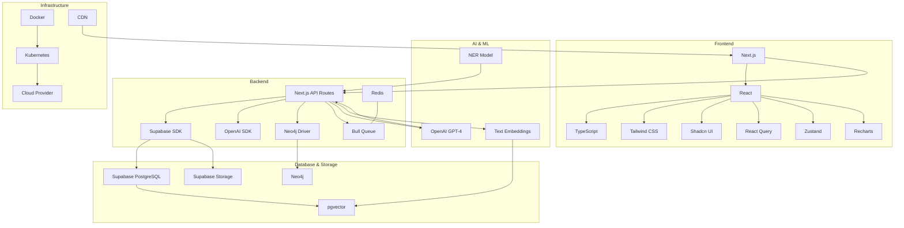

# CyberInsightHub Technology Choices

This document outlines the proposed technology stack for the CyberInsightHub application, providing rationale for each choice and identifying any decisions that still need to be made.

## Frontend Technology Stack

### Core Framework: Next.js with TypeScript
- **Proposed Version**: Next.js 14+ with TypeScript 5+
- **Rationale**: Next.js provides server-side rendering capabilities, static site generation, API routes, and optimized client-side navigation, which are all valuable for this application. TypeScript adds type safety and improves developer experience.
- **Alternatives**: Remix, Nuxt.js (Vue-based), SvelteKit
- **Decision Status**: ✅ Confirmed based on Frontend Architecture document

### UI Framework: Tailwind CSS with Shadcn UI
- **Proposed Version**: Tailwind CSS 3+ with Shadcn UI components
- **Rationale**: Tailwind provides utility-first styling that enables rapid UI development, while Shadcn UI offers accessible, customizable components built on Radix UI primitives.
- **Alternatives**: Material UI, Chakra UI, Mantine
- **Decision Status**: ✅ Confirmed based on Frontend Architecture document

### State Management: React Query & Zustand
- **Proposed Version**: React Query v5+ and Zustand v4+
- **Rationale**: React Query handles server state (data fetching, caching, and updates) while Zustand provides lightweight global state management.
- **Alternatives**: Redux Toolkit, Jotai, Recoil
- **Decision Status**: ✅ Confirmed based on Frontend Architecture document

### Data Visualization: Recharts
- **Proposed Version**: Recharts 2+
- **Rationale**: Recharts is a composable charting library built with React components, making it easier to create customized charts.
- **Alternatives**: D3.js, Chart.js, Visx, ECharts
- **Decision Status**: ✅ Confirmed based on Frontend Architecture document

### Icons: Lucide React
- **Proposed Version**: Lucide React latest
- **Rationale**: Lucide provides a consistent, customizable icon set with good React integration.
- **Alternatives**: React Icons, Heroicons, Phosphor Icons
- **Decision Status**: ✅ Confirmed based on Frontend Architecture document

## Backend Technology Stack

### API Framework: Next.js API Routes
- **Proposed Version**: Next.js 14+ API Routes
- **Rationale**: Using Next.js API routes allows for a unified development experience and simpler deployment.
- **Alternatives**: Express.js, NestJS, FastAPI (Python)
- **Decision Status**: ✅ Confirmed based on API Endpoint and Integration Design document

### Authentication: Supabase Auth
- **Proposed Version**: Supabase Auth latest
- **Rationale**: Supabase Auth integrates seamlessly with the rest of the Supabase ecosystem and provides comprehensive authentication features.
- **Alternatives**: NextAuth.js, Auth0, Firebase Auth
- **Decision Status**: ✅ Confirmed based on API Endpoint and Integration Design document

### Validation: Zod
- **Proposed Version**: Zod latest
- **Rationale**: Zod provides TypeScript-first schema validation with a clean API.
- **Alternatives**: Joi, Yup, AJV
- **Decision Status**: ✅ Confirmed based on API Endpoint and Integration Design document

### Background Processing: Bull Queue with Redis
- **Proposed Version**: Bull Queue latest with Redis
- **Rationale**: Bull provides a robust queue system for handling background jobs like document processing.
- **Alternatives**: BullMQ, Celery (Python), AWS SQS
- **Decision Status**: ✅ Confirmed based on Data Enrichment document

## Database and Storage

### Primary Database: Supabase PostgreSQL
- **Proposed Version**: Supabase with PostgreSQL 15+
- **Rationale**: Supabase provides a managed PostgreSQL database with additional features like real-time subscriptions, auth, and storage.
- **Alternatives**: Firebase, MongoDB Atlas, AWS RDS
- **Decision Status**: ✅ Confirmed based on Database Schema document

### Vector Store: pgvector Extension in Supabase
- **Proposed Version**: pgvector extension in PostgreSQL
- **Rationale**: pgvector allows for efficient vector similarity search directly within PostgreSQL.
- **Alternatives**: Pinecone, Weaviate, Milvus, Qdrant
- **Decision Status**: ✅ Confirmed based on Database Schema document

### Graph Database: Neo4j
- **Proposed Version**: Neo4j 5+
- **Rationale**: Neo4j is a mature graph database that's ideal for modeling the complex relationships between cybersecurity entities.
- **Alternatives**: Amazon Neptune, ArangoDB, JanusGraph
- **Decision Status**: ✅ Confirmed based on Data Enrichment and Knowledge Graph document

### File Storage: Supabase Storage
- **Proposed Version**: Supabase Storage
- **Rationale**: Supabase Storage integrates with the rest of the Supabase ecosystem and provides simple file storage.
- **Alternatives**: AWS S3, Google Cloud Storage, Azure Blob Storage
- **Decision Status**: ✅ Confirmed based on PRD document

## AI and ML Technologies

### LLM Provider: OpenAI
- **Proposed Version**: GPT-4 or equivalent latest model
- **Rationale**: OpenAI's models provide state-of-the-art performance for text generation and analysis.
- **Alternatives**: Anthropic Claude, Cohere, Open source models (Llama, Mistral)
- **Decision Status**: ✅ Confirmed based on LLM Integration document

### Embedding Model: OpenAI Text Embedding
- **Proposed Version**: text-embedding-3-large or latest equivalent
- **Rationale**: OpenAI's embedding models provide high-quality vector representations for search.
- **Alternatives**: Cohere embeddings, SentenceTransformers, custom-trained embeddings
- **Decision Status**: ✅ Confirmed based on LLM Integration document

### Named Entity Recognition: Custom NER model
- **Proposed Version**: Custom-trained NER model for cybersecurity entities
- **Rationale**: A domain-specific NER model will better identify cybersecurity entities than general-purpose models.
- **Alternatives**: spaCy, Hugging Face transformers, cloud NLP services
- **Decision Status**: ⚠️ Need to decide on specific approach and training data

## Deployment and Infrastructure

### Containerization: Docker
- **Proposed Version**: Docker with multi-stage builds
- **Rationale**: Docker provides consistent environments across development and production.
- **Alternatives**: Buildpacks, direct deployment
- **Decision Status**: ✅ Confirmed based on Deployment Architecture document

### Orchestration: Kubernetes
- **Proposed Version**: Kubernetes (version depends on cloud provider)
- **Rationale**: Kubernetes provides robust container orchestration for scaling and managing the application.
- **Alternatives**: Docker Swarm, AWS ECS, Google Cloud Run
- **Decision Status**: ✅ Confirmed based on Deployment Architecture document

### Cloud Provider: Multiple options provided
- **Proposed Options**: AWS, Google Cloud, Azure
- **Rationale**: The documentation provides deployment configurations for all three major cloud providers.
- **Decision Status**: ⚠️ Need to decide on specific cloud provider

### CDN: Based on cloud provider
- **Proposed Options**: Cloudflare, AWS CloudFront, Google Cloud CDN, Azure CDN
- **Rationale**: A CDN will improve performance for static assets and API requests.
- **Decision Status**: ⚠️ Depends on chosen cloud provider

## Development Tooling

### Package Manager: npm or yarn
- **Proposed Version**: npm or yarn latest
- **Rationale**: Standard package managers for Node.js projects.
- **Alternatives**: pnpm
- **Decision Status**: ⚠️ Need to decide on specific package manager

### Linting and Formatting: ESLint and Prettier
- **Proposed Version**: ESLint and Prettier latest
- **Rationale**: Industry-standard tools for code quality and formatting.
- **Alternatives**: TSLint (deprecated), StandardJS
- **Decision Status**: ⚠️ Not explicitly mentioned in docs, but recommended

### Testing: Jest, React Testing Library, Cypress
- **Proposed Version**: Jest, React Testing Library, and Cypress latest
- **Rationale**: Comprehensive testing suite for unit, integration, and E2E testing.
- **Alternatives**: Vitest, Playwright
- **Decision Status**: ⚠️ Testing approach mentioned but specific tools not confirmed

### CI/CD: Based on version control
- **Proposed Options**: GitHub Actions, GitLab CI, CircleCI
- **Rationale**: Automated testing and deployment pipelines.
- **Decision Status**: ⚠️ Need to decide based on version control system

## Decisions Needed

1. **Named Entity Recognition Approach**: Decide on specific approach and training data for cybersecurity entity extraction
2. **Cloud Provider Selection**: Choose between AWS, Google Cloud, or Azure
3. **Package Manager**: Select npm, yarn, or pnpm
4. **Testing Tools**: Confirm testing tools and framework
5. **CI/CD Platform**: Select based on version control system
6. **Development Environment**: Define local development setup requirements

## Recommended Additional Technologies

These technologies weren't explicitly mentioned in the documentation but could be valuable additions:

1. **Playwright** for browser testing and PDF processing
2. **Sentry** for error monitoring and performance tracking
3. **LogRocket** or similar for session replay and debugging
4. **Storybook** for component development and documentation
5. **Localization Library** (i18next, react-intl) if multilingual support is planned
6. **Feature Flags Service** for phased feature rollout
7. **API Documentation** (OpenAPI, Swagger) for developer documentation

## Technology Integration Diagram

This diagram illustrates how the various technologies integrate with each other in the CyberInsightHub architecture.