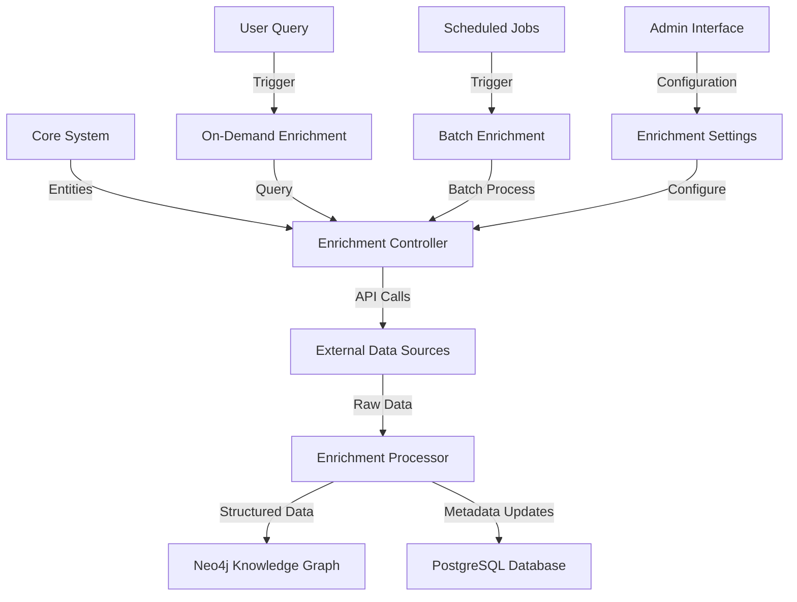

# Data Enrichment and Knowledge Graph Architecture

## Overview

This document outlines the architecture for data enrichment and knowledge graph integration in the CyberInsightHub platform. It focuses on how external data sources and services can be used to enhance the value of cybersecurity report content, with specific attention to the integration of Neo4j for relationship modeling and Diffbot (or similar services) for entity enrichment.

## System Architecture



## Components

### 1. Entity Extraction and Recognition System

**Technologies:**
- Named Entity Recognition (NER) models
- Cybersecurity-specific entity extractors
- Pattern matching for technical identifiers

**Entity Types:**
- Threat Actors (APT groups, criminal organizations)
- Malware Families
- Attack Techniques (mapped to MITRE ATT&CK)
- Vulnerabilities (CVEs)
- Industry Sectors
- Geographic Regions
- Technology Products and Vendors
- Security Controls and Mitigations

**Implementation:**

```javascript
// Entity extraction service
class EntityExtractionService {
  constructor(models, customPatterns) {
    this.models = models;
    this.customPatterns = customPatterns;
  }
  
  // Extract entities from text
  async extractEntities(text, documentContext = {}) {
    // Results container
    const entities = {
      threatActors: [],
      malware: [],
      techniques: [],
      vulnerabilities: [],
      industries: [],
      regions: [],
      products: [],
      controls: []
    };
    
    // Run general NER model
    const generalEntities = await this.models.generalNer.extract(text);
    
    // Run cybersecurity-specific NER
    const cyberEntities = await this.models.cyberNer.extract(text);
    
    // Apply custom pattern matching
    const patternEntities = this.applyPatternMatching(text);
    
    // Merge results with deduplication
    this.mergeEntities(entities, generalEntities);
    this.mergeEntities(entities, cyberEntities);
    this.mergeEntities(entities, patternEntities);
    
    // Context-based entity filtering and classification
    return this.refineEntities(entities, documentContext);
  }
  
  // Pattern matching for specialized entities
  applyPatternMatching(text) {
    const matches = {
      threatActors: [],
      malware: [],
      techniques: [],
      vulnerabilities: [],
      industries: [],
      regions: [],
      products: [],
      controls: []
    };
    
    // Apply CVE pattern matching
    const cveRegex = /CVE-\d{4}-\d{4,7}/g;
    const cveMatches = text.match(cveRegex) || [];
    cveMatches.forEach(cve => {
      matches.vulnerabilities.push({
        text: cve,
        type: 'vulnerability',
        subtype: 'cve',
        confidence: 1.0
      });
    });
    
    // Apply MITRE ATT&CK technique ID pattern matching
    const mitreRegex = /T\d{4}(\.\d{3})?/g;
    const mitreMatches = text.match(mitreRegex) || [];
    mitreMatches.forEach(technique => {
      matches.techniques.push({
        text: technique,
        type: 'technique',
        subtype: 'mitre_attack',
        confidence: 1.0
      });
    });
    
    // Apply custom patterns from configuration
    this.customPatterns.forEach(pattern => {
      const regex = new RegExp(pattern.regex, 'g');
      const patternMatches = text.match(regex) || [];
      
      patternMatches.forEach(match => {
        if (matches[pattern.category]) {
          matches[pattern.category].push({
            text: match,
            type: pattern.category,
            subtype: pattern.subtype,
            confidence: pattern.confidence || 0.8
          });
        }
      });
    });
    
    return matches;
  }
  
  // Merge entity results with deduplication
  mergeEntities(target, source) {
    Object.keys(source).forEach(category => {
      if (!target[category]) return;
      
      source[category].forEach(entity => {
        // Check if entity already exists
        const exists = target[category].some(
          e => e.text.toLowerCase() === entity.text.toLowerCase()
        );
        
        if (!exists) {
          target[category].push(entity);
        }
      });
    });
  }
  
  // Refine entities based on context
  refineEntities(entities, context) {
    // Apply context-specific rules
    if (context.publisher) {
      // Publisher-specific entity handling
      // ...
    }
    
    if (context.year) {
      // Time-based entity refinement
      // ...
    }
    
    return entities;
  }
}
```

### 2. External Enrichment Services Integration

**Technologies:**
- Diffbot Knowledge Graph API
- VirusTotal API
- MITRE CVE Database
- AlienVault OTX
- News and social media APIs
- OSINT sources

**Functionality:**
- Entity identity resolution
- Relationship discovery
- Temporal information
- Technical details and classifications
- Real-time intelligence updates

**Implementation:**

```javascript
// Enrichment service manager
class EnrichmentManager {
  constructor(config, dbClient) {
    this.config = config;
    this.db = dbClient;
    this.services = this.initializeServices();
  }
  
  // Initialize configured services
  initializeServices() {
    const services = {};
    
    if (this.config.diffbot?.enabled) {
      services.diffbot = new DiffbotEnrichmentService(
        this.config.diffbot.apiKey,
        this.config.diffbot.options
      );
    }
    
    if (this.config.virusTotal?.enabled) {
      services.virusTotal = new VirusTotalEnrichmentService(
        this.config.virusTotal.apiKey,
        this.config.virusTotal.options
      );
    }
    
    if (this.config.mitreCve?.enabled) {
      services.mitreCve = new MitreCveEnrichmentService(
        this.config.mitreCve.options
      );
    }
    
    if (this.config.alienVault?.enabled) {
      services.alienVault = new AlienVaultEnrichmentService(
        this.config.alienVault.apiKey,
        this.config.alienVault.options
      );
    }
    
    if (this.config.newsApi?.enabled) {
      services.newsApi = new NewsApiEnrichmentService(
        this.config.newsApi.apiKey,
        this.config.newsApi.options
      );
    }
    
    return services;
  }
  
  // Enrich a single entity
  async enrichEntity(entity, options = {}) {
    const results = {};
    const services = options.services || Object.keys(this.services);
    
    // Call each requested service
    for (const serviceName of services) {
      if (this.services[serviceName]) {
        try {
          results[serviceName] = await this.services[serviceName].enrichEntity(
            entity,
            options
          );
        } catch (error) {
          console.error(`Error with ${serviceName} enrichment:`, error);
          results[serviceName] = { error: error.message };
        }
      }
    }
    
    // Process and merge results
    const enriched = this.mergeEnrichmentResults(entity, results);
    
    // Store enrichment results
    await this.storeEnrichmentResults(entity, enriched);
    
    return enriched;
  }
  
  // Batch enrich multiple entities
  async batchEnrichEntities(entities, options = {}) {
    // Process in batches to avoid rate limits
    const batchSize = options.batchSize || 10;
    const results = [];
    
    for (let i = 0; i < entities.length; i += batchSize) {
      const batch = entities.slice(i, i + batchSize);
      const batchResults = await Promise.all(
        batch.map(entity => this.enrichEntity(entity, options))
      );
      
      results.push(...batchResults);
      
      // Respect rate limits with delay between batches
      if (i + batchSize < entities.length) {
        await new Promise(resolve => setTimeout(resolve, options.batchDelay || 1000));
      }
    }
    
    return results;
  }
  
  // Merge results from multiple enrichment services
  mergeEnrichmentResults(entity, serviceResults) {
    const merged = {
      id: entity.id,
      name: entity.text,
      type: entity.type,
      subtype: entity.subtype,
      enriched: true,
      enrichedAt: new Date(),
      sources: {},
      attributes: {},
      relationships: [],
      externalIds: {},
      references: []
    };
    
    // Process each service's results
    Object.keys(serviceResults).forEach(serviceName => {
      const result = serviceResults[serviceName];
      if (result.error) return;
      
      // Track source
      merged.sources[serviceName] = {
        timestamp: new Date(),
        confidence: result.confidence || 0.5
      };
      
      // Merge attributes
      if (result.attributes) {
        Object.keys(result.attributes).forEach(attr => {
          if (!merged.attributes[attr]) {
            merged.attributes[attr] = result.attributes[attr];
          }
        });
      }
      
      // Merge relationships
      if (result.relationships) {
        merged.relationships.push(
          ...result.relationships.map(rel => ({
            ...rel,
            source: serviceName
          }))
        );
      }
      
      // Merge external IDs
      if (result.externalIds) {
        Object.keys(result.externalIds).forEach(system => {
          merged.externalIds[system] = result.externalIds[system];
        });
      }
      
      // Merge references
      if (result.references) {
        merged.references.push(
          ...result.references.map(ref => ({
            ...ref,
            source: serviceName
          }))
        );
      }
    });
    
    return merged;
  }
  
  // Store enrichment results
  async storeEnrichmentResults(entity, enriched) {
    // Store in PostgreSQL
    const { data, error } = await this.db.from('entity_enrichments').upsert({
      entity_id: entity.id,
      enriched_data: enriched,
      last_updated: new Date()
    });
    
    if (error) throw error;
    
    // Return success indicator
    return { success: true, id: data[0].id };
  }
}

// Diffbot enrichment service implementation
class DiffbotEnrichmentService {
  constructor(apiKey, options = {}) {
    this.apiKey = apiKey;
    this.options = options;
    this.baseUrl = 'https://kg.diffbot.com/kg/v3';
  }
  
  // Enrich an entity using Diffbot Knowledge Graph
  async enrichEntity(entity, options = {}) {
    // Determine query type based on entity type
    let endpoint;
    let query;
    
    switch (entity.type.toLowerCase()) {
      case 'organization':
      case 'company':
        endpoint = 'organizations';
        query = entity.text;
        break;
      case 'person':
        endpoint = 'people';
        query = entity.text;
        break;
      case 'product':
        endpoint = 'products';
        query = entity.text;
        break;
      case 'location':
      case 'region':
        endpoint = 'locations';
        query = entity.text;
        break;
      default:
        endpoint = 'search';
        query = entity.text;
    }
    
    // Build request URL
    const url = new URL(`${this.baseUrl}/${endpoint}`);
    url.searchParams.append('token', this.apiKey);
    url.searchParams.append('query', query);
    url.searchParams.append('limit', options.limit || 1);
    
    // Additional parameters
    if (options.type) {
      url.searchParams.append('type', options.type);
    }
    
    // Make API request
    const response = await fetch(url.toString());
    
    if (!response.ok) {
      throw new Error(`Diffbot API error: ${response.status} ${response.statusText}`);
    }
    
    const data = await response.json();
    
    // Process and transform the response
    return this.processDiffbotResponse(entity, data);
  }
  
  // Process Diffbot response into standard format
  processDiffbotResponse(entity, response) {
    // No results
    if (!response.data || response.data.length === 0) {
      return {
        confidence: 0,
        attributes: {},
        relationships: [],
        externalIds: {},
        references: []
      };
    }
    
    // Get the most relevant result
    const result = response.data[0];
    
    // Calculate confidence based on name similarity
    const confidence = this.calculateNameSimilarity(entity.text, result.name);
    
    // Extract attributes based on entity type
    const attributes = {};
    
    // Common attributes
    if (result.description) {
      attributes.description = result.description;
    }
    
    if (result.images && result.images.length > 0) {
      attributes.imageUrl = result.images[0].url;
    }
    
    // Type-specific attributes
    switch (entity.type.toLowerCase()) {
      case 'organization':
      case 'company':
        if (result.foundingDate) attributes.foundingDate = result.foundingDate;
        if (result.industries) attributes.industries = result.industries;
        if (result.location) attributes.headquarters = result.location;
        if (result.size) attributes.size = result.size;
        break;
      case 'person':
        if (result.title) attributes.title = result.title;
        if (result.employment) attributes.employment = result.employment;
        if (result.education) attributes.education = result.education;
        break;
      // Add other type-specific processing
    }
    
    // Extract relationships
    const relationships = [];
    
    // Extract external IDs
    const externalIds = {};
    if (result.diffbotUri) {
      externalIds.diffbot = result.diffbotUri;
    }
    if (result.type) {
      externalIds.type = result.type;
    }
    
    // References
    const references = [];
    if (result.websiteUrls) {
      result.websiteUrls.forEach(url => {
        references.push({
          type: 'website',
          url: url
        });
      });
    }
    
    return {
      confidence,
      attributes,
      relationships,
      externalIds,
      references
    };
  }
  
  // Calculate confidence based on name similarity
  calculateNameSimilarity(entityName, resultName) {
    // Simple case-insensitive exact match
    if (entityName.toLowerCase() === resultName.toLowerCase()) {
      return 1.0;
    }
    
    // Contains check
    if (resultName.toLowerCase().includes(entityName.toLowerCase())) {
      return 0.8;
    }
    
    // Levenshtein distance based confidence
    const distance = this.levenshteinDistance(
      entityName.toLowerCase(),
      resultName.toLowerCase()
    );
    const maxLength = Math.max(entityName.length, resultName.length);
    const similarity = 1 - (distance / maxLength);
    
    // Threshold at 0.5
    return Math.max(similarity, 0.5);
  }
  
  // Calculate Levenshtein distance between two strings
  levenshteinDistance(a, b) {
    if (a.length === 0) return b.length;
    if (b.length === 0) return a.length;
    
    const matrix = [];
    
    for (let i = 0; i <= b.length; i++) {
      matrix[i] = [i];
    }
    
    for (let j = 0; j <= a.length; j++) {
      matrix[0][j] = j;
    }
    
    for (let i = 1; i <= b.length; i++) {
      for (let j = 1; j <= a.length; j++) {
        const cost = a[j - 1] === b[i - 1] ? 0 : 1;
        matrix[i][j] = Math.min(
          matrix[i - 1][j] + 1,
          matrix[i][j - 1] + 1,
          matrix[i - 1][j - 1] + cost
        );
      }
    }
    
    return matrix[b.length][a.length];
  }
}
```

### 3. Neo4j Knowledge Graph Implementation

**Technologies:**
- Neo4j Graph Database
- Cypher Query Language
- Neo4j-JavaScript Driver
- Graph Data Science Library

**Functionality:**
- Entity relationship modeling
- Temporal relationship tracking
- Centrality and significance analysis
- Community detection
- Shortest path analysis
- Recommendation engine

**Implementation:**

```javascript
// Neo4j Knowledge Graph Service
class KnowledgeGraphService {
  constructor(uri, username, password) {
    this.driver = neo4j.driver(uri, neo4j.auth.basic(username, password));
  }
  
  // Close Neo4j connection
  close() {
    this.driver.close();
  }
  
  // Add a report to the knowledge graph
  async addReport(report) {
    const session = this.driver.session();
    
    try {
      // Create report node
      const result = await session.run(`
        CREATE (r:Report {
          id: $id,
          title: $title,
          publisher: $publisher,
          year: $year,
          date: $date,
          type: $type
        })
        RETURN r
      `, {
        id: report.id,
        title: report.title,
        publisher: report.publisher,
        year: report.publish_year,
        date: report.publish_date ? report.publish_date.toISOString() : null,
        type: report.report_type
      });
      
      return result.records[0].get('r').properties;
    } finally {
      await session.close();
    }
  }
  
  // Add an entity to the knowledge graph
  async addEntity(entity) {
    const session = this.driver.session();
    
    try {
      // Determine labels based on entity type and subtype
      const labels = this.getEntityLabels(entity.type, entity.subtype);
      
      // Create entity node with appropriate labels
      const result = await session.run(`
        MERGE (e:Entity${labels.join('')} {
          id: $id,
          name: $name
        })
        ON CREATE SET
          e.created = datetime(),
          e.type = $type,
          e.subtype = $subtype,
          e.confidence = $confidence
        ON MATCH SET
          e.updated = datetime(),
          e.confidence = CASE
            WHEN $confidence > e.confidence THEN $confidence
            ELSE e.confidence
          END
        RETURN e
      `, {
        id: entity.id,
        name: entity.text,
        type: entity.type,
        subtype: entity.subtype || '',
        confidence: entity.confidence || 0.5
      });
      
      return result.records[0].get('e').properties;
    } finally {
      await session.close();
    }
  }
  
  // Create a relationship between a report and an entity
  async createReportEntityRelationship(reportId, entity, context) {
    const session = this.driver.session();
    
    try {
      // Create the MENTIONS relationship
      const result = await session.run(`
        MATCH (r:Report {id: $reportId})
        MATCH (e:Entity {id: $entityId})
        MERGE (r)-[rel:MENTIONS]->(e)
        ON CREATE SET
          rel.created = datetime(),
          rel.count = 1,
          rel.confidence = $confidence,
          rel.contexts = [$context]
        ON MATCH SET
          rel.updated = datetime(),
          rel.count = rel.count + 1,
          rel.confidence = CASE
            WHEN $confidence > rel.confidence THEN $confidence
            ELSE rel.confidence
          END,
          rel.contexts = CASE
            WHEN size(rel.contexts) < 5 THEN rel.contexts + $context
            ELSE rel.contexts
          END
        RETURN rel
      `, {
        reportId: reportId,
        entityId: entity.id,
        confidence: entity.confidence || 0.5,
        context: context || ''
      });
      
      return result.records[0].get('rel').properties;
    } finally {
      await session.close();
    }
  }
  
  // Create a relationship between two entities
  async createEntityRelationship(sourceId, targetId, relationType, properties = {}) {
    const session = this.driver.session();
    
    try {
      // Dynamic relationship type creation
      const result = await session.run(`
        MATCH (source:Entity {id: $sourceId})
        MATCH (target:Entity {id: $targetId})
        MERGE (source)-[rel:${relationType}]->(target)
        ON CREATE SET
          rel.created = datetime(),
          rel += $properties
        ON MATCH SET
          rel.updated = datetime(),
          rel += $properties
        RETURN rel
      `, {
        sourceId: sourceId,
        targetId: targetId,
        properties: properties
      });
      
      return result.records[0].get('rel').properties;
    } finally {
      await session.close();
    }
  }
  
  // Add enrichment data to an entity
  async addEntityEnrichment(entityId, enrichment) {
    const session = this.driver.session();
    
    try {
      // Update entity with enrichment data
      const result = await session.run(`
        MATCH (e:Entity {id: $entityId})
        SET e.enriched = true,
            e.enrichedAt = datetime(),
            e.attributes = $attributes,
            e.externalIds = $externalIds
        RETURN e
      `, {
        entityId: entityId,
        attributes: enrichment.attributes || {},
        externalIds: enrichment.externalIds || {}
      });
      
      // Add references as nodes
      if (enrichment.references && enrichment.references.length > 0) {
        await this.addEntityReferences(entityId, enrichment.references);
      }
      
      // Add relationships from enrichment
      if (enrichment.relationships && enrichment.relationships.length > 0) {
        await this.addEnrichmentRelationships(entityId, enrichment.relationships);
      }
      
      return result.records[0].get('e').properties;
    } finally {
      await session.close();
    }
  }
  
  // Add reference nodes for an entity
  async addEntityReferences(entityId, references) {
    const session = this.driver.session();
    
    try {
      for (const reference of references) {
        await session.run(`
          MATCH (e:Entity {id: $entityId})
          MERGE (r:Reference {url: $url})
          ON CREATE SET
            r.type = $type,
            r.source = $source,
            r.created = datetime()
          MERGE (e)-[rel:HAS_REFERENCE]->(r)
          ON CREATE SET
            rel.created = datetime()
          ON MATCH SET
            rel.updated = datetime()
        `, {
          entityId: entityId,
          url: reference.url,
          type: reference.type,
          source: reference.source
        });
      }
      
      return { success: true };
    } finally {
      await session.close();
    }
  }
  
  // Add relationships from enrichment data
  async addEnrichmentRelationships(entityId, relationships) {
    const session = this.driver.session();
    
    try {
      for (const relationship of relationships) {
        // Find or create the target entity
        const targetResult = await session.run(`
          MERGE (target:Entity {name: $targetName})
          ON CREATE SET
            target.created = datetime(),
            target.type = $targetType,
            target.enriched = false
          RETURN target
        `, {
          targetName: relationship.target,
          targetType: relationship.targetType
        });
        
        const targetNode = targetResult.records[0].get('target');
        
        // Create the relationship
        await session.run(`
          MATCH (source:Entity {id: $sourceId})
          MATCH (target) WHERE id(target) = $targetId
          MERGE (source)-[rel:${relationship.type}]->(target)
          ON CREATE SET
            rel.created = datetime(),
            rel.source = $source,
            rel.confidence = $confidence
          ON MATCH SET
            rel.updated = datetime(),
            rel.confidence = CASE
              WHEN $confidence > rel.confidence THEN $confidence
              ELSE rel.confidence
            END
        `, {
          sourceId: entityId,
          targetId: targetNode.identity.toString(),
          source: relationship.source,
          confidence: relationship.confidence || 0.5
        });
      }
      
      return { success: true };
    } finally {
      await session.close();
    }
  }
  
  // Get related entities for an entity
  async getRelatedEntities(entityId, options = {}) {
    const session = this.driver.session();
    
    try {
      // Default parameters
      const limit = options.limit || 10;
      const relationshipTypes = options.relationshipTypes || [];
      const entityTypes = options.entityTypes || [];
      
      // Build relationship filter
      let relFilter = '';
      if (relationshipTypes.length > 0) {
        relFilter = `type(rel) IN [${relationshipTypes.map(t => `'${t}'`).join(', ')}]`;
      }
      
      // Build entity type filter
      let entityFilter = '';
      if (entityTypes.length > 0) {
        entityFilter = `AND (${entityTypes.map(t => `related:${t}`).join(' OR ')})`;
      }
      
      // Execute query
      const result = await session.run(`
        MATCH (e:Entity {id: $entityId})-[rel]->(related:Entity)
        WHERE ${relFilter || 'true'} ${entityFilter}
        RETURN related, type(rel) AS relationType, rel.confidence AS confidence
        ORDER BY rel.confidence DESC
        LIMIT $limit
      `, {
        entityId: entityId,
        limit: limit
      });
      
      // Process results
      return result.records.map(record => ({
        entity: record.get('related').properties,
        relationType: record.get('relationType'),
        confidence: record.get('confidence')
      }));
    } finally {
      await session.close();
    }
  }
  
  // Get entities mentioned in the same reports
  async getCoOccurringEntities(entityId, options = {}) {
    const session = this.driver.session();
    
    try {
      const limit = options.limit || 10;
      const minCoOccurrences = options.minCoOccurrences || 1;
      const years = options.years || [];
      
      // Build year filter
      let yearFilter = '';
      if (years.length > 0) {
        yearFilter = `AND r.year IN [${years.join(', ')}]`;
      }
      
      // Execute query
      const result = await session.run(`
        MATCH (e:Entity {id: $entityId})<-[:MENTIONS]-(r:Report)-[:MENTIONS]->(related:Entity)
        WHERE e <> related ${yearFilter}
        WITH related, count(r) AS occurrences
        WHERE occurrences >= $minCoOccurrences
        RETURN related, occurrences
        ORDER BY occurrences DESC
        LIMIT $limit
      `, {
        entityId: entityId,
        minCoOccurrences: minCoOccurrences,
        limit: limit
      });
      
      // Process results
      return result.records.map(record => ({
        entity: record.get('related').properties,
        occurrences: record.get('occurrences').toNumber()
      }));
    } finally {
      await session.close();
    }
  }
  
  // Get the shortest path between two entities
  async getShortestPath(sourceId, targetId, options = {}) {
    const session = this.driver.session();
    
    try {
      const maxDepth = options.maxDepth || 5;
      
      // Execute query
      const result = await session.run(`
        MATCH path = shortestPath((source:Entity {id: $sourceId})-[*1..$maxDepth]-(target:Entity {id: $targetId}))
        RETURN path
      `, {
        sourceId: sourceId,
        targetId: targetId,
        maxDepth: maxDepth
      });
      
      // No path found
      if (result.records.length === 0) {
        return null;
      }
      
      // Process path
      const path = result.records[0].get('path');
      
      // Extract nodes and relationships
      const nodes = path.segments.map(s => s.start).concat([path.segments[path.segments.length - 1].end]);
      const relationships = path.segments.map(s => s.relationship);
      
      return {
        length: path.segments.length,
        nodes: nodes.map(n => n.properties),
        relationships: relationships.map(r => ({
          type: r.type,
          properties: r.properties
        }))
      };
    } finally {
      await session.close();
    }
  }
  
  // Get entity data by ID
  async getEntityById(entityId) {
    const session = this.driver.session();
    
    try {
      const result = await session.run(`
        MATCH (e:Entity {id: $entityId})
        OPTIONAL MATCH (e)-[rel:HAS_REFERENCE]->(r:Reference)
        RETURN e, collect(r) AS references
      `, {
        entityId: entityId
      });
      
      if (result.records.length === 0) {
        return null;
      }
      
      const record = result.records[0];
      const entity = record.get('e').properties;
      const references = record.get('references').map(r => r.properties);
      
      return {
        ...entity,
        references
      };
    } finally {
      await session.close();
    }
  }
  
  // Search entities by name, type, and attributes
  async searchEntities(query, options = {}) {
    const session = this.driver.session();
    
    try {
      const limit = options.limit || 20;
      const types = options.types || [];
      const exactMatch = options.exactMatch || false;
      
      // Build type filter
      let typeFilter = '';
      if (types.length > 0) {
        typeFilter = `AND e.type IN [${types.map(t => `'${t}'`).join(', ')}]`;
      }
      
      // Build name matching condition
      let nameCondition;
      if (exactMatch) {
        nameCondition = `e.name = $query`;
      } else {
        nameCondition = `e.name CONTAINS $query OR toLower(e.name) CONTAINS toLower($query)`;
      }
      
      // Execute query
      const result = await session.run(`
        MATCH (e:Entity)
        WHERE (${nameCondition}) ${typeFilter}
        RETURN e, score(e) AS relevance
        ORDER BY relevance DESC
        LIMIT $limit
      `, {
        query: query,
        limit: limit
      });
      
      // Process results
      return result.records.map(record => ({
        entity: record.get('e').properties,
        relevance: record.get('relevance')
      }));
    } finally {
      await session.close();
    }
  }
  
  // Get entity centrality in the knowledge graph
  async getEntityCentrality(options = {}) {
    const session = this.driver.session();
    
    try {
      const limit = options.limit || 20;
      const algorithm = options.algorithm || 'pagerank';
      const types = options.types || [];
      
      // Build type filter
      let typeFilter = '';
      if (types.length > 0) {
        typeFilter = `WHERE e.type IN [${types.map(t => `'${t}'`).join(', ')}]`;
      }
      
      // Execute appropriate centrality algorithm
      let query;
      
      if (algorithm === 'pagerank') {
        query = `
          CALL gds.pageRank.stream('entity-graph')
          YIELD nodeId, score
          MATCH (e:Entity) WHERE id(e) = nodeId
          ${typeFilter}
          RETURN e.id AS id, e.name AS name, e.type AS type, score
          ORDER BY score DESC
          LIMIT $limit
        `;
      } else if (algorithm === 'betweenness') {
        query = `
          CALL gds.betweenness.stream('entity-graph')
          YIELD nodeId, score
          MATCH (e:Entity) WHERE id(e) = nodeId
          ${typeFilter}
          RETURN e.id AS id, e.name AS name, e.type AS type, score
          ORDER BY score DESC
          LIMIT $limit
        `;
      } else if (algorithm === 'degree') {
        query = `
          CALL gds.degree.stream('entity-graph')
          YIELD nodeId, score
          MATCH (e:Entity) WHERE id(e) = nodeId
          ${typeFilter}
          RETURN e.id AS id, e.name AS name, e.type AS type, score
          ORDER BY score DESC
          LIMIT $limit
        `;
      } else {
        throw new Error(`Unsupported centrality algorithm: ${algorithm}`);
      }
      
      const result = await session.run(query, { limit });
      
      // Process results
      return result.records.map(record => ({
        id: record.get('id'),
        name: record.get('name'),
        type: record.get('type'),
        centrality: record.get('score')
      }));
    } finally {
      await session.close();
    }
  }
  
  // Helper to determine Neo4j labels from entity type
  getEntityLabels(type, subtype) {
    const labels = [];
    
    switch (type.toLowerCase()) {
      case 'threatactor':
        labels.push(':ThreatActor');
        break;
      case 'malware':
        labels.push(':Malware');
        break;
      case 'vulnerability':
        labels.push(':Vulnerability');
        break;
      case 'technique':
        labels.push(':Technique');
        if (subtype?.toLowerCase() === 'mitre_attack') {
          labels.push(':MitreAttack');
        }
        break;
      case 'industry':
        labels.push(':Industry');
        break;
      case 'country':
      case 'region':
        labels.push(':Location');
        break;
      case 'product':
        labels.push(':Product');
        break;
    }
    
    return labels;
  }
}
```

### 4. Enrichment Jobs and Scheduling

**Technologies:**
- Bull Queue for job management
- Redis for queue backend
- Cron for scheduling

**Functionality:**
- Scheduled batch enrichment
- On-demand enrichment
- Error handling and retries
- Rate limiting
- Priority queuing

**Implementation:**

```javascript
// Enrichment job queue
class EnrichmentJobQueue {
  constructor(redis, enrichmentManager) {
    this.enrichmentManager = enrichmentManager;
    
    // Initialize queues
    this.entityQueue = new Bull('entity-enrichment', {
      redis,
      defaultJobOptions: {
        attempts: 3,
        backoff: {
          type: 'exponential',
          delay: 1000
        }
      }
    });
    
    this.reportQueue = new Bull('report-enrichment', {
      redis,
      defaultJobOptions: {
        attempts: 2,
        backoff: {
          type: 'exponential',
          delay: 2000
        }
      }
    });
    
    // Set up processors
    this.setupProcessors();
    
    // Set up schedulers
    this.setupSchedulers();
  }
  
  // Set up job processors
  setupProcessors() {
    // Process entity enrichment jobs
    this.entityQueue.process(async (job) => {
      const { entity, options } = job.data;
      
      try {
        // Perform enrichment
        const enriched = await this.enrichmentManager.enrichEntity(entity, options);
        
        // Return result
        return { success: true, entityId: entity.id, enriched };
      } catch (error) {
        console.error(`Error enriching entity ${entity.id}:`, error);
        throw error; // Will trigger retry mechanism
      }
    });
    
    // Process report enrichment jobs
    this.reportQueue.process(async (job) => {
      const { reportId, options } = job.data;
      
      try {
        // Get report entities
        const entities = await this.getReportEntities(reportId);
        
        // Enrich each entity
        const results = [];
        for (const entity of entities) {
          // Add to entity queue with higher priority
          const job = await this.entityQueue.add(
            { entity, options },
            { priority: 1 }
          );
          
          // Wait for job completion
          const result = await job.finished();
          results.push(result);
        }
        
        // Return results
        return { success: true, reportId, enriched: results.length };
      } catch (error) {
        console.error(`Error enriching report ${reportId}:`, error);
        throw error;
      }
    });
  }
  
  // Set up scheduled jobs
  setupSchedulers() {
    // Schedule batch enrichment for high-priority entities
    this.entityQueue.add(
      { type: 'batch', entityType: 'threatactor' },
      {
        repeat: { cron: '0 0 * * *' }, // Daily at midnight
        jobId: 'daily-threatactor-enrichment'
      }
    );
    
    // Schedule batch enrichment for vulnerabilities
    this.entityQueue.add(
      { type: 'batch', entityType: 'vulnerability' },
      {
        repeat: { cron: '0 2 * * *' }, // Daily at 2 AM
        jobId: 'daily-vulnerability-enrichment'
      }
    );
    
    // Schedule weekly full refresh of entities
    this.entityQueue.add(
      { type: 'refresh-all' },
      {
        repeat: { cron: '0 0 * * 0' }, // Weekly on Sunday
        jobId: 'weekly-entity-refresh'
      }
    );
  }
  
  // Queue entity enrichment
  async queueEntityEnrichment(entity, options = {}, priority = 5) {
    const job = await this.entityQueue.add(
      { entity, options },
      { priority }
    );
    
    return { jobId: job.id };
  }
  
  // Queue batch entity enrichment
  async queueBatchEntityEnrichment(entities, options = {}, priority = 10) {
    const jobs = [];
    
    for (const entity of entities) {
      const job = await this.entityQueue.add(
        { entity, options },
        { priority }
      );
      
      jobs.push(job.id);
    }
    
    return { jobIds: jobs };
  }
  
  // Queue report enrichment
  async queueReportEnrichment(reportId, options = {}) {
    const job = await this.reportQueue.add({ reportId, options });
    return { jobId: job.id };
  }
  
  // Get entities for a report
  async getReportEntities(reportId) {
    // Implementation depends on your specific database setup
    // Example using Supabase:
    const { data, error } = await supabase
      .from('report_entities')
      .select('*')
      .eq('report_id', reportId);
      
    if (error) throw error;
    return data;
  }
  
  // Get job status
  async getJobStatus(queueName, jobId) {
    const queue = queueName === 'entity' ? this.entityQueue : this.reportQueue;
    const job = await queue.getJob(jobId);
    
    if (!job) {
      return { exists: false };
    }
    
    const state = await job.getState();
    
    return {
      exists: true,
      id: job.id,
      state,
      progress: job.progress,
      attempts: job.attemptsMade,
      created: job.timestamp,
      finished: job.finishedOn,
      data: job.data
    };
  }
  
  // Clean completed jobs
  async cleanCompletedJobs() {
    await this.entityQueue.clean(24 * 60 * 60 * 1000, 'completed');
    await this.reportQueue.clean(24 * 60 * 60 * 1000, 'completed');
  }
}
```

### 5. Admin Interface for Enrichment Configuration

**Technologies:**
- React Admin Components
- Supabase Backend
- Configuration Management

**Functionality:**
- API key management
- Service enabling/disabling
- Service configuration
- Enrichment job monitoring
- Manual enrichment triggering

**Implementation:**

```javascript
// React component for enrichment configuration
import React, { useState, useEffect } from 'react';
import {
  Card,
  CardContent,
  CardHeader,
  Tabs,
  Tab,
  Box,
  Switch,
  FormControlLabel,
  TextField,
  Button,
  Alert,
  CircularProgress,
  Typography,
  Divider,
  IconButton,
  Tooltip
} from '@mui/material';
import {
  Save as SaveIcon,
  Refresh as RefreshIcon,
  Delete as DeleteIcon,
  Add as AddIcon,
  Play as RunIcon,
  Settings as SettingsIcon
} from '@mui/icons-material';

// Enrichment Configuration Component
const EnrichmentConfig = ({ supabase }) => {
  // State
  const [activeTab, setActiveTab] = useState(0);
  const [config, setConfig] = useState({});
  const [isLoading, setIsLoading] = useState(true);
  const [isSaving, setIsSaving] = useState(false);
  const [saveError, setSaveError] = useState(null);
  const [saveSuccess, setSaveSuccess] = useState(false);
  
  // Tabs
  const tabs = [
    { label: 'General', value: 0 },
    { label: 'Diffbot', value: 1 },
    { label: 'VirusTotal', value: 2 },
    { label: 'MITRE CVE', value: 3 },
    { label: 'AlienVault', value: 4 },
    { label: 'News API', value: 5 },
    { label: 'Scheduling', value: 6 }
  ];
  
  // Load configuration
  useEffect(() => {
    loadConfig();
  }, []);
  
  // Load configuration from Supabase
  const loadConfig = async () => {
    setIsLoading(true);
    
    try {
      const { data, error } = await supabase
        .from('system_config')
        .select('*')
        .eq('config_key', 'enrichment_services')
        .single();
        
      if (error) throw error;
      
      setConfig(data.config_value || {});
    } catch (error) {
      console.error('Error loading configuration:', error);
      // Set default config if none exists
      setConfig({
        general: {
          enabled: true,
          maxConcurrentJobs: 5,
          defaultBatchSize: 10,
          enrichNewEntities: true
        },
        diffbot: {
          enabled: false,
          apiKey: '',
          options: {
            limit: 1
          }
        },
        virusTotal: {
          enabled: false,
          apiKey: '',
          options: {}
        },
        mitreCve: {
          enabled: true,
          options: {
            updateFrequency: 'daily'
          }
        },
        alienVault: {
          enabled: false,
          apiKey: '',
          options: {}
        },
        newsApi: {
          enabled: false,
          apiKey: '',
          options: {
            sources: []
          }
        },
        scheduling: {
          entities: {
            threatactors: { frequency: 'daily', time: '00:00' },
            vulnerabilities: { frequency: 'daily', time: '02:00' },
            malware: { frequency: 'weekly', time: '03:00', day: 'Monday' }
          },
          reports: {
            newReports: { enabled: true },
            allReports: { frequency: 'weekly', time: '01:00', day: 'Sunday' }
          }
        }
      });
    } finally {
      setIsLoading(false);
    }
  };
  
  // Save configuration
  const saveConfig = async () => {
    setIsSaving(true);
    setSaveError(null);
    setSaveSuccess(false);
    
    try {
      const { data, error } = await supabase
        .from('system_config')
        .upsert({
          config_key: 'enrichment_services',
          config_value: config,
          updated_at: new Date()
        }, {
          onConflict: 'config_key'
        });
        
      if (error) throw error;
      
      setSaveSuccess(true);
      setTimeout(() => setSaveSuccess(false), 3000);
    } catch (error) {
      console.error('Error saving configuration:', error);
      setSaveError(error.message);
    } finally {
      setIsSaving(false);
    }
  };
  
  // Handle tab change
  const handleTabChange = (event, newValue) => {
    setActiveTab(newValue);
  };
  
  // Handle input change
  const handleInputChange = (section, field, value) => {
    setConfig({
      ...config,
      [section]: {
        ...config[section],
        [field]: value
      }
    });
  };
  
  // Handle nested input change
  const handleNestedInputChange = (section, parent, field, value) => {
    setConfig({
      ...config,
      [section]: {
        ...config[section],
        [parent]: {
          ...config[section][parent],
          [field]: value
        }
      }
    });
  };
  
  // Run manual enrichment job
  const runManualEnrichment = async (type, params) => {
    try {
      const { data, error } = await supabase
        .rpc('trigger_enrichment_job', {
          job_type: type,
          job_params: params
        });
        
      if (error) throw error;
      
      alert(`Job started successfully: ${data.job_id}`);
    } catch (error) {
      console.error('Error starting job:', error);
      alert(`Error starting job: ${error.message}`);
    }
  };
  
  // Render general configuration
  const renderGeneralConfig = () => (
    <Box>
      <Typography variant="h6" gutterBottom>
        General Settings
      </Typography>
      
      <FormControlLabel
        control={
          <Switch
            checked={config.general?.enabled || false}
            onChange={(e) => handleInputChange('general', 'enabled', e.target.checked)}
          />
        }
        label="Enable Enrichment Services"
      />
      
      <TextField
        fullWidth
        margin="normal"
        label="Max Concurrent Jobs"
        type="number"
        value={config.general?.maxConcurrentJobs || 5}
        onChange={(e) => handleInputChange('general', 'maxConcurrentJobs', parseInt(e.target.value))}
      />
      
      <TextField
        fullWidth
        margin="normal"
        label="Default Batch Size"
        type="number"
        value={config.general?.defaultBatchSize || 10}
        onChange={(e) => handleInputChange('general', 'defaultBatchSize', parseInt(e.target.value))}
      />
      
      <FormControlLabel
        control={
          <Switch
            checked={config.general?.enrichNewEntities || false}
            onChange={(e) => handleInputChange('general', 'enrichNewEntities', e.target.checked)}
          />
        }
        label="Automatically Enrich New Entities"
      />
      
      <Divider sx={{ my: 3 }} />
      
      <Typography variant="h6" gutterBottom>
        Manual Enrichment
      </Typography>
      
      <Box sx={{ display: 'flex', gap: 2, mt: 2 }}>
        <Button
          variant="contained"
          startIcon={<RunIcon />}
          onClick={() => runManualEnrichment('refresh_all_entities', {})}
        >
          Refresh All Entities
        </Button>
        
        <Button
          variant="contained"
          startIcon={<RunIcon />}
          onClick={() => runManualEnrichment('refresh_vulnerabilities', {})}
        >
          Refresh Vulnerabilities
        </Button>
        
        <Button
          variant="contained"
          startIcon={<RunIcon />}
          onClick={() => runManualEnrichment('refresh_threatactors', {})}
        >
          Refresh Threat Actors
        </Button>
      </Box>
    </Box>
  );
  
  // Render service configuration template
  const renderServiceConfig = (serviceName, serviceConfig, fields) => (
    <Box>
      <Typography variant="h6" gutterBottom>
        {serviceName} Configuration
      </Typography>
      
      <FormControlLabel
        control={
          <Switch
            checked={serviceConfig?.enabled || false}
            onChange={(e) => handleInputChange(serviceName.toLowerCase(), 'enabled', e.target.checked)}
          />
        }
        label={`Enable ${serviceName}`}
      />
      
      {fields.map((field) => (
        <TextField
          key={field.name}
          fullWidth
          margin="normal"
          label={field.label}
          type={field.type || 'text'}
          value={serviceConfig?.[field.name] || ''}
          onChange={(e) => handleInputChange(serviceName.toLowerCase(), field.name, e.target.value)}
          InputProps={{
            endAdornment: field.name === 'apiKey' && (
              <Tooltip title="Delete API Key">
                <IconButton
                  onClick={() => handleInputChange(serviceName.toLowerCase(), 'apiKey', '')}
                >
                  <DeleteIcon />
                </IconButton>
              </Tooltip>
            )
          }}
        />
      ))}
      
      <Divider sx={{ my: 3 }} />
      
      <Typography variant="h6" gutterBottom>
        {serviceName} Options
      </Typography>
      
      {/* Service-specific options */}
      {serviceName === 'Diffbot' && (
        <>
          <TextField
            fullWidth
            margin="normal"
            label="Result Limit"
            type="number"
            value={serviceConfig?.options?.limit || 1}
            onChange={(e) => handleNestedInputChange(
              serviceName.toLowerCase(),
              'options',
              'limit',
              parseInt(e.target.value)
            )}
          />
        </>
      )}
      
      {serviceName === 'News API' && (
        <>
          <Typography variant="subtitle2" gutterBottom>
            News Sources
          </Typography>
          
          {(serviceConfig?.options?.sources || []).map((source, index) => (
            <Box key={index} sx={{ display: 'flex', gap: 1, mb: 1 }}>
              <TextField
                fullWidth
                size="small"
                value={source}
                onChange={(e) => {
                  const newSources = [...(serviceConfig?.options?.sources || [])];
                  newSources[index] = e.target.value;
                  handleNestedInputChange(
                    serviceName.toLowerCase(),
                    'options',
                    'sources',
                    newSources
                  );
                }}
              />
              <IconButton
                color="error"
                onClick={() => {
                  const newSources = [...(serviceConfig?.options?.sources || [])];
                  newSources.splice(index, 1);
                  handleNestedInputChange(
                    serviceName.toLowerCase(),
                    'options',
                    'sources',
                    newSources
                  );
                }}
              >
                <DeleteIcon />
              </IconButton>
            </Box>
          ))}
          
          <Button
            startIcon={<AddIcon />}
            onClick={() => {
              const newSources = [...(serviceConfig?.options?.sources || []), ''];
              handleNestedInputChange(
                serviceName.toLowerCase(),
                'options',
                'sources',
                newSources
              );
            }}
          >
            Add Source
          </Button>
        </>
      )}
      
      <Box sx={{ display: 'flex', gap: 2, mt: 3 }}>
        <Button
          variant="contained"
          startIcon={<RunIcon />}
          onClick={() => runManualEnrichment(`test_${serviceName.toLowerCase()}`, {})}
          disabled={!serviceConfig?.enabled || !serviceConfig?.apiKey}
        >
          Test Connection
        </Button>
      </Box>
    </Box>
  );
  
  // Render Diffbot configuration
  const renderDiffbotConfig = () => (
    renderServiceConfig('Diffbot', config.diffbot, [
      { name: 'apiKey', label: 'API Key' }
    ])
  );
  
  // Render VirusTotal configuration
  const renderVirusTotalConfig = () => (
    renderServiceConfig('VirusTotal', config.virusTotal, [
      { name: 'apiKey', label: 'API Key' }
    ])
  );
  
  // Render MITRE CVE configuration
  const renderMitreCveConfig = () => (
    <Box>
      <Typography variant="h6" gutterBottom>
        MITRE CVE Configuration
      </Typography>
      
      <FormControlLabel
        control={
          <Switch
            checked={config.mitreCve?.enabled || false}
            onChange={(e) => handleInputChange('mitreCve', 'enabled', e.target.checked)}
          />
        }
        label="Enable MITRE CVE"
      />
      
      <TextField
        select
        fullWidth
        margin="normal"
        label="Update Frequency"
        value={config.mitreCve?.options?.updateFrequency || 'daily'}
        onChange={(e) => handleNestedInputChange('mitreCve', 'options', 'updateFrequency', e.target.value)}
        SelectProps={{ native: true }}
      >
        <option value="hourly">Hourly</option>
        <option value="daily">Daily</option>
        <option value="weekly">Weekly</option>
      </TextField>
      
      <Box sx={{ display: 'flex', gap: 2, mt: 3 }}>
        <Button
          variant="contained"
          startIcon={<RefreshIcon />}
          onClick={() => runManualEnrichment('refresh_cve_database', {})}
        >
          Refresh CVE Database
        </Button>
      </Box>
    </Box>
  );
  
  // Render AlienVault configuration
  const renderAlienVaultConfig = () => (
    renderServiceConfig('AlienVault', config.alienVault, [
      { name: 'apiKey', label: 'API Key' }
    ])
  );
  
  // Render News API configuration
  const renderNewsApiConfig = () => (
    renderServiceConfig('NewsApi', config.newsApi, [
      { name: 'apiKey', label: 'API Key' }
    ])
  );
  
  // Render scheduling configuration
  const renderSchedulingConfig = () => (
    <Box>
      <Typography variant="h6" gutterBottom>
        Entity Enrichment Schedule
      </Typography>
      
      {Object.entries(config.scheduling?.entities || {}).map(([entityType, schedule]) => (
        <Box key={entityType} sx={{ mb: 3 }}>
          <Typography variant="subtitle1" gutterBottom>
            {entityType.charAt(0).toUpperCase() + entityType.slice(1)}
          </Typography>
          
          <Box sx={{ display: 'flex', gap: 2 }}>
            <TextField
              select
              label="Frequency"
              value={schedule.frequency}
              onChange={(e) => handleNestedInputChange(
                'scheduling',
                'entities',
                entityType,
                { ...schedule, frequency: e.target.value }
              )}
              SelectProps={{ native: true }}
            >
              <option value="hourly">Hourly</option>
              <option value="daily">Daily</option>
              <option value="weekly">Weekly</option>
              <option value="monthly">Monthly</option>
            </TextField>
            
            <TextField
              label="Time"
              type="time"
              value={schedule.time}
              onChange={(e) => handleNestedInputChange(
                'scheduling',
                'entities',
                entityType,
                { ...schedule, time: e.target.value }
              )}
              InputLabelProps={{ shrink: true }}
            />
            
            {schedule.frequency === 'weekly' && (
              <TextField
                select
                label="Day"
                value={schedule.day}
                onChange={(e) => handleNestedInputChange(
                  'scheduling',
                  'entities',
                  entityType,
                  { ...schedule, day: e.target.value }
                )}
                SelectProps={{ native: true }}
              >
                <option value="Monday">Monday</option>
                <option value="Tuesday">Tuesday</option>
                <option value="Wednesday">Wednesday</option>
                <option value="Thursday">Thursday</option>
                <option value="Friday">Friday</option>
                <option value="Saturday">Saturday</option>
                <option value="Sunday">Sunday</option>
              </TextField>
            )}
          </Box>
        </Box>
      ))}
      
      <Button
        startIcon={<AddIcon />}
        onClick={() => {
          const entityTypes = ['threatactors', 'vulnerabilities', 'malware', 'products', 'techniques'];
          const existingTypes = Object.keys(config.scheduling?.entities || {});
          const availableTypes = entityTypes.filter(type => !existingTypes.includes(type));
          
          if (availableTypes.length > 0) {
            const newEntities = {
              ...(config.scheduling?.entities || {}),
              [availableTypes[0]]: {
                frequency: 'daily',
                time: '00:00'
              }
            };
            
            setConfig({
              ...config,
              scheduling: {
                ...config.scheduling,
                entities: newEntities
              }
            });
          }
        }}
      >
        Add Entity Type
      </Button>
      
      <Divider sx={{ my: 3 }} />
      
      <Typography variant="h6" gutterBottom>
        Report Enrichment Schedule
      </Typography>
      
      <FormControlLabel
        control={
          <Switch
            checked={config.scheduling?.reports?.newReports?.enabled || false}
            onChange={(e) => handleNestedInputChange(
              'scheduling',
              'reports',
              'newReports',
              { ...config.scheduling?.reports?.newReports, enabled: e.target.checked }
            )}
          />
        }
        label="Automatically Enrich New Reports"
      />
      
      <Box sx={{ mt: 2 }}>
        <Typography variant="subtitle1" gutterBottom>
          Full Report Refresh
        </Typography>
        
        <Box sx={{ display: 'flex', gap: 2 }}>
          <TextField
            select
            label="Frequency"
            value={config.scheduling?.reports?.allReports?.frequency || 'weekly'}
            onChange={(e) => handleNestedInputChange(
              'scheduling',
              'reports',
              'allReports',
              { ...config.scheduling?.reports?.allReports, frequency: e.target.value }
            )}
            SelectProps={{ native: true }}
          >
            <option value="never">Never</option>
            <option value="daily">Daily</option>
            <option value="weekly">Weekly</option>
            <option value="monthly">Monthly</option>
          </TextField>
          
          <TextField
            label="Time"
            type="time"
            value={config.scheduling?.reports?.allReports?.time || '01:00'}
            onChange={(e) => handleNestedInputChange(
              'scheduling',
              'reports',
              'allReports',
              { ...config.scheduling?.reports?.allReports, time: e.target.value }
            )}
            InputLabelProps={{ shrink: true }}
            disabled={config.scheduling?.reports?.allReports?.frequency === 'never'}
          />
          
          {config.scheduling?.reports?.allReports?.frequency === 'weekly' && (
            <TextField
              select
              label="Day"
              value={config.scheduling?.reports?.allReports?.day || 'Sunday'}
              onChange={(e) => handleNestedInputChange(
                'scheduling',
                'reports',
                'allReports',
                { ...config.scheduling?.reports?.allReports, day: e.target.value }
              )}
              SelectProps={{ native: true }}
            >
              <option value="Monday">Monday</option>
              <option value="Tuesday">Tuesday</option>
              <option value="Wednesday">Wednesday</option>
              <option value="Thursday">Thursday</option>
              <option value="Friday">Friday</option>
              <option value="Saturday">Saturday</option>
              <option value="Sunday">Sunday</option>
            </TextField>
          )}
        </Box>
      </Box>
    </Box>
  );
  
  // Render active tab content
  const renderTabContent = () => {
    switch (activeTab) {
      case 0:
        return renderGeneralConfig();
      case 1:
        return renderDiffbotConfig();
      case 2:
        return renderVirusTotalConfig();
      case 3:
        return renderMitreCveConfig();
      case 4:
        return renderAlienVaultConfig();
      case 5:
        return renderNewsApiConfig();
      case 6:
        return renderSchedulingConfig();
      default:
        return null;
    }
  };
  
  // Main render
  return (
    <Card>
      <CardHeader
        title="Enrichment Configuration"
        action={
          <Box sx={{ display: 'flex', gap: 1 }}>
            <Button
              color="primary"
              startIcon={<RefreshIcon />}
              onClick={loadConfig}
              disabled={isLoading}
            >
              Reload
            </Button>
            <Button
              variant="contained"
              color="primary"
              startIcon={isSaving ? <CircularProgress size={24} /> : <SaveIcon />}
              onClick={saveConfig}
              disabled={isLoading || isSaving}
            >
              Save
            </Button>
          </Box>
        }
      />
      
      {saveSuccess && (
        <Alert severity="success" sx={{ mx: 2 }}>
          Configuration saved successfully!
        </Alert>
      )}
      
      {saveError && (
        <Alert severity="error" sx={{ mx: 2 }}>
          Error saving configuration: {saveError}
        </Alert>
      )}
      
      <Tabs
        value={activeTab}
        onChange={handleTabChange}
        variant="scrollable"
        scrollButtons="auto"
        sx={{ borderBottom: 1, borderColor: 'divider' }}
      >
        {tabs.map((tab) => (
          <Tab key={tab.value} label={tab.label} value={tab.value} />
        ))}
      </Tabs>
      
      <CardContent>
        {isLoading ? (
          <Box sx={{ display: 'flex', justifyContent: 'center', p: 3 }}>
            <CircularProgress />
          </Box>
        ) : (
          renderTabContent()
        )}
      </CardContent>
    </Card>
  );
};

export default EnrichmentConfig;
```

## Integration with LLM and Chat System

The enrichment system and knowledge graph integrate with the LLM and chat system through the following mechanisms:

### 1. Context Enrichment

When a user asks a question, the retrieval system not only fetches relevant document chunks but also related entity information from the knowledge graph:

```javascript
async function buildEnrichedContext(query, retrievalResults) {
  // Extract entities from query
  const entities = await extractEntitiesFromQuery(query);
  
  // Get entity information from knowledge graph
  const enrichedEntities = await Promise.all(
    entities.map(async (entity) => {
      return await knowledgeGraphService.getEntityById(entity.id);
    })
  );
  
  // Get related entities for context expansion
  const relatedEntities = await Promise.all(
    entities.map(async (entity) => {
      return await knowledgeGraphService.getRelatedEntities(entity.id, { limit: 5 });
    })
  );
  
  // Combine document context with entity information
  return {
    documents: retrievalResults,
    entities: enrichedEntities,
    relatedEntities: relatedEntities.flat()
  };
}
```

### 2. Dynamic Graph Queries

The LLM can generate Cypher queries to search the knowledge graph directly:

```javascript
async function generateAndExecuteCypherQuery(question, entityContext) {
  // LLM prompt to generate Cypher query
  const prompt = `Given the following user question and entity context, generate a Cypher query for Neo4j that would help answer the question.
  
User question: "${question}"

Known entities:
${entityContext.map(entity => `- ${entity.name} (${entity.type})`).join('\n')}

INSTRUCTIONS:
1. Generate only the Cypher query without explanation
2. Use appropriate patterns and clauses
3. Include only entities that are relevant to the question
4. Keep the query efficient and focused
5. Return results in a meaningful order
`;

  const response = await openai.chat.completions.create({
    model: "gpt-4-turbo",
    messages: [
      { role: "system", content: prompt }
    ],
    temperature: 0.2
  });
  
  const cypherQuery = response.choices[0].message.content.trim();
  
  // Execute the generated Cypher query
  const session = knowledgeGraphService.driver.session();
  try {
    const result = await session.run(cypherQuery);
    return result.records;
  } finally {
    await session.close();
  }
}
```

### 3. Relationship Visualization

The chat system can generate visualizations of entity relationships from the knowledge graph:

```javascript
async function generateRelationshipVisualization(entityName, options = {}) {
  // Fetch entity and relationships from Neo4j
  const session = knowledgeGraphService.driver.session();
  
  try {
    const queryResult = await session.run(`
      MATCH (e:Entity {name: $entityName})
      OPTIONAL MATCH path = (e)-[r]->(related:Entity)
      WHERE type(r) <> 'HAS_REFERENCE'
      RETURN e, collect(path) AS paths
    `, {
      entityName: entityName
    });
    
    if (queryResult.records.length === 0) {
      return null;
    }
    
    // Process results into visualization format
    const entity = queryResult.records[0].get('e').properties;
    const paths = queryResult.records[0].get('paths');
    
    // Extract nodes and links for visualization
    const nodes = new Map();
    const links = [];
    
    // Add main entity
    nodes.set(entity.id, {
      id: entity.id,
      name: entity.name,
      type: entity.type,
      group: 1
    });
    
    // Process relationship paths
    paths.forEach(path => {
      if (!path.end) return;
      
      // Add related entity
      const relatedEntity = path.end.properties;
      if (!nodes.has(relatedEntity.id)) {
        nodes.set(relatedEntity.id, {
          id: relatedEntity.id,
          name: relatedEntity.name,
          type: relatedEntity.type,
          group: 2
        });
      }
      
      // Add relationship
      const relationship = path.segments[0].relationship;
      links.push({
        source: entity.id,
        target: relatedEntity.id,
        type: relationship.type,
        value: relationship.properties.confidence || 1
      });
    });
    
    // Generate visualization data
    return {
      nodes: Array.from(nodes.values()),
      links: links
    };
  } finally {
    await session.close();
  }
}
```

## Performance and Scaling Considerations

1. **Database Indexing**
   - Create appropriate indexes in Neo4j for performance optimization
   - Use full-text indexes for name properties
   - Create compound indexes for frequently queried property combinations

2. **Batch Processing**
   - Process enrichment in batches to prevent overwhelming APIs
   - Implement rate limiting for external service calls
   - Use queuing systems for long-running operations

3. **Caching Strategy**
   - Cache enrichment results to reduce redundant API calls
   - Implement TTL-based cache expiration for dynamic data
   - Use Redis for distributed caching across services

4. **High-Availability Architecture**
   - Deploy Neo4j in causal cluster configuration for high availability
   - Implement read replicas for query-heavy workloads
   - Create backup and disaster recovery processes

## Security Considerations

1. **API Key Management**
   - Store API keys in secure vaults (e.g., AWS Secrets Manager, HashiCorp Vault)
   - Rotate keys regularly
   - Implement key usage monitoring and alerts

2. **Data Validation**
   - Validate all data coming from external sources
   - Implement proper sanitization for data from enrichment services
   - Create allowlists for expected data formats and values

3. **Access Control**
   - Implement granular access control for enrichment configuration
   - Log all administrative actions
   - Restrict access to sensitive entity information
   - Implement session-based authentication for admin functions