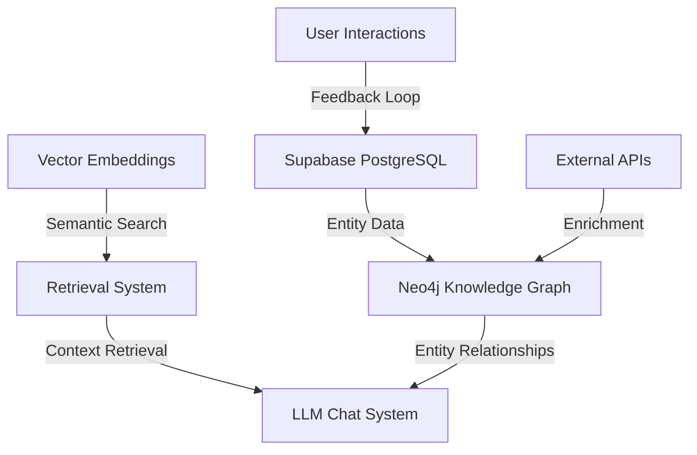

# Database Schema and Vector Store Design

## Overview

This document outlines the database schema and vector store design for the CyberInsightHub platform, focusing on Supabase PostgreSQL for structured data and metadata, Supabase Storage for raw files, pgvector for embeddings, and Neo4j for the knowledge graph.

## Supabase Schema Design

### Core Tables

#### `users` Table
```sql
CREATE TABLE users (
  id UUID REFERENCES auth.users NOT NULL PRIMARY KEY,
  email TEXT UNIQUE NOT NULL,
  full_name TEXT,
  avatar_url TEXT,
  organization TEXT,
  job_title TEXT,
  created_at TIMESTAMP WITH TIME ZONE DEFAULT CURRENT_TIMESTAMP,
  last_sign_in TIMESTAMP WITH TIME ZONE,
  preferences JSONB DEFAULT '{}'::JSONB,
  role TEXT DEFAULT 'user'
);

-- Enable RLS
ALTER TABLE users ENABLE ROW LEVEL SECURITY;

-- Policies
CREATE POLICY "Users can view their own data" 
  ON users FOR SELECT USING (auth.uid() = id);
  
CREATE POLICY "Users can update their own data" 
  ON users FOR UPDATE USING (auth.uid() = id);
```

#### `reports` Table
```sql
CREATE TABLE reports (
  id UUID DEFAULT uuid_generate_v4() PRIMARY KEY,
  title TEXT NOT NULL,
  publisher TEXT NOT NULL,
  publish_year INTEGER NOT NULL,
  publish_date DATE,
  report_type TEXT NOT NULL,
  summary TEXT,
  file_path TEXT NOT NULL,
  file_size INTEGER NOT NULL,
  file_type TEXT NOT NULL,
  processed_status TEXT DEFAULT 'pending',
  processed_at TIMESTAMP WITH TIME ZONE,
  uploaded_by UUID REFERENCES users(id),
  uploaded_at TIMESTAMP WITH TIME ZONE DEFAULT CURRENT_TIMESTAMP,
  is_public BOOLEAN DEFAULT TRUE,
  metadata JSONB DEFAULT '{}'::JSONB,
  cover_image_url TEXT
);

-- Enable RLS
ALTER TABLE reports ENABLE ROW LEVEL SECURITY;

-- Policies
CREATE POLICY "Public reports are viewable by all users" 
  ON reports FOR SELECT USING (is_public = TRUE);
  
CREATE POLICY "Users can view reports they uploaded" 
  ON reports FOR SELECT USING (auth.uid() = uploaded_by);
  
CREATE POLICY "Admin users can view all reports" 
  ON reports FOR SELECT USING (
    EXISTS (SELECT 1 FROM users WHERE id = auth.uid() AND role = 'admin')
  );
```

#### `report_sections` Table
```sql
CREATE TABLE report_sections (
  id UUID DEFAULT uuid_generate_v4() PRIMARY KEY,
  report_id UUID REFERENCES reports(id) ON DELETE CASCADE,
  section_number INTEGER NOT NULL,
  section_title TEXT,
  content TEXT NOT NULL,
  content_hash TEXT UNIQUE NOT NULL,
  page_number INTEGER,
  chunk_start INTEGER,
  chunk_end INTEGER,
  section_type TEXT,
  created_at TIMESTAMP WITH TIME ZONE DEFAULT CURRENT_TIMESTAMP,
  metadata JSONB DEFAULT '{}'::JSONB
);

-- Enable RLS
ALTER TABLE report_sections ENABLE ROW LEVEL SECURITY;

-- Policies (similar to reports table policies)
```

#### `report_entities` Table
```sql
CREATE TABLE report_entities (
  id UUID DEFAULT uuid_generate_v4() PRIMARY KEY,
  report_id UUID REFERENCES reports(id) ON DELETE CASCADE,
  section_id UUID REFERENCES report_sections(id) ON DELETE CASCADE,
  entity_name TEXT NOT NULL,
  entity_type TEXT NOT NULL,
  entity_subtype TEXT,
  confidence_score FLOAT,
  mentioned_count INTEGER DEFAULT 1,
  first_mention_context TEXT,
  created_at TIMESTAMP WITH TIME ZONE DEFAULT CURRENT_TIMESTAMP,
  metadata JSONB DEFAULT '{}'::JSONB,
  external_references JSONB DEFAULT '{}'::JSONB
);

-- Enable RLS
ALTER TABLE report_entities ENABLE ROW LEVEL SECURITY;
```

#### `report_stats` Table
```sql
CREATE TABLE report_stats (
  id UUID DEFAULT uuid_generate_v4() PRIMARY KEY,
  report_id UUID REFERENCES reports(id) ON DELETE CASCADE,
  section_id UUID REFERENCES report_sections(id) ON DELETE CASCADE,
  stat_type TEXT NOT NULL,
  stat_name TEXT NOT NULL,
  numeric_value FLOAT,
  string_value TEXT,
  unit TEXT,
  time_period TEXT,
  confidence_score FLOAT,
  context TEXT,
  created_at TIMESTAMP WITH TIME ZONE DEFAULT CURRENT_TIMESTAMP
);

-- Enable RLS
ALTER TABLE report_stats ENABLE ROW LEVEL SECURITY;
```

#### `custom_reports` Table
```sql
CREATE TABLE custom_reports (
  id UUID DEFAULT uuid_generate_v4() PRIMARY KEY,
  title TEXT NOT NULL,
  description TEXT,
  created_by UUID REFERENCES users(id),
  created_at TIMESTAMP WITH TIME ZONE DEFAULT CURRENT_TIMESTAMP,
  updated_at TIMESTAMP WITH TIME ZONE DEFAULT CURRENT_TIMESTAMP,
  is_public BOOLEAN DEFAULT FALSE,
  is_complete BOOLEAN DEFAULT FALSE,
  content JSONB DEFAULT '{}'::JSONB,
  source_reports JSONB DEFAULT '[]'::JSONB
);

-- Enable RLS
ALTER TABLE custom_reports ENABLE ROW LEVEL SECURITY;
```

#### `user_saved_items` Table
```sql
CREATE TABLE user_saved_items (
  id UUID DEFAULT uuid_generate_v4() PRIMARY KEY,
  user_id UUID REFERENCES users(id) ON DELETE CASCADE,
  item_type TEXT NOT NULL,
  item_id UUID NOT NULL,
  saved_at TIMESTAMP WITH TIME ZONE DEFAULT CURRENT_TIMESTAMP,
  notes TEXT,
  folder TEXT DEFAULT 'default'
);

-- Enable RLS
ALTER TABLE user_saved_items ENABLE ROW LEVEL SECURITY;
```

#### `chat_sessions` Table
```sql
CREATE TABLE chat_sessions (
  id UUID DEFAULT uuid_generate_v4() PRIMARY KEY,
  user_id UUID REFERENCES users(id) ON DELETE CASCADE,
  title TEXT,
  created_at TIMESTAMP WITH TIME ZONE DEFAULT CURRENT_TIMESTAMP,
  updated_at TIMESTAMP WITH TIME ZONE DEFAULT CURRENT_TIMESTAMP,
  report_context JSONB DEFAULT '[]'::JSONB,
  metadata JSONB DEFAULT '{}'::JSONB
);

-- Enable RLS
ALTER TABLE chat_sessions ENABLE ROW LEVEL SECURITY;
```

#### `chat_messages` Table
```sql
CREATE TABLE chat_messages (
  id UUID DEFAULT uuid_generate_v4() PRIMARY KEY,
  session_id UUID REFERENCES chat_sessions(id) ON DELETE CASCADE,
  role TEXT NOT NULL,
  content TEXT NOT NULL,
  created_at TIMESTAMP WITH TIME ZONE DEFAULT CURRENT_TIMESTAMP,
  citations JSONB DEFAULT '[]'::JSONB,
  tokens_used INTEGER
);

-- Enable RLS
ALTER TABLE chat_messages ENABLE ROW LEVEL SECURITY;
```

### Vector Tables

#### `section_embeddings` Table
```sql
CREATE EXTENSION IF NOT EXISTS vector;

CREATE TABLE section_embeddings (
  id UUID DEFAULT uuid_generate_v4() PRIMARY KEY,
  section_id UUID REFERENCES report_sections(id) ON DELETE CASCADE,
  embedding vector(1536), -- 1536 for OpenAI embeddings
  created_at TIMESTAMP WITH TIME ZONE DEFAULT CURRENT_TIMESTAMP
);

-- Create index for vector similarity search
CREATE INDEX ON section_embeddings USING ivfflat (embedding vector_cosine_ops) WITH (lists = 100);

-- Enable RLS
ALTER TABLE section_embeddings ENABLE ROW LEVEL SECURITY;
```

#### `entity_embeddings` Table
```sql
CREATE TABLE entity_embeddings (
  id UUID DEFAULT uuid_generate_v4() PRIMARY KEY,
  entity_id UUID REFERENCES report_entities(id) ON DELETE CASCADE,
  embedding vector(1536),
  created_at TIMESTAMP WITH TIME ZONE DEFAULT CURRENT_TIMESTAMP
);

-- Create index for vector similarity search
CREATE INDEX ON entity_embeddings USING ivfflat (embedding vector_cosine_ops) WITH (lists = 100);

-- Enable RLS
ALTER TABLE entity_embeddings ENABLE ROW LEVEL SECURITY;
```

### Supabase Storage Buckets

```sql
-- Create storage buckets
INSERT INTO storage.buckets (id, name, public) VALUES ('raw_reports', 'Raw Reports', false);
INSERT INTO storage.buckets (id, name, public) VALUES ('processed_reports', 'Processed Reports', false);
INSERT INTO storage.buckets (id, name, public) VALUES ('generated_visualizations', 'Generated Visualizations', true);
INSERT INTO storage.buckets (id, name, public) VALUES ('custom_reports', 'Custom Reports', false);

-- Set up storage policies
CREATE POLICY "Authenticated users can upload reports" 
  ON storage.objects FOR INSERT 
  TO authenticated 
  WITH CHECK (bucket_id = 'raw_reports');

CREATE POLICY "Users can access public report assets" 
  ON storage.objects FOR SELECT 
  TO authenticated 
  USING (bucket_id = 'processed_reports' AND EXISTS (
    SELECT 1 FROM reports r WHERE r.file_path = storage.objects.name AND r.is_public = TRUE
  ));
```

## Neo4j Knowledge Graph Schema

### Node Labels

```cypher
// Define node constraints
CREATE CONSTRAINT IF NOT EXISTS ON (r:Report) ASSERT r.id IS UNIQUE;
CREATE CONSTRAINT IF NOT EXISTS ON (e:Entity) ASSERT e.id IS UNIQUE;
CREATE CONSTRAINT IF NOT EXISTS ON (t:ThreatActor) ASSERT t.name IS UNIQUE;
CREATE CONSTRAINT IF NOT EXISTS ON (m:Malware) ASSERT m.name IS UNIQUE;
CREATE CONSTRAINT IF NOT EXISTS ON (v:Vulnerability) ASSERT v.cve_id IS UNIQUE;
CREATE CONSTRAINT IF NOT EXISTS ON (i:Industry) ASSERT i.name IS UNIQUE;
CREATE CONSTRAINT IF NOT EXISTS ON (c:Country) ASSERT c.name IS UNIQUE;
CREATE CONSTRAINT IF NOT EXISTS ON (a:AttackTechnique) ASSERT a.mitre_id IS UNIQUE;
```

### Relationship Types

```cypher
// Example relationships
// MENTIONS: A report mentions an entity
// TARGETS: A threat actor targets an industry or country
// USES: A threat actor uses a malware or attack technique
// EXPLOITS: A malware exploits a vulnerability
// AFFECTS: A vulnerability affects an industry
// LINKED_TO: Entities are linked to each other

// Example of creating a report node with entity relationships
CREATE (r:Report {
  id: $report_id,
  title: $title,
  publisher: $publisher,
  year: $year
})
WITH r
MATCH (e:Entity {name: $entity_name})
CREATE (r)-[:MENTIONS {
  confidence: $confidence,
  context: $context
}]->(e)
```

## Data Integration Flow



## Indexing Strategy

1. **Vector Indexes**
   - Use IVFFlat indexes for approximate nearest neighbor search
   - Optimize for cosine similarity
   - Use multiple specialized indexes for different query types

2. **PostgreSQL Indexes**
   - B-tree indexes on all foreign keys
   - GIN indexes on JSONB columns for faster JSON operations
   - Text search indexes for full-text search capabilities

3. **Neo4j Indexes**
   - Index on all node properties used in frequent queries
   - Full-text indexes for text properties
   - Composite indexes for commonly co-queried properties

## Data Access Patterns

1. **Report Retrieval**
   - Direct lookup by ID
   - Full-text search by content
   - Filtered queries by metadata (year, publisher, type)
   - Vector similarity for "reports like this"

2. **Entity Exploration**
   - Graph traversal for related entities
   - Temporal analysis of entity mentions
   - Co-occurrence analysis

3. **Chat Context Building**
   - Hybrid retrieval (vector + keyword + graph)
   - Context ranking and prioritization
   - Citation tracking for responses

## Data Update Strategy

1. **Report Processing**
   - Initial processing for basic structure and entities
   - Background enrichment for deeper analysis
   - Periodic reprocessing for new entity extraction models

2. **Knowledge Graph Updates**
   - Real-time entity additions
   - Batch relationship updates
   - Confidence score aggregation across sources

3. **Vector Re-embedding**
   - Scheduled updates when embedding models improve
   - Incremental updates for modified content
   - Version tracking for compatibility

## Migration Strategy

The schema includes version tracking to allow for future migrations and schema evolution:

```sql
CREATE TABLE schema_versions (
  id UUID DEFAULT uuid_generate_v4() PRIMARY KEY,
  component TEXT NOT NULL,
  version TEXT NOT NULL,
  applied_at TIMESTAMP WITH TIME ZONE DEFAULT CURRENT_TIMESTAMP,
  description TEXT,
  migration_script TEXT
);
```