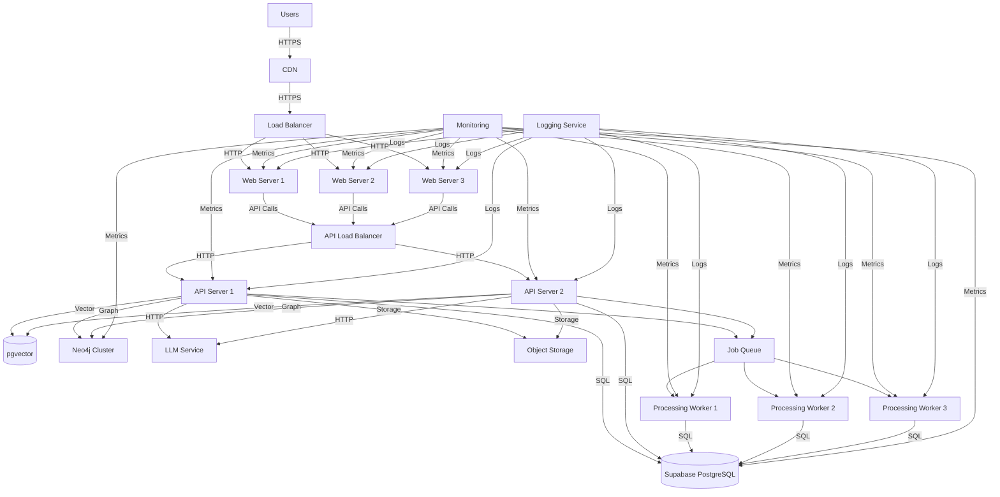

# Deployment Architecture and Infrastructure

## Overview

This document outlines the deployment architecture and infrastructure requirements for the CyberInsightHub platform. The architecture is designed for scalability, reliability, security, and maintainability, while leveraging cloud-native services to minimize operational overhead.

## Architecture Diagram



## Infrastructure Components

### Frontend Infrastructure

1. **Content Delivery Network (CDN)**
   - Cloudflare or similar CDN for global distribution
   - Edge caching for static assets
   - DDoS protection
   - SSL termination

2. **Web Application Servers**
   - Container-based deployment (Docker)
   - Deployed on Kubernetes or equivalent orchestration
   - Auto-scaling based on load
   - Health checks and automatic recovery

### Backend Infrastructure

1. **API Servers**
   - Container-based deployment (Docker)
   - Deployed on Kubernetes or equivalent orchestration
   - Auto-scaling based on load
   - Rate limiting
   - API gateway for security and routing

2. **Database Infrastructure**
   - Supabase PostgreSQL (managed service)
   - Read replicas for query performance
   - Automatic backups
   - Point-in-time recovery
   - High availability configuration

3. **Vector Database**
   - pgvector extension within PostgreSQL
   - Optimized for similarity search
   - Efficient indexing for large embeddings

4. **Graph Database**
   - Neo4j cluster (3-node minimum)
   - Causal clustering for high availability
   - Read replicas for query performance
   - Dedicated instances for graph algorithms

5. **Object Storage**
   - Cloud object storage (e.g., S3, GCS, Supabase Storage)
   - Lifecycle policies for archiving older reports
   - Versioning for document revisions
   - Access controls based on user roles

6. **Job Queue and Processing Workers**
   - Redis or similar for job queuing
   - Worker nodes for processing reports
   - Scaling based on queue length
   - Retry mechanisms with exponential backoff

7. **LLM Service**
   - Managed LLM API service (OpenAI, Anthropic, etc.)
   - Fallback providers for reliability
   - Token usage monitoring and quotas
   - Caching layer for common queries

### Infrastructure Services

1. **Monitoring and Alerting**
   - Prometheus for metrics collection
   - Grafana for dashboards
   - PagerDuty or similar for alerts
   - Custom SLO/SLI monitoring

2. **Logging**
   - Centralized logging service (ELK stack or similar)
   - Log retention policies
   - Structured logging format
   - Log-based alerts for critical errors

3. **Secrets Management**
   - HashiCorp Vault or cloud-native secrets manager
   - Rotation policies for sensitive credentials
   - Least privilege access

4. **CI/CD Pipeline**
   - GitHub Actions or similar
   - Automated testing
   - Infrastructure as Code deployment
   - Blue/green deployment strategy

## Cloud Provider Considerations

The platform can be deployed on any major cloud provider, with the following recommendations:

### AWS Deployment

```
Frontend:
- CloudFront for CDN
- ECS Fargate or EKS for web application
- Application Load Balancer

Backend:
- ECS Fargate or EKS for API servers
- Aurora PostgreSQL for database
- ElastiCache for Redis
- S3 for object storage
- EC2 or EKS for Neo4j
- API Gateway for API management
- SQS for job queuing
- Lambda for lightweight processing

Infrastructure:
- CloudWatch for monitoring and logs
- AWS Secrets Manager
- AWS Certificate Manager for SSL
- CodePipeline for CI/CD
```

### Google Cloud Deployment

```
Frontend:
- Cloud CDN
- GKE for web application
- Cloud Load Balancing

Backend:
- GKE for API servers
- Cloud SQL for PostgreSQL
- Memorystore for Redis
- Cloud Storage for object storage
- GKE or Compute Engine for Neo4j
- Cloud Tasks for job queuing
- Cloud Functions for lightweight processing

Infrastructure:
- Cloud Monitoring
- Cloud Logging
- Secret Manager
- Cloud Build for CI/CD
```

### Azure Deployment

```
Frontend:
- Azure CDN
- AKS for web application
- Application Gateway

Backend:
- AKS for API servers
- Azure Database for PostgreSQL
- Azure Cache for Redis
- Azure Blob Storage
- AKS or VM for Neo4j
- Azure Queue Storage
- Azure Functions for lightweight processing

Infrastructure:
- Azure Monitor
- Azure Log Analytics
- Key Vault
- Azure DevOps for CI/CD
```

## Containerization Strategy

The application is containerized using Docker with the following structure:

```
├── frontend/
│   ├── Dockerfile
│   ├── nginx.conf
│   └── ...
├── api/
│   ├── Dockerfile
│   └── ...
├── workers/
│   ├── document-processor/
│   │   ├── Dockerfile
│   │   └── ...
│   ├── enrichment-worker/
│   │   ├── Dockerfile
│   │   └── ...
│   └── ...
├── neo4j/
│   ├── Dockerfile
│   ├── plugins/
│   └── conf/
└── docker-compose.yml
```

### Container Optimization

1. **Multi-stage Builds**
   - Smaller production images
   - Separation of build and runtime dependencies

2. **Resource Limits**
   - CPU and memory limits for each container
   - Appropriate resource requests

3. **Base Images**
   - Alpine-based images where possible
   - Regular security updates
   - Minimal installed packages

4. **Health Checks**
   - Liveness and readiness probes
   - Graceful shutdown handling

## Kubernetes Deployment

The application is orchestrated with Kubernetes for production environments:

```yaml
# Example Kubernetes configuration for API component
apiVersion: apps/v1
kind: Deployment
metadata:
  name: cyberinsighthub-api
  labels:
    app: cyberinsighthub
    component: api
spec:
  replicas: 3
  selector:
    matchLabels:
      app: cyberinsighthub
      component: api
  strategy:
    type: RollingUpdate
    rollingUpdate:
      maxSurge: 1
      maxUnavailable: 0
  template:
    metadata:
      labels:
        app: cyberinsighthub
        component: api
    spec:
      containers:
      - name: api
        image: cyberinsighthub/api:latest
        imagePullPolicy: Always
        ports:
        - containerPort: 3000
        env:
        - name: DATABASE_URL
          valueFrom:
            secretKeyRef:
              name: cyberinsighthub-secrets
              key: database-url
        - name: NODE_ENV
          value: "production"
        resources:
          limits:
            cpu: "1"
            memory: "1Gi"
          requests:
            cpu: "500m"
            memory: "512Mi"
        livenessProbe:
          httpGet:
            path: /api/health
            port: 3000
          initialDelaySeconds: 30
          periodSeconds: 10
        readinessProbe:
          httpGet:
            path: /api/health/ready
            port: 3000
          initialDelaySeconds: 5
          periodSeconds: 5
```

### Kubernetes Resources

1. **Deployments**
   - Frontend Deployment
   - API Deployment
   - Worker Deployments

2. **Services**
   - Frontend Service
   - API Service
   - Neo4j Service

3. **ConfigMaps**
   - Application configuration
   - Environment-specific settings

4. **Secrets**
   - Database credentials
   - API keys
   - Authentication tokens

5. **Ingress**
   - TLS termination
   - Path-based routing
   - Host-based routing

6. **PersistentVolumes**
   - Neo4j data
   - Temporary storage for processing

7. **HorizontalPodAutoscalers**
   - CPU-based scaling
   - Custom metrics scaling

8. **NetworkPolicies**
   - Controlled communication between components
   - Isolation of sensitive services

## Scaling Strategy

The platform employs a multi-layered scaling strategy:

### Horizontal Scaling

1. **Web Tier**
   - Auto-scaling based on CPU utilization (target: 70%)
   - Minimum 3 replicas for high availability
   - Maximum based on expected peak load

2. **API Tier**
   - Auto-scaling based on request rate and CPU
   - Minimum 3 replicas for high availability
   - Separate scaling for read and write operations

3. **Worker Tier**
   - Queue-based auto-scaling
   - Scale to zero when idle
   - Burst capacity for batch processing

### Vertical Scaling

1. **Database**
   - Instance size based on data volume and query complexity
   - Scheduled scaling for known usage patterns
   - Performance monitoring for proactive scaling

2. **Neo4j**
   - Memory-optimized instances for graph queries
   - CPU optimization for graph algorithms
   - Storage scaling independent of compute

### Database Scaling

1. **Read Replicas**
   - Distribution of read queries
   - Geographic distribution for global deployments
   - Promotion capability for failover

2. **Connection Pooling**
   - PgBouncer for efficient connection management
   - Connection limits per service
   - Timeout policies

3. **Sharding Strategy**
   - Tenant-based sharding for multi-tenant deployments
   - Report-based sharding for large document stores
   - Entity-based sharding for the knowledge graph

## High Availability and Disaster Recovery

### High Availability

1. **Multi-AZ Deployment**
   - Components distributed across availability zones
   - Automatic failover for stateful services
   - Load balancing across healthy instances

2. **Service Redundancy**
   - No single points of failure
   - N+1 redundancy for critical components
   - Autonomous recovery

3. **Database HA**
   - Primary-replica setup with automatic failover
   - Synchronous replication for critical data
   - Regular health checks

### Disaster Recovery

1. **Backup Strategy**
   - Daily full backups
   - Point-in-time recovery capability
   - Cross-region backup replication
   - Regular restoration testing

2. **Recovery Time Objectives (RTO)**
   - Tier 1 (Critical): 1 hour
   - Tier 2 (Important): 4 hours
   - Tier 3 (Non-critical): 24 hours

3. **Recovery Point Objectives (RPO)**
   - Tier 1 (Critical): 5 minutes
   - Tier 2 (Important): 1 hour
   - Tier 3 (Non-critical): 24 hours

4. **Disaster Recovery Plan**
   - Documented recovery procedures
   - Regular DR drills
   - Automated recovery scripts

## Performance Optimization

### Caching Strategy

1. **Content Caching**
   - CDN for static assets (cache TTL: 7 days)
   - Application-level caching for semi-static content
   - Cache invalidation on updates

2. **Database Caching**
   - Redis for frequently accessed data
   - Query result caching with time-based invalidation
   - Materialized views for complex analytics

3. **API Response Caching**
   - Cache-Control headers for client-side caching
   - Server-side caching for expensive operations
   - Conditional requests (ETag, If-Modified-Since)

### Query Optimization

1. **Index Management**
   - Strategic indexes based on query patterns
   - Regular index maintenance
   - Index usage monitoring

2. **Query Tuning**
   - Optimized SQL queries
   - Query plan analysis
   - Parameterized queries

3. **Connection Management**
   - Connection pooling
   - Statement timeout limits
   - Prepared statements

### Resource Allocation

1. **Memory Management**
   - JVM tuning for Neo4j
   - Node.js memory limits
   - Redis memory policies

2. **CPU Optimization**
   - Worker thread allocation
   - Process affinity
   - Background task scheduling

3. **I/O Optimization**
   - Storage IOPS allocation
   - Bulk operations for large datasets
   - Asynchronous processing

## Monitoring and Observability

### Metrics Collection

1. **System Metrics**
   - CPU, memory, disk, and network utilization
   - Container resource usage
   - Node health

2. **Application Metrics**
   - Request rates and latencies
   - Error rates
   - Database query performance
   - LLM token usage and latency
   - Processing pipeline throughput

3. **Business Metrics**
   - User activity
   - Report processing times
   - Chat session analytics
   - Feature usage

### Logging Strategy

1. **Log Levels**
   - ERROR: System failures requiring immediate attention
   - WARN: Potential issues that don't affect operation
   - INFO: Significant operations and state changes
   - DEBUG: Detailed information for troubleshooting

2. **Log Format**
   - Structured JSON format
   - Consistent fields across services
   - Correlation IDs for request tracing
   - Timestamps in UTC

3. **Log Management**
   - Centralized logging (ELK stack)
   - Log retention policies
   - Log-based alerting
   - Log search and analysis

### Alerting

1. **Alert Priorities**
   - P0: Critical service outage (immediate response)
   - P1: Degraded service (response within 30 minutes)
   - P2: Non-critical issues (response within 4 hours)
   - P3: Monitoring and improvements (next business day)

2. **Alert Channels**
   - PagerDuty for on-call notification
   - Slack for team awareness
   - Email for non-urgent notifications

3. **Alert Rules**
   - Error rate thresholds
   - Latency percentiles
   - Resource utilization
   - SLO violations

## Security Measures

### Network Security

1. **Perimeter Protection**
   - Web Application Firewall (WAF)
   - DDoS protection
   - IP allowlisting for admin functions

2. **Network Segregation**
   - VPC isolation
   - Subnet separation by function
   - Security groups for granular access control

3. **Encryption**
   - TLS for all external connections
   - TLS for internal service communication
   - Data encryption at rest

### Application Security

1. **Authentication**
   - Multi-factor authentication for administrative access
   - Role-based access control
   - JWT with short expiration

2. **API Security**
   - Rate limiting
   - Input validation
   - Output encoding
   - CSRF protection

3. **Dependency Management**
   - Regular security updates
   - Vulnerability scanning
   - Software composition analysis

### Data Security

1. **Data Classification**
   - Public: Unrestricted reports and data
   - Internal: Organization-specific analysis
   - Confidential: User data and credentials

2. **Data Protection**
   - Encryption at rest
   - Encryption in transit
   - Tokenization of sensitive data

3. **Access Controls**
   - Row-level security in Supabase
   - Principle of least privilege
   - Regular access review

## Deployment Workflow

### CI/CD Pipeline

1. **Continuous Integration**
   - Automated testing
   - Code quality checks
   - Security scanning
   - Build artifacts

2. **Continuous Deployment**
   - Environment promotion (dev → staging → production)
   - Blue/green deployment
   - Canary releases for high-risk changes
   - Automated rollback capability

3. **Infrastructure as Code**
   - Terraform for infrastructure provisioning
   - Kubernetes manifests for orchestration
   - Version-controlled configuration

### Release Process

1. **Release Planning**
   - Feature branches
   - Release candidates
   - Pre-release testing

2. **Deployment Stages**
   - Development: Continuous deployment
   - Staging: Daily releases
   - Production: Scheduled releases

3. **Rollback Procedures**
   - Automated rollback triggers
   - Manual rollback process
   - Post-incident review

## Cost Optimization

### Resource Efficiency

1. **Right-sizing**
   - Regular resource utilization review
   - Scaling based on actual usage patterns
   - Reserved instances for stable workloads

2. **Autoscaling**
   - Scale to zero for development environments
   - Scheduled scaling for predictable patterns
   - Spot instances for batch processing

3. **Storage Optimization**
   - Tiered storage for older reports
   - Compression for text-heavy data
   - Lifecycle policies for automated archiving

### Cost Monitoring

1. **Tagging Strategy**
   - Environment tags
   - Component tags
   - Feature tags
   - Owner tags

2. **Budget Alerts**
   - Service-level budget monitoring
   - Anomaly detection
   - Trend analysis

3. **Cost Analysis**
   - Regular cost reviews
   - Cost per feature tracking
   - Optimization recommendations

## Development Environments

### Environment Parity

1. **Local Development**
   - Docker Compose for local services
   - Mocked external services
   - Sample data sets

2. **Development Environment**
   - Shared cloud environment
   - Scaled-down resources
   - Feature branch deployments

3. **Staging Environment**
   - Production-like configuration
   - Synthetic data
   - Performance testing

### Testing Strategy

1. **Unit Testing**
   - Component-level tests
   - Mocked dependencies
   - Fast execution

2. **Integration Testing**
   - Service interaction tests
   - Database interaction tests
   - API contract tests

3. **End-to-End Testing**
   - User journey tests
   - Performance tests
   - Security tests

## Maintenance Procedures

### Upgrade Processes

1. **Database Migrations**
   - Backward compatible changes
   - Phased schema evolution
   - Rollback scripts

2. **Dependency Updates**
   - Regular security updates
   - Compatibility testing
   - Version pinning

3. **Platform Upgrades**
   - OS patching strategy
   - Kubernetes version upgrades
   - Database version upgrades

### Backup and Restoration

1. **Backup Types**
   - Database backups
   - Object storage backups
   - Configuration backups

2. **Backup Schedule**
   - Continuous transaction log backups
   - Daily full backups
   - Weekly consolidated backups

3. **Restoration Testing**
   - Monthly restoration drills
   - Documented restoration procedures
   - Recovery time measurement

## Compliance and Governance

### Auditing

1. **Access Auditing**
   - User activity logs
   - Admin action logs
   - Authentication events

2. **Data Access Logs**
   - Report access tracking
   - Search query logging
   - Data export records

3. **Change Management**
   - Infrastructure changes
   - Configuration changes
   - Schema changes

### Compliance Controls

1. **Data Residency**
   - Regional deployment options
   - Data sovereignty controls
   - Cross-region replication options

2. **Retention Policies**
   - Data retention requirements
   - Log retention policies
   - Backup retention schedule

3. **Security Controls**
   - Regular penetration testing
   - Vulnerability management
   - Security incident response

## Appendix: Deployment Checklist

### Pre-Deployment

- [ ] Infrastructure provisioned and configured
- [ ] Database schemas created and migrated
- [ ] Security controls implemented and verified
- [ ] Monitoring and alerting configured
- [ ] Backup procedures implemented and tested
- [ ] Load testing completed
- [ ] Security testing completed
- [ ] Rollback procedures documented and tested

### Deployment

- [ ] Deployment window communicated
- [ ] Database backups created
- [ ] Deployment plan reviewed
- [ ] Canary deployment initiated
- [ ] Health checks verified
- [ ] Smoke tests executed
- [ ] Full rollout completed
- [ ] Post-deployment verification

### Post-Deployment

- [ ] Monitoring verified
- [ ] Performance baseline established
- [ ] Documentation updated
- [ ] Deployment retrospective conducted
- [ ] Unused resources cleaned up