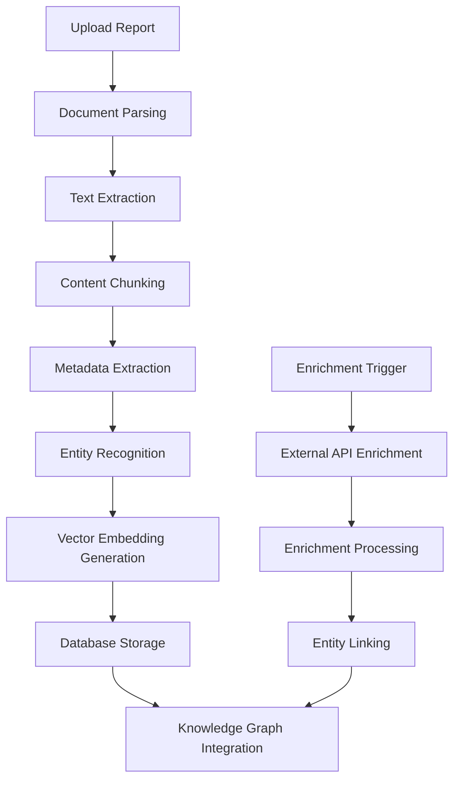

# Document Processing Pipeline Architecture

## Overview

This document outlines the data processing pipeline for the CyberInsightHub platform, focusing on how cybersecurity reports are ingested, processed, and prepared for analysis.

## Pipeline Stages

## Stage Descriptions

### 1. Document Upload & Initial Processing

**Inputs:**
- PDF, DOCX, HTML, or TXT cybersecurity reports
- Basic metadata (report title, publisher, year, report type)

**Processing:**
- Secure file upload to Supabase Storage
- File format validation and virus scanning
- Generation of unique document ID
- Initial metadata record creation

**Outputs:**
- Raw document stored in Supabase Storage
- Initial metadata record in the `reports` table

### 2. Text Extraction & Document Parsing

**Technologies:**
- PDF.js or PyPDF for PDF parsing
- Mammoth.js for DOCX parsing
- Custom HTML parser for web content

**Processing:**
- Extract raw text while preserving document structure
- Identify document sections (Executive Summary, Findings, etc.)
- Preserve tables, lists, and other structured content
- Extract images and diagrams for separate processing
- Convert to normalized markdown format

**Outputs:**
- Markdown version of the document
- Section map with page/position references
- Extracted tables in structured format
- Image references and captions

### 3. Content Chunking & Preprocessing

**Processing:**
- Split content into semantic chunks (400-1000 tokens)
- Ensure chunks maintain context and don't break mid-section
- Generate chunk overlaps to preserve context (100-200 tokens)
- Clean and normalize text (consistent spacing, Unicode normalization)
- Apply text preprocessing (lowercase, remove excessive whitespace)

**Outputs:**
- Content chunks stored in `report_sections` table
- Chunk metadata including position in document and section type

### 4. Metadata & Entity Extraction

**Technologies:**
- Named Entity Recognition using spaCy or LLM-based extraction
- Custom extractors for cybersecurity-specific entities

**Processing:**
- Extract key entities: threat actors, malware names, CVEs, attack techniques
- Identify and extract statistical claims and metrics
- Extract temporal references (dates, timeframes)
- Identify geographic entities and sectors mentioned
- Extract MITRE ATT&CK framework references

**Outputs:**
- Entity records in `report_entities` table
- Statistical data in `report_stats` table
- Temporal data for trend analysis
- MITRE ATT&CK mappings

### 5. Vector Embedding Generation

**Technologies:**
- OpenAI Ada 2 or equivalent embedding model

**Processing:**
- Generate vector embeddings for each content chunk
- Create specialized embeddings for entities and key concepts
- Generate summary embeddings for entire reports

**Outputs:**
- Vector embeddings stored in Supabase pgvector
- Indexing for efficient similarity search

### 6. Knowledge Graph Integration

**Technologies:**
- Neo4j graph database integration

**Processing:**
- Create nodes for entities and documents
- Establish relationships between entities
- Link documents to entities with relationship properties
- Create temporal edges for trend analysis

**Outputs:**
- Knowledge graph stored in Neo4j
- Entity relationship maps
- Temporal relationship tracking

### 7. Data Enrichment

**Technologies:**
- Diffbot Knowledge Graph API
- VirusTotal API
- MITRE CVE Database
- AlienVault OTX
- News APIs

**Processing:**
- Enrich identified entities with additional context
- Link to real-time threat intelligence
- Add current news mentions 
- Augment with vulnerability database information

**Outputs:**
- Enriched entity records
- External links and references
- Real-time intelligence integration

## Error Handling & Monitoring

- Document processing failures logged with specific error states
- Retry mechanism for failed processing steps
- Admin dashboard for monitoring pipeline health
- Queue system for processing backlog management

## Storage Requirements

- Raw documents: Supabase Storage
- Document text and chunks: Supabase PostgreSQL
- Vector embeddings: Supabase pgvector
- Entity relationships: Neo4j
- Processing metadata: Supabase PostgreSQL
- Enrichment data: Combination of Supabase and Neo4j

## Scaling Considerations

- Batch processing for multiple document uploads
- Queue-based architecture for asynchronous processing
- Caching layer for frequently accessed documents and embeddings
- Separate workers for computation-intensive tasks (embedding generation)
- Incremental processing with checkpoint storage