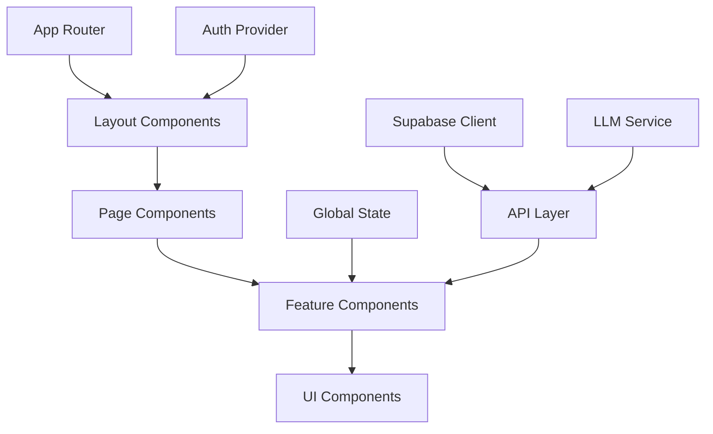

# Frontend Architecture and UI Components

## Overview

This document outlines the frontend architecture and key UI components for the CyberInsightHub platform. The frontend provides the user interface for accessing, analyzing, and deriving insights from cybersecurity reports.

## Technology Stack

The frontend is built using the following technologies:

- **Next.js** - React framework with server-side rendering capabilities
- **TypeScript** - For type safety and improved developer experience
- **Tailwind CSS** - For utility-first styling
- **Shadcn UI** - Component library built on Radix UI primitives
- **React Query** - For data fetching, caching, and state management
- **Zustand** - For lightweight global state management
- **Recharts** - For data visualization components
- **Lucide React** - For consistent iconography

## Architecture



### Core Architecture Principles

1. **Component-Based Design**
   - Modular components with clear separation of concerns
   - Composition over inheritance
   - Reusable components across different parts of the application

2. **Server Components and Client Components**
   - Use Next.js App Router with React Server Components
   - Server components for data fetching and rendering
   - Client components for interactive elements

3. **State Management**
   - Local state for component-specific state
   - React Query for server state
   - Zustand for global UI state
   - URL state for shareable/bookmarkable state

4. **Responsive Design**
   - Mobile-first approach
   - Adaptive layouts for different screen sizes
   - Consistent user experience across devices

## Application Structure

```
src/
├── app/                      # Next.js App Router
│   ├── api/                  # API routes
│   ├── auth/                 # Authentication pages
│   ├── dashboard/            # Dashboard pages
│   ├── reports/              # Reports pages  
│   ├── chat/                 # Chat interface
│   ├── admin/                # Admin pages
│   ├── layout.tsx            # Root layout
│   └── page.tsx              # Home page
├── components/
│   ├── ui/                   # Base UI components
│   ├── dashboard/            # Dashboard components
│   ├── reports/              # Report viewing components
│   ├── chat/                 # Chat interface components
│   ├── visualization/        # Data visualization components
│   ├── analysis/             # Analysis components
│   └── admin/                # Admin components
├── hooks/                    # Custom React hooks
├── lib/                      # Utility functions
│   ├── api.ts                # API client
│   ├── supabase.ts           # Supabase client
│   ├── llm.ts                # LLM service
│   └── utils.ts              # Utility functions
├── stores/                   # Zustand stores
├── types/                    # TypeScript type definitions
└── styles/                   # Global styles
```

## Key Pages and Routes

- `/` - Landing page with platform overview
- `/auth/signin` - User authentication
- `/auth/signup` - User registration
- `/dashboard` - Main dashboard with report statistics and trends
- `/reports` - Report listing and search
- `/reports/[id]` - Individual report view
- `/reports/analysis` - Custom report analysis
- `/chat` - Chat interface for querying reports
- `/admin` - Admin dashboard
- `/admin/reports` - Report management
- `/admin/users` - User management
- `/admin/enrichment` - Enrichment configuration
- `/admin/llm` - LLM configuration

## Key Components

### Layout Components

#### MainLayout

The base layout for authenticated pages with common navigation and structure.

```tsx
// Main application layout with navigation and user context
export default function MainLayout({ children }: { children: React.ReactNode }) {
  return (
    <div className="min-h-screen flex">
      <Sidebar />
      <div className="flex-1 flex flex-col">
        <Header />
        <main className="flex-1 p-6 overflow-auto">
          {children}
        </main>
        <Footer />
      </div>
    </div>
  );
}
```

#### Sidebar

```tsx
export function Sidebar() {
  const { user } = useAuth();
  const pathname = usePathname();
  
  // Navigation items based on user role
  const navItems = useMemo(() => {
    const items = [
      { label: 'Dashboard', icon: <LayoutDashboard size={20} />, href: '/dashboard' },
      { label: 'Reports', icon: <FileText size={20} />, href: '/reports' },
      { label: 'Chat Assistant', icon: <MessageSquare size={20} />, href: '/chat' },
      { label: 'Analysis', icon: <BarChart size={20} />, href: '/analysis' },
    ];
    
    // Add admin items for admin users
    if (user?.role === 'admin') {
      items.push(
        { label: 'Admin', icon: <Shield size={20} />, href: '/admin' }
      );
    }
    
    return items;
  }, [user]);
  
  return (
    <aside className="w-64 bg-background border-r h-screen sticky top-0">
      <div className="h-16 flex items-center px-4 border-b">
        <Logo />
      </div>
      <nav className="px-2 py-4">
        <ul className="space-y-1">
          {navItems.map((item) => (
            <li key={item.href}>
              <Link
                href={item.href}
                className={cn(
                  "flex items-center gap-3 rounded-md px-3 py-2 text-sm font-medium",
                  pathname === item.href 
                    ? "bg-primary/10 text-primary" 
                    : "text-muted-foreground hover:bg-accent hover:text-accent-foreground"
                )}
              >
                {item.icon}
                {item.label}
              </Link>
            </li>
          ))}
        </ul>
      </nav>
    </aside>
  );
}
```

### Dashboard Components

#### DashboardOverview

```tsx
export function DashboardOverview() {
  const { data: stats, isLoading } = useQuery({
    queryKey: ['dashboard-stats'],
    queryFn: async () => {
      const response = await fetch('/api/dashboard/stats');
      return response.json();
    }
  });
  
  if (isLoading) {
    return <DashboardSkeleton />;
  }
  
  return (
    <div className="grid gap-6 md:grid-cols-2 lg:grid-cols-4">
      <StatCard 
        title="Total Reports" 
        value={stats.totalReports} 
        icon={<FileText className="text-blue-500" />} 
      />
      <StatCard 
        title="Reports This Year" 
        value={stats.reportsThisYear} 
        trend={stats.yearOverYearChange} 
        icon={<CalendarClock className="text-green-500" />} 
      />
      <StatCard 
        title="Threat Actors" 
        value={stats.threatActorCount} 
        icon={<UserX className="text-red-500" />} 
      />
      <StatCard 
        title="Active Vulnerabilities" 
        value={stats.activeVulnerabilities} 
        trend={stats.vulnerabilityTrend} 
        icon={<ShieldAlert className="text-orange-500" />} 
      />
      
      <div className="md:col-span-2 lg:col-span-4">
        <Card>
          <CardHeader>
            <CardTitle>Threat Landscape Overview</CardTitle>
          </CardHeader>
          <CardContent className="h-80">
            <ThreatLandscapeChart data={stats.threatData} />
          </CardContent>
        </Card>
      </div>
      
      <div className="md:col-span-2">
        <Card>
          <CardHeader>
            <CardTitle>Recent Reports</CardTitle>
          </CardHeader>
          <CardContent>
            <RecentReportsList reports={stats.recentReports} />
          </CardContent>
        </Card>
      </div>
      
      <div className="md:col-span-2">
        <Card>
          <CardHeader>
            <CardTitle>Top Threats by Industry</CardTitle>
          </CardHeader>
          <CardContent className="h-80">
            <IndustryThreatChart data={stats.industryThreats} />
          </CardContent>
        </Card>
      </div>
    </div>
  );
}
```

#### StatCard

```tsx
interface StatCardProps {
  title: string;
  value: number | string;
  trend?: number;
  icon?: React.ReactNode;
}

export function StatCard({ title, value, trend, icon }: StatCardProps) {
  return (
    <Card>
      <CardContent className="p-6">
        <div className="flex items-center justify-between">
          <div>
            <p className="text-sm font-medium text-muted-foreground">{title}</p>
            <h4 className="text-2xl font-bold">{value}</h4>
            {trend !== undefined && (
              <div className="flex items-center mt-1">
                {trend > 0 ? (
                  <ArrowUpRight className="text-green-500 mr-1 h-4 w-4" />
                ) : (
                  <ArrowDownRight className="text-red-500 mr-1 h-4 w-4" />
                )}
                <span className={cn(
                  "text-sm",
                  trend > 0 ? "text-green-500" : "text-red-500"
                )}>
                  {Math.abs(trend)}%
                </span>
              </div>
            )}
          </div>
          <div className="h-12 w-12 rounded-full bg-primary/10 flex items-center justify-center">
            {icon}
          </div>
        </div>
      </CardContent>
    </Card>
  );
}
```

### Report Components

#### ReportList

```tsx
export function ReportList() {
  const [filters, setFilters] = useState({
    publisher: '',
    year: '',
    type: '',
    search: ''
  });
  
  const { data: reports, isLoading } = useQuery({
    queryKey: ['reports', filters],
    queryFn: async () => {
      const params = new URLSearchParams();
      Object.entries(filters).forEach(([key, value]) => {
        if (value) params.append(key, value);
      });
      
      const response = await fetch(`/api/reports?${params.toString()}`);
      return response.json();
    }
  });
  
  return (
    <div className="space-y-6">
      <Card>
        <CardContent className="p-6">
          <div className="grid gap-4 md:grid-cols-4">
            <div>
              <Label htmlFor="search">Search</Label>
              <Input
                id="search"
                placeholder="Search reports..."
                value={filters.search}
                onChange={(e) => setFilters({ ...filters, search: e.target.value })}
              />
            </div>
            <div>
              <Label htmlFor="publisher">Publisher</Label>
              <Select
                value={filters.publisher}
                onValueChange={(value) => setFilters({ ...filters, publisher: value })}
              >
                <SelectTrigger id="publisher">
                  <SelectValue placeholder="All Publishers" />
                </SelectTrigger>
                <SelectContent>
                  <SelectItem value="">All Publishers</SelectItem>
                  {/* Publisher options */}
                </SelectContent>
              </Select>
            </div>
            <div>
              <Label htmlFor="year">Year</Label>
              <Select
                value={filters.year}
                onValueChange={(value) => setFilters({ ...filters, year: value })}
              >
                <SelectTrigger id="year">
                  <SelectValue placeholder="All Years" />
                </SelectTrigger>
                <SelectContent>
                  <SelectItem value="">All Years</SelectItem>
                  {/* Year options */}
                </SelectContent>
              </Select>
            </div>
            <div>
              <Label htmlFor="type">Report Type</Label>
              <Select
                value={filters.type}
                onValueChange={(value) => setFilters({ ...filters, type: value })}
              >
                <SelectTrigger id="type">
                  <SelectValue placeholder="All Types" />
                </SelectTrigger>
                <SelectContent>
                  <SelectItem value="">All Types</SelectItem>
                  {/* Type options */}
                </SelectContent>
              </Select>
            </div>
          </div>
        </CardContent>
      </Card>
      
      {isLoading ? (
        <ReportListSkeleton />
      ) : (
        <div className="grid gap-6 md:grid-cols-2 lg:grid-cols-3">
          {reports.map((report) => (
            <ReportCard key={report.id} report={report} />
          ))}
        </div>
      )}
    </div>
  );
}
```

#### ReportCard

```tsx
interface ReportCardProps {
  report: {
    id: string;
    title: string;
    publisher: string;
    publish_year: number;
    summary: string;
    cover_image_url?: string;
  };
}

export function ReportCard({ report }: ReportCardProps) {
  return (
    <Card className="overflow-hidden">
      <div className="relative aspect-video">
        {report.cover_image_url ? (
          
        ) : (
          <div className="w-full h-full bg-muted flex items-center justify-center">
            <FileText className="h-12 w-12 text-muted-foreground" />
          </div>
        )}
      </div>
      <CardContent className="p-6">
        <div className="flex items-center justify-between mb-2">
          <span className="text-sm font-medium text-muted-foreground">
            {report.publisher}
          </span>
          <span className="text-sm text-muted-foreground">
            {report.publish_year}
          </span>
        </div>
        <h3 className="text-xl font-semibold line-clamp-2 mb-2">{report.title}</h3>
        <p className="text-muted-foreground text-sm line-clamp-3 mb-4">
          {report.summary}
        </p>
        <div className="flex justify-end">
          <Link href={`/reports/${report.id}`}>
            <Button variant="outline" size="sm">
              View Report
            </Button>
          </Link>
        </div>
      </CardContent>
    </Card>
  );
}
```

#### ReportViewer

```tsx
export function ReportViewer({ reportId }: { reportId: string }) {
  const { data: report, isLoading } = useQuery({
    queryKey: ['report', reportId],
    queryFn: async () => {
      const response = await fetch(`/api/reports/${reportId}`);
      return response.json();
    }
  });
  
  const [selectedSection, setSelectedSection] = useState<string | null>(null);
  
  if (isLoading) {
    return <ReportViewerSkeleton />;
  }
  
  return (
    <div className="flex flex-col md:flex-row gap-6">
      <div className="md:w-1/4">
        <Card>
          <CardHeader>
            <CardTitle>Report Sections</CardTitle>
          </CardHeader>
          <CardContent>
            <div className="space-y-1">
              {report.sections.map((section) => (
                <Button
                  key={section.id}
                  variant={selectedSection === section.id ? "default" : "ghost"}
                  className="w-full justify-start text-left"
                  onClick={() => setSelectedSection(section.id)}
                >
                  {section.title}
                </Button>
              ))}
            </div>
          </CardContent>
        </Card>
        
        <Card className="mt-6">
          <CardHeader>
            <CardTitle>Report Details</CardTitle>
          </CardHeader>
          <CardContent>
            <dl className="space-y-2">
              <div>
                <dt className="text-sm font-medium text-muted-foreground">Publisher</dt>
                <dd>{report.publisher}</dd>
              </div>
              <div>
                <dt className="text-sm font-medium text-muted-foreground">Year</dt>
                <dd>{report.publish_year}</dd>
              </div>
              <div>
                <dt className="text-sm font-medium text-muted-foreground">Type</dt>
                <dd>{report.report_type}</dd>
              </div>
            </dl>
            
            <div className="mt-4 flex gap-2">
              <Button size="sm" variant="outline" className="w-full">
                <Download className="mr-2 h-4 w-4" />
                Download
              </Button>
              <Button size="sm" variant="outline" className="w-full">
                <Share className="mr-2 h-4 w-4" />
                Share
              </Button>
            </div>
          </CardContent>
        </Card>
      </div>
      
      <div className="md:w-3/4">
        <Card>
          <CardHeader>
            <CardTitle>{report.title}</CardTitle>
            <CardDescription>
              {report.publisher} • {report.publish_year}
            </CardDescription>
          </CardHeader>
          <CardContent>
            {selectedSection ? (
              <ReportSection section={report.sections.find(s => s.id === selectedSection)} />
            ) : (
              <ReportSummary report={report} />
            )}
          </CardContent>
        </Card>
        
        <Card className="mt-6">
          <CardHeader>
            <CardTitle>Key Entities</CardTitle>
          </CardHeader>
          <CardContent>
            <div className="flex flex-wrap gap-2">
              {report.entities.map((entity) => (
                <Badge 
                  key={entity.id}
                  variant="outline"
                  className={cn(
                    "px-3 py-1",
                    getEntityColorClass(entity.type)
                  )}
                >
                  {entity.name}
                </Badge>
              ))}
            </div>
          </CardContent>
        </Card>
      </div>
    </div>
  );
}
```

### Chat Interface

#### ChatInterface

```tsx
export function ChatInterface() {
  const [messages, setMessages] = useState<ChatMessage[]>([]);
  const [inputValue, setInputValue] = useState('');
  const [isLoading, setIsLoading] = useState(false);
  const [selectedReports, setSelectedReports] = useState<string[]>([]);
  
  const messagesEndRef = useRef<HTMLDivElement>(null);
  
  const { data: reports } = useQuery({
    queryKey: ['reports-minimal'],
    queryFn: async () => {
      const response = await fetch('/api/reports/minimal');
      return response.json();
    }
  });
  
  const sendMessage = async () => {
    if (!inputValue.trim()) return;
    
    const userMessage: ChatMessage = {
      id: Date.now().toString(),
      role: 'user',
      content: inputValue,
      timestamp: new Date()
    };
    
    setMessages([...messages, userMessage]);
    setInputValue('');
    setIsLoading(true);
    
    try {
      const response = await fetch('/api/chat', {
        method: 'POST',
        headers: {
          'Content-Type': 'application/json'
        },
        body: JSON.stringify({
          message: inputValue,
          context: selectedReports,
          history: messages
        })
      });
      
      const data = await response.json();
      
      setMessages((prev) => [
        ...prev,
        {
          id: data.id,
          role: 'assistant',
          content: data.content,
          citations: data.citations,
          timestamp: new Date()
        }
      ]);
    } catch (error) {
      console.error('Error sending message:', error);
      
      setMessages((prev) => [
        ...prev,
        {
          id: 'error',
          role: 'assistant',
          content: 'Sorry, there was an error processing your request. Please try again.',
          timestamp: new Date()
        }
      ]);
    } finally {
      setIsLoading(false);
    }
  };
  
  useEffect(() => {
    if (messagesEndRef.current) {
      messagesEndRef.current.scrollIntoView({ behavior: 'smooth' });
    }
  }, [messages]);
  
  return (
    <div className="flex h-[calc(100vh-8rem)]">
      <div className="w-1/4 border-r p-4 overflow-y-auto">
        <h2 className="text-xl font-semibold mb-4">Context Reports</h2>
        
        <div className="space-y-2">
          {reports?.map((report) => (
            <div
              key={report.id}
              className={cn(
                "p-3 rounded-md cursor-pointer",
                selectedReports.includes(report.id)
                  ? "bg-primary/10 border border-primary"
                  : "bg-card hover:bg-accent"
              )}
              onClick={() => {
                setSelectedReports((prev) => 
                  prev.includes(report.id)
                    ? prev.filter(id => id !== report.id)
                    : [...prev, report.id]
                );
              }}
            >
              <div className="flex items-center justify-between">
                <span className="font-medium">{report.title}</span>
                {selectedReports.includes(report.id) && (
                  <Check className="h-4 w-4 text-primary" />
                )}
              </div>
              <div className="text-sm text-muted-foreground mt-1">
                {report.publisher} • {report.publish_year}
              </div>
            </div>
          ))}
        </div>
      </div>
      
      <div className="flex-1 flex flex-col">
        <div className="flex-1 p-6 overflow-y-auto">
          <div className="space-y-6">
            {messages.map((message) => (
              <ChatMessage key={message.id} message={message} />
            ))}
            
            {isLoading && <ChatTypingIndicator />}
            
            <div ref={messagesEndRef} />
          </div>
        </div>
        
        <div className="p-4 border-t">
          <div className="flex gap-2">
            <Input
              placeholder="Ask about cybersecurity trends and threats..."
              value={inputValue}
              onChange={(e) => setInputValue(e.target.value)}
              onKeyDown={(e) => {
                if (e.key === 'Enter' && !e.shiftKey) {
                  e.preventDefault();
                  sendMessage();
                }
              }}
              disabled={isLoading}
            />
            <Button onClick={sendMessage} disabled={isLoading || !inputValue.trim()}>
              <Send className="h-4 w-4" />
            </Button>
          </div>
          
          <div className="mt-2 text-xs text-muted-foreground">
            {selectedReports.length === 0 ? (
              <span>No context reports selected. Select reports for more accurate answers.</span>
            ) : (
              <span>Using {selectedReports.length} report(s) as context.</span>
            )}
          </div>
        </div>
      </div>
    </div>
  );
}
```

#### ChatMessage

```tsx
interface ChatMessageProps {
  message: {
    id: string;
    role: 'user' | 'assistant';
    content: string;
    citations?: {
      id: string;
      text: string;
      report_id: string;
      report_title: string;
    }[];
    timestamp: Date;
  };
}

export function ChatMessage({ message }: ChatMessageProps) {
  return (
    <div
      className={cn(
        "flex gap-3 max-w-3xl",
        message.role === 'user' ? "ml-auto" : "mr-auto"
      )}
    >
      <div
        className={cn(
          "h-8 w-8 rounded-full flex items-center justify-center text-white",
          message.role === 'user'
            ? "bg-blue-500 order-2"
            : "bg-neutral-500 order-1"
        )}
      >
        {message.role === 'user' ? (
          <User className="h-5 w-5" />
        ) : (
          <Bot className="h-5 w-5" />
        )}
      </div>
      
      <div
        className={cn(
          "rounded-lg p-4",
          message.role === 'user'
            ? "bg-blue-500 text-white order-1"
            : "bg-muted order-2"
        )}
      >
        <div className="prose dark:prose-invert">
          <ReactMarkdown
            components={{
              a: ({ node, ...props }) => (
                <a 
                  {...props} 
                  className="text-primary underline" 
                  target="_blank"
                  rel="noopener noreferrer"
                />
              )
            }}
          >
            {message.content}
          </ReactMarkdown>
        </div>
        
        {message.citations && message.citations.length > 0 && (
          <div className="mt-2 pt-2 border-t border-border">
            <h4 className="text-sm font-semibold mb-1">Sources:</h4>
            <ul className="text-xs space-y-1">
              {message.citations.map((citation) => (
                <li key={citation.id}>
                  <Link
                    href={`/reports/${citation.report_id}`}
                    className="text-primary hover:underline"
                  >
                    {citation.report_title}
                  </Link>
                </li>
              ))}
            </ul>
          </div>
        )}
        
        <div className="text-xs text-muted-foreground mt-2">
          {format(message.timestamp, 'h:mm a')}
        </div>
      </div>
    </div>
  );
}
```

### Data Visualization Components

#### ThreatLandscapeChart

```tsx
interface ThreatData {
  name: string;
  value: number;
  year: number;
  category: string;
}

interface ThreatLandscapeChartProps {
  data: ThreatData[];
}

export function ThreatLandscapeChart({ data }: ThreatLandscapeChartProps) {
  const [view, setView] = useState<'yearly' | 'category'>('yearly');
  
  // Process data based on selected view
  const processedData = useMemo(() => {
    if (view === 'yearly') {
      // Group by year and name
      const yearGroups = groupBy(data, 'year');
      return Object.entries(yearGroups).map(([year, threats]) => ({
        name: year,
        ...threats.reduce((acc, threat) => {
          acc[threat.name] = threat.value;
          return acc;
        }, {} as Record<string, number>)
      }));
    } else {
      // Group by category
      const categoryGroups = groupBy(data, 'category');
      return Object.entries(categoryGroups).map(([category, threats]) => ({
        name: category,
        value: threats.reduce((sum, t) => sum + t.value, 0)
      }));
    }
  }, [data, view]);
  
  // Extract all unique threat names for yearly view
  const threatNames = useMemo(() => {
    if (view === 'yearly') {
      return Array.from(new Set(data.map(d => d.name)));
    }
    return [];
  }, [data, view]);
  
  // Generate colors for each threat
  const colors = useMemo(() => {
    const colorScale = scaleOrdinal()
      .domain(view === 'yearly' ? threatNames : data.map(d => d.category))
      .range(schemeCategory10);
      
    return colorScale;
  }, [view, threatNames, data]);
  
  return (
    <div>
      <div className="flex justify-end mb-4">
        <ToggleGroup type="single" value={view} onValueChange={(v) => setView(v as any)}>
          <ToggleGroupItem value="yearly">By Year</ToggleGroupItem>
          <ToggleGroupItem value="category">By Category</ToggleGroupItem>
        </ToggleGroup>
      </div>
      
      <ResponsiveContainer width="100%" height={350}>
        {view === 'yearly' ? (
          <BarChart data={processedData}>
            <CartesianGrid strokeDasharray="3 3" />
            <XAxis dataKey="name" />
            <YAxis />
            <Tooltip />
            <Legend />
            {threatNames.map((name) => (
              <Bar 
                key={name}
                dataKey={name} 
                stackId="a"
                fill={colors(name) as string}
              />
            ))}
          </BarChart>
        ) : (
          <PieChart>
            <Pie
              data={processedData}
              dataKey="value"
              nameKey="name"
              cx="50%"
              cy="50%"
              outerRadius={130}
              fill="#8884d8"
              label={({name, percent}) => `${name}: ${(percent * 100).toFixed(0)}%`}
            >
              {processedData.map((entry, index) => (
                <Cell key={`cell-${index}`} fill={colors(entry.name) as string} />
              ))}
            </Pie>
            <Tooltip formatter={(value) => [`${value} reports`, 'Count']} />
            <Legend />
          </PieChart>
        )}
      </ResponsiveContainer>
    </div>
  );
}
```

### Admin Components

#### ReportUploadForm

```tsx
export function ReportUploadForm() {
  const [file, setFile] = useState<File | null>(null);
  const [metadata, setMetadata] = useState({
    title: '',
    publisher: '',
    publish_year: new Date().getFullYear(),
    report_type: '',
    is_public: true
  });
  const [isUploading, setIsUploading] = useState(false);
  const [progress, setProgress] = useState(0);
  const [error, setError] = useState<string | null>(null);
  const [success, setSuccess] = useState(false);
  
  const handleFileChange = (e: React.ChangeEvent<HTMLInputElement>) => {
    if (e.target.files && e.target.files[0]) {
      setFile(e.target.files[0]);
      
      // Try to extract title from filename
      const fileName = e.target.files[0].name.replace(/\.[^/.]+$/, '');
      setMetadata({ ...metadata, title: fileName });
    }
  };
  
  const handleInputChange = (e: React.ChangeEvent<HTMLInputElement | HTMLSelectElement>) => {
    const { name, value, type } = e.target;
    
    if (type === 'checkbox') {
      const target = e.target as HTMLInputElement;
      setMetadata({ ...metadata, [name]: target.checked });
    } else {
      setMetadata({ ...metadata, [name]: value });
    }
  };
  
  const handleSubmit = async (e: React.FormEvent) => {
    e.preventDefault();
    
    if (!file) {
      setError('Please select a file to upload');
      return;
    }
    
    setIsUploading(true);
    setProgress(0);
    setError(null);
    setSuccess(false);
    
    // Create form data
    const formData = new FormData();
    formData.append('file', file);
    Object.entries(metadata).forEach(([key, value]) => {
      formData.append(key, value.toString());
    });
    
    try {
      const response = await fetch('/api/admin/reports/upload', {
        method: 'POST',
        body: formData
      });
      
      if (!response.ok) {
        const error = await response.json();
        throw new Error(error.message || 'Failed to upload report');
      }
      
      setSuccess(true);
      setFile(null);
      setMetadata({
        title: '',
        publisher: '',
        publish_year: new Date().getFullYear(),
        report_type: '',
        is_public: true
      });
    } catch (err) {
      setError(err instanceof Error ? err.message : 'An unknown error occurred');
    } finally {
      setIsUploading(false);
    }
  };
  
  return (
    <Card>
      <CardHeader>
        <CardTitle>Upload New Report</CardTitle>
        <CardDescription>
          Upload cybersecurity reports for processing and analysis
        </CardDescription>
      </CardHeader>
      <CardContent>
        <form onSubmit={handleSubmit} className="space-y-6">
          <div className="grid gap-4 md:grid-cols-2">
            <div className="md:col-span-2">
              <Label htmlFor="title">Report Title</Label>
              <Input
                id="title"
                name="title"
                value={metadata.title}
                onChange={handleInputChange}
                required
              />
            </div>
            
            <div>
              <Label htmlFor="publisher">Publisher</Label>
              <Input
                id="publisher"
                name="publisher"
                value={metadata.publisher}
                onChange={handleInputChange}
                required
              />
            </div>
            
            <div>
              <Label htmlFor="publish_year">Publish Year</Label>
              <Input
                id="publish_year"
                name="publish_year"
                type="number"
                min={2000}
                max={new Date().getFullYear()}
                value={metadata.publish_year}
                onChange={handleInputChange}
                required
              />
            </div>
            
            <div>
              <Label htmlFor="report_type">Report Type</Label>
              <Select
                name="report_type"
                value={metadata.report_type}
                onValueChange={(value) => setMetadata({ ...metadata, report_type: value })}
              >
                <SelectTrigger id="report_type">
                  <SelectValue placeholder="Select type" />
                </SelectTrigger>
                <SelectContent>
                  <SelectItem value="annual">Annual Report</SelectItem>
                  <SelectItem value="quarterly">Quarterly Report</SelectItem>
                  <SelectItem value="threat_intelligence">Threat Intelligence</SelectItem>
                  <SelectItem value="vulnerability">Vulnerability Research</SelectItem>
                  <SelectItem value="industry">Industry-Specific</SelectItem>
                  <SelectItem value="technical">Technical Analysis</SelectItem>
                </SelectContent>
              </Select>
            </div>
            
            <div className="flex items-center space-x-2">
              <Checkbox
                id="is_public"
                name="is_public"
                checked={metadata.is_public}
                onCheckedChange={(checked) => 
                  setMetadata({ ...metadata, is_public: checked as boolean })
                }
              />
              <Label htmlFor="is_public">Public Report</Label>
            </div>
          </div>
          
          <div className="grid w-full max-w-sm items-center gap-1.5">
            <Label htmlFor="report-file">Report File</Label>
            <Input
              id="report-file"
              type="file"
              accept=".pdf,.docx,.doc,.html,.txt"
              onChange={handleFileChange}
            />
            <p className="text-sm text-muted-foreground">
              Supported formats: PDF, DOCX, DOC, HTML, TXT
            </p>
          </div>
          
          {isUploading && (
            <div className="space-y-2">
              <div className="flex items-center justify-between">
                <span className="text-sm font-medium">Uploading...</span>
                <span className="text-sm font-medium">{progress}%</span>
              </div>
              <Progress value={progress} />
            </div>
          )}
          
          {error && (
            <Alert variant="destructive">
              <AlertCircle className="h-4 w-4" />
              <AlertTitle>Upload Failed</AlertTitle>
              <AlertDescription>{error}</AlertDescription>
            </Alert>
          )}
          
          {success && (
            <Alert variant="success">
              <CheckCircle className="h-4 w-4" />
              <AlertTitle>Success</AlertTitle>
              <AlertDescription>
                Report uploaded and scheduled for processing
              </AlertDescription>
            </Alert>
          )}
          
          <div className="flex justify-end">
            <Button type="submit" disabled={isUploading || !file}>
              {isUploading ? (
                <>
                  <Loader2 className="mr-2 h-4 w-4 animate-spin" />
                  Uploading
                </>
              ) : (
                <>
                  <Upload className="mr-2 h-4 w-4" />
                  Upload Report
                </>
              )}
            </Button>
          </div>
        </form>
      </CardContent>
    </Card>
  );
}
```

## Responsive Design

The interface is designed to be responsive across different device sizes:

- **Mobile** (< 640px) - Single column layout with collapsible sidebar
- **Tablet** (640px - 1024px) - Two column layout for report viewing
- **Desktop** (> 1024px) - Full layout with side-by-side components

Media query examples:

```css
/* Mobile First Approach with Tailwind */

/* Base (Mobile) */
.dashboard-grid {
  @apply grid gap-6;
}

/* Medium Screens (Tablets) */
@screen md {
  .dashboard-grid {
    @apply grid-cols-2;
  }
}

/* Large Screens (Desktops) */
@screen lg {
  .dashboard-grid {
    @apply grid-cols-4;
  }
}
```

## Theme Support

The application supports both light and dark themes using Tailwind CSS:

```tsx
export function ThemeProvider({ children }: { children: React.ReactNode }) {
  const [theme, setTheme] = useState<'light' | 'dark'>('light');
  
  useEffect(() => {
    const savedTheme = localStorage.getItem('theme') as 'light' | 'dark' | null;
    
    if (savedTheme) {
      setTheme(savedTheme);
    } else if (window.matchMedia('(prefers-color-scheme: dark)').matches) {
      setTheme('dark');
    }
  }, []);
  
  useEffect(() => {
    const root = window.document.documentElement;
    root.classList.remove('light', 'dark');
    root.classList.add(theme);
    localStorage.setItem('theme', theme);
  }, [theme]);
  
  const toggleTheme = () => {
    setTheme(theme === 'light' ? 'dark' : 'light');
  };
  
  return (
    <ThemeContext.Provider value={{ theme, toggleTheme }}>
      {children}
    </ThemeContext.Provider>
  );
}
```

## Accessibility Considerations

The application is designed with accessibility in mind:

- Proper contrast ratios for text and UI elements
- Keyboard navigation support
- ARIA attributes for interactive elements
- Screen reader compatible components
- Focus management for modals and popups

Example of an accessible component:

```tsx
export function AccessibleDialog({
  title,
  description,
  isOpen,
  onClose,
  children
}: {
  title: string;
  description?: string;
  isOpen: boolean;
  onClose: () => void;
  children: React.ReactNode;
}) {
  return (
    <Dialog open={isOpen} onOpenChange={onClose}>
      <DialogContent className="sm:max-w-[425px]">
        <DialogHeader>
          <DialogTitle>{title}</DialogTitle>
          {description && <DialogDescription>{description}</DialogDescription>}
        </DialogHeader>
        <div>
          {children}
        </div>
        <DialogFooter>
          <Button variant="outline" onClick={onClose}>
            Cancel
          </Button>
          <Button onClick={onClose}>Continue</Button>
        </DialogFooter>
      </DialogContent>
    </Dialog>
  );
}
```

## Performance Optimization

Several strategies are employed to optimize frontend performance:

1. **Code Splitting**
   - Next.js route-based code splitting
   - Dynamic imports for heavy components

2. **Data Fetching**
   - React Query for efficient data fetching and caching
   - Server Components for initial data loading
   - Pagination for large data sets

3. **Rendering Optimization**
   - Virtualized lists for large collections
   - Memoization of expensive calculations
   - Debouncing and throttling for frequent updates

4. **Asset Optimization**
   - Next.js Image component for optimized images
   - Font optimization
   - Prefetching key resources

Example of virtualized list implementation:

```tsx
import { useVirtualizer } from '@tanstack/react-virtual';

export function VirtualizedReportList({ reports }: { reports: Report[] }) {
  const parentRef = useRef<HTMLDivElement>(null);
  
  const rowVirtualizer = useVirtualizer({
    count: reports.length,
    getScrollElement: () => parentRef.current,
    estimateSize: () => 72,
    overscan: 5
  });
  
  return (
    <div 
      ref={parentRef}
      className="h-[600px] overflow-auto"
    >
      <div
        style={{
          height: `${rowVirtualizer.getTotalSize()}px`,
          width: '100%',
          position: 'relative'
        }}
      >
        {rowVirtualizer.getVirtualItems().map((virtualRow) => (
          <div
            key={virtualRow.index}
            style={{
              position: 'absolute',
              top: 0,
              left: 0,
              width: '100%',
              height: `${virtualRow.size}px`,
              transform: `translateY(${virtualRow.start}px)`
            }}
          >
            <ReportListItem report={reports[virtualRow.index]} />
          </div>
        ))}
      </div>
    </div>
  );
}
```

## Build and Deployment

The frontend build process leverages Next.js optimizations:

```bash
# Development
npm run dev

# Build
npm run build

# Analyze bundle
npm run analyze

# Lint
npm run lint

# Type check
npm run type-check
```

Deployment-specific configuration is managed through environment variables:

```
# .env.production
NEXT_PUBLIC_SUPABASE_URL=your-production-supabase-url
NEXT_PUBLIC_SUPABASE_ANON_KEY=your-production-supabase-anon-key
NEXT_PUBLIC_API_BASE_URL=your-production-api-url
```

## Testing Strategy

The frontend components are tested using the following approach:

1. **Unit Tests** - Testing individual components
2. **Integration Tests** - Testing component interactions
3. **E2E Tests** - Testing full user flows

Example of a unit test using React Testing Library:

```tsx
import { render, screen, fireEvent } from '@testing-library/react';
import { StatCard } from './StatCard';

describe('StatCard Component', () => {
  it('renders the card with title and value', () => {
    render(<StatCard title="Total Reports" value={123} />);
    
    expect(screen.getByText('Total Reports')).toBeInTheDocument();
    expect(screen.getByText('123')).toBeInTheDocument();
  });
  
  it('shows positive trend with arrow up', () => {
    render(<StatCard title="Total Reports" value={123} trend={15} />);
    
    expect(screen.getByText('15%')).toBeInTheDocument();
    expect(screen.getByText('15%')).toHaveClass('text-green-500');
  });
  
  it('shows negative trend with arrow down', () => {
    render(<StatCard title="Total Reports" value={123} trend={-10} />);
    
    expect(screen.getByText('10%')).toBeInTheDocument();
    expect(screen.getByText('10%')).toHaveClass('text-red-500');
  });
});
```