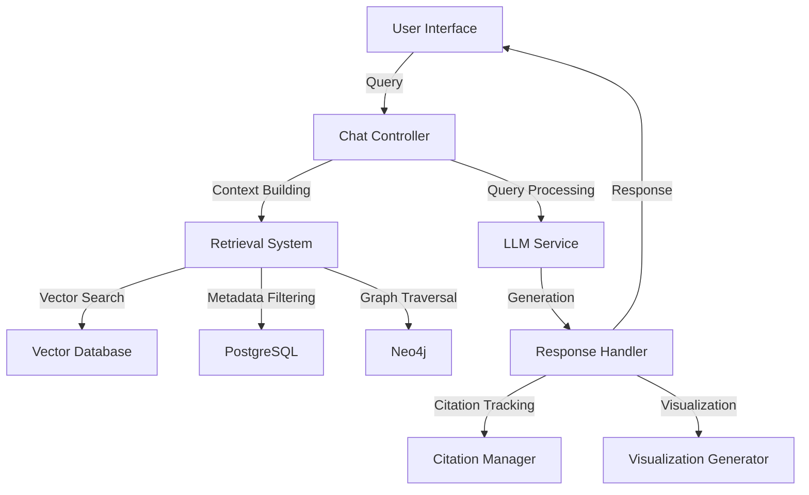

# LLM Integration and Chat System Design

## Overview

This document outlines the architecture and implementation details for the LLM-powered chat and analysis system in the CyberInsightHub platform. This system enables users to query cybersecurity reports through natural language, generate insights, and create visualizations with proper citations.

## System Architecture



## Components

### 1. Query Processing & Intent Recognition

**Technologies:**
- OpenAI GPT-4 or equivalent LLM
- Custom prompt engineering
- Query classification system

**Functionality:**
- Classify query intent (factual, analytical, comparative, temporal)
- Extract key entities and attributes
- Identify time ranges and constraints
- Determine visualization needs
- Generate search parameters

**Implementation:**
```javascript
async function processQuery(query, sessionContext) {
  const systemPrompt = `You are an expert cybersecurity analyst assistant. 
  Analyze the following query to identify:
  1. Primary intent (factual, analytical, comparative, temporal)
  2. Key entities mentioned (threat actors, malware, vulnerabilities, etc.)
  3. Time constraints or ranges
  4. Comparison requirements
  5. Specific reports or sources mentioned
  6. Visualization needs`;

  const response = await openai.chat.completions.create({
    model: "gpt-4-turbo",
    messages: [
      { role: "system", content: systemPrompt },
      { role: "user", content: query },
      ...sessionContext.map(msg => ({
        role: msg.role,
        content: msg.content
      }))
    ],
    temperature: 0.1,
    response_format: { type: "json_object" }
  });

  return JSON.parse(response.choices[0].message.content);
}
```

### 2. Context Retrieval System

**Technologies:**
- Hybrid retrieval system combining:
  - Vector similarity search (pgvector)
  - Keyword-based search
  - Graph-based retrieval (Neo4j)
- BM25 ranking algorithm
- Custom re-ranking

**Functionality:**
- Retrieve relevant document chunks based on query
- Identify related entities and concepts
- Build comprehensive context for LLM
- Track citation sources
- Rank and prioritize context

**Implementation:**

```javascript
async function retrieveContext(queryAnalysis, filters = {}) {
  // Vector search for semantic relevance
  const vectorResults = await performVectorSearch(
    queryAnalysis.queryEmbedding,
    filters,
    10
  );
  
  // Keyword search for explicit terms
  const keywordResults = await performKeywordSearch(
    queryAnalysis.keyTerms,
    filters,
    10
  );
  
  // Graph search for entity relationships
  const graphResults = await performGraphSearch(
    queryAnalysis.entities,
    queryAnalysis.timeRange,
    5
  );
  
  // Combine and deduplicate results
  const combinedResults = deduplicateAndRank([
    ...vectorResults,
    ...keywordResults,
    ...graphResults
  ]);
  
  // Format context for LLM
  return formatContextForLLM(combinedResults);
}

// Vector search implementation
async function performVectorSearch(embedding, filters, limit) {
  const { data, error } = await supabase.rpc('match_section_embeddings', {
    query_embedding: embedding,
    match_threshold: 0.7,
    match_count: limit,
    filter_year: filters.year || null,
    filter_publisher: filters.publisher || null
  });
  
  if (error) throw error;
  return data.map(item => ({
    type: 'section',
    id: item.section_id,
    content: item.content,
    report_id: item.report_id,
    report_title: item.report_title,
    publisher: item.publisher,
    year: item.year,
    similarity: item.similarity,
    source: `${item.report_title} (${item.publisher}, ${item.year})`
  }));
}

// Graph search implementation
async function performGraphSearch(entities, timeRange, limit) {
  const session = driver.session();
  try {
    const result = await session.run(`
      MATCH (e:Entity)
      WHERE e.name IN $entities
      MATCH (r:Report)-[:MENTIONS]->(e)
      WHERE r.year >= $startYear AND r.year <= $endYear
      MATCH (r)-[:MENTIONS]->(related:Entity)
      WHERE NOT related.name IN $entities
      RETURN r.id as report_id, r.title as report_title, 
             r.publisher as publisher, r.year as year,
             collect(distinct related.name) as related_entities,
             count(related) as relevance
      ORDER BY relevance DESC
      LIMIT $limit
    `, {
      entities: entities,
      startYear: timeRange.start,
      endYear: timeRange.end,
      limit: limit
    });
    
    // Process results
    return result.records.map(record => ({
      type: 'graph_result',
      report_id: record.get('report_id'),
      report_title: record.get('report_title'),
      publisher: record.get('publisher'),
      year: record.get('year'),
      related_entities: record.get('related_entities'),
      relevance: record.get('relevance'),
      source: `${record.get('report_title')} (${record.get('publisher')}, ${record.get('year')})`
    }));
  } finally {
    session.close();
  }
}
```

### 3. LLM Interaction Service

**Technologies:**
- OpenAI GPT-4 or equivalent
- Custom prompt templates
- Chain-of-thought prompting
- Tool-use capabilities

**Functionality:**
- Process user queries with retrieved context
- Generate detailed analytical responses
- Include proper citations for all information
- Support for multi-turn conversations
- Ability to generate SQL, Cypher, and chart specifications

**Implementation:**

```javascript
async function generateResponse(query, context, sessionHistory, tools = []) {
  // Build system prompt with context
  const systemPrompt = `You are CyberInsightHub, an expert cybersecurity analyst assistant.
  Answer questions about cybersecurity trends, threats, and vulnerabilities based on the provided context.
  
  IMPORTANT GUIDELINES:
  1. Only use information from the provided context.
  2. If the answer isn't in the context, say so clearly.
  3. Always cite your sources using [Report Name (Publisher, Year)] format.
  4. When presenting statistics or claims, always include the source.
  5. Maintain a neutral, analytical tone.
  6. Present information from multiple sources when available.
  7. Highlight conflicting information across reports when relevant.
  
  AVAILABLE CONTEXT:
  ${formatContextForPrompt(context)}`;

  // Generate response
  const response = await openai.chat.completions.create({
    model: "gpt-4-turbo",
    messages: [
      { role: "system", content: systemPrompt },
      ...sessionHistory.map(msg => ({
        role: msg.role,
        content: msg.content
      })),
      { role: "user", content: query }
    ],
    temperature: 0.2,
    tools: tools,
    tool_choice: tools.length > 0 ? "auto" : "none"
  });

  // Process and track citations
  const responseContent = response.choices[0].message.content;
  const citations = extractCitations(responseContent, context);
  
  return {
    content: responseContent,
    citations: citations,
    tool_calls: response.choices[0].message.tool_calls || []
  };
}

// Format context for LLM prompt
function formatContextForPrompt(context) {
  return context.map(item => {
    return `--- ${item.source} ---\n${item.content}\n`;
  }).join('\n\n');
}

// Extract citations from response
function extractCitations(text, context) {
  const citationRegex = /\[(.*?)\]/g;
  const citations = [];
  let match;
  
  while ((match = citationRegex.exec(text)) !== null) {
    const citationText = match[1];
    const contextItem = context.find(item => 
      item.source.includes(citationText)
    );
    
    if (contextItem) {
      citations.push({
        text: match[0],
        source: contextItem.source,
        report_id: contextItem.report_id,
        section_id: contextItem.id
      });
    }
  }
  
  return citations;
}
```

### 4. Visualization Generation System

**Technologies:**
- Chart.js or Recharts for visualization rendering
- LLM for chart specification generation
- Custom visualization templates

**Functionality:**
- Generate chart specifications from natural language
- Extract data points from context
- Create SVG or interactive visualizations
- Include proper data citations
- Support multiple visualization types (bar, line, scatter, heatmap, etc.)

**Implementation:**

```javascript
async function generateVisualization(query, analysisContext) {
  // Step 1: Extract data points from context
  const dataPoints = extractDataFromContext(analysisContext);
  
  // Step 2: Generate chart specification
  const chartSpec = await generateChartSpecification(query, dataPoints);
  
  // Step 3: Validate and process specification
  const validatedSpec = validateChartSpec(chartSpec);
  
  // Step 4: Generate visualization code
  const visualizationCode = generateVisualizationCode(validatedSpec);
  
  // Step 5: Track data sources for citation
  const dataSources = trackDataSources(validatedSpec.data, analysisContext);
  
  return {
    chartSpec: validatedSpec,
    code: visualizationCode,
    sources: dataSources
  };
}

// Generate chart specification using LLM
async function generateChartSpecification(query, dataPoints) {
  const systemPrompt = `You are a data visualization expert.
  Generate a JSON specification for a chart based on the user's query and available data points.
  The specification should include:
  1. Chart type (bar, line, pie, scatter, etc.)
  2. Data mapping
  3. Axes configuration
  4. Color scheme
  5. Title and labels
  
  Available data points:
  ${JSON.stringify(dataPoints, null, 2)}`;

  const response = await openai.chat.completions.create({
    model: "gpt-4-turbo",
    messages: [
      { role: "system", content: systemPrompt },
      { role: "user", content: query }
    ],
    temperature: 0.2,
    response_format: { type: "json_object" }
  });

  return JSON.parse(response.choices[0].message.content);
}

// Generate React visualization component code
function generateVisualizationCode(chartSpec) {
  // Template for a React component using Recharts
  return `
import React from 'react';
import { ${getRechartsImports(chartSpec.type)} } from 'recharts';

const ${chartSpec.title.replace(/\s+/g, '')}Chart = ({ data }) => {
  return (
    <div className="chart-container">
      <h3>${chartSpec.title}</h3>
      ${generateChartJsx(chartSpec)}
      <div className="chart-sources">
        <small>Sources: ${chartSpec.sources.join(', ')}</small>
      </div>
    </div>
  );
};

export default ${chartSpec.title.replace(/\s+/g, '')}Chart;
  `;
}
```

### 5. Citation and Source Management

**Technologies:**
- Custom citation tracker
- Source verification system
- Citation formatting engine

**Functionality:**
- Track all information sources
- Verify claims against sources
- Format citations consistently
- Link to original report sections
- Generate citation metadata

**Implementation:**

```javascript
// Citation Manager Class
class CitationManager {
  constructor() {
    this.citations = new Map();
  }
  
  // Add a new citation
  addCitation(sourceId, reportInfo, sectionId, quote) {
    const citationId = `cit-${this.citations.size + 1}`;
    
    this.citations.set(citationId, {
      id: citationId,
      sourceId,
      reportInfo,
      sectionId,
      quote,
      timestamp: new Date()
    });
    
    return citationId;
  }
  
  // Get citation by ID
  getCitation(citationId) {
    return this.citations.get(citationId);
  }
  
  // Get all citations for a chat response
  getResponseCitations(citationIds) {
    return citationIds.map(id => this.getCitation(id))
      .filter(citation => citation !== undefined);
  }
  
  // Format citations for display
  formatCitationsForDisplay(citationIds) {
    return citationIds.map(id => {
      const citation = this.getCitation(id);
      if (!citation) return '';
      
      return `[${citation.reportInfo.title} (${citation.reportInfo.publisher}, ${citation.reportInfo.year})]`;
    });
  }
  
  // Format citations for export (e.g., in a generated report)
  formatCitationsForExport(citationIds) {
    const uniqueCitations = new Map();
    
    citationIds.forEach(id => {
      const citation = this.getCitation(id);
      if (citation) {
        uniqueCitations.set(citation.sourceId, citation);
      }
    });
    
    return Array.from(uniqueCitations.values())
      .sort((a, b) => a.reportInfo.title.localeCompare(b.reportInfo.title))
      .map(citation => {
        return `${citation.reportInfo.title}. ${citation.reportInfo.publisher}, ${citation.reportInfo.year}. Available at: ${citation.reportInfo.url || 'N/A'}.`;
      });
  }
}
```

### 6. Chat Session Management

**Technologies:**
- Supabase real-time subscriptions
- Session state management
- Context window management

**Functionality:**
- Manage multi-turn conversations
- Persist chat history
- Track context window utilization
- Manage report selection for context
- Handle user feedback and corrections

**Implementation:**

```javascript
// Chat Session Manager
class ChatSessionManager {
  constructor(userId, supabase) {
    this.userId = userId;
    this.supabase = supabase;
    this.activeSessionId = null;
    this.sessionMessages = [];
    this.contextReports = [];
    this.citationManager = new CitationManager();
  }
  
  // Create a new chat session
  async createSession(title = "New Chat") {
    const { data, error } = await this.supabase
      .from('chat_sessions')
      .insert({
        user_id: this.userId,
        title: title,
        created_at: new Date(),
        updated_at: new Date()
      })
      .select();
      
    if (error) throw error;
    
    this.activeSessionId = data[0].id;
    this.sessionMessages = [];
    this.contextReports = [];
    
    return this.activeSessionId;
  }
  
  // Load an existing session
  async loadSession(sessionId) {
    // Load session metadata
    const { data: sessionData, error: sessionError } = await this.supabase
      .from('chat_sessions')
      .select('*')
      .eq('id', sessionId)
      .single();
      
    if (sessionError) throw sessionError;
    
    // Load session messages
    const { data: messagesData, error: messagesError } = await this.supabase
      .from('chat_messages')
      .select('*')
      .eq('session_id', sessionId)
      .order('created_at', { ascending: true });
      
    if (messagesError) throw messagesError;
    
    this.activeSessionId = sessionId;
    this.sessionMessages = messagesData;
    this.contextReports = sessionData.report_context || [];
    
    return {
      session: sessionData,
      messages: messagesData
    };
  }
  
  // Add a message to the session
  async addMessage(role, content, citations = []) {
    if (!this.activeSessionId) {
      throw new Error("No active session");
    }
    
    const { data, error } = await this.supabase
      .from('chat_messages')
      .insert({
        session_id: this.activeSessionId,
        role: role,
        content: content,
        created_at: new Date(),
        citations: citations
      })
      .select();
      
    if (error) throw error;
    
    // Update session timestamp
    await this.supabase
      .from('chat_sessions')
      .update({ updated_at: new Date() })
      .eq('id', this.activeSessionId);
    
    this.sessionMessages.push(data[0]);
    return data[0];
  }
  
  // Add a report to the context
  async addContextReport(reportId) {
    if (!this.contextReports.includes(reportId)) {
      this.contextReports.push(reportId);
      
      await this.supabase
        .from('chat_sessions')
        .update({
          report_context: this.contextReports,
          updated_at: new Date()
        })
        .eq('id', this.activeSessionId);
    }
  }
  
  // Remove a report from the context
  async removeContextReport(reportId) {
    this.contextReports = this.contextReports.filter(id => id !== reportId);
    
    await this.supabase
      .from('chat_sessions')
      .update({
        report_context: this.contextReports,
        updated_at: new Date()
      })
      .eq('id', this.activeSessionId);
  }
  
  // Generate context for LLM
  async buildLLMContext(query) {
    // Implementation of context building logic
    // Based on query and selected reports
    // ...
  }
}
```

### 7. Advanced Analysis Features

#### Time Series Analysis

```javascript
async function performTimeSeriesAnalysis(entity, timeRange, reportFilters = {}) {
  // Get mentions over time from Neo4j
  const session = driver.session();
  try {
    const result = await session.run(`
      MATCH (e:Entity {name: $entityName})
      MATCH (r:Report)-[rel:MENTIONS]->(e)
      WHERE r.year >= $startYear AND r.year <= $endYear
      ${reportFilters.publisher ? 'AND r.publisher = $publisher' : ''}
      RETURN r.year as year, count(r) as mention_count, 
             avg(rel.confidence) as avg_confidence
      ORDER BY year ASC
    `, {
      entityName: entity,
      startYear: timeRange.start,
      endYear: timeRange.end,
      ...(reportFilters.publisher && { publisher: reportFilters.publisher })
    });
    
    // Process and return time series data
    return result.records.map(record => ({
      year: record.get('year').toNumber(),
      mentionCount: record.get('mention_count').toNumber(),
      confidence: record.get('avg_confidence').toNumber()
    }));
  } finally {
    session.close();
  }
}
```

#### Comparative Analysis

```javascript
async function compareEntities(entities, aspects, reportFilters = {}) {
  // Generate SQL for comparison
  const sql = `
    SELECT 
      e.entity_name,
      e.entity_type,
      COUNT(DISTINCT r.id) as report_count,
      COUNT(rs.id) as mention_count,
      ${aspects.includes('industries') ? `
        JSONB_AGG(DISTINCT rs.metadata->'industries') FILTER (WHERE rs.metadata->'industries' IS NOT NULL) as targeted_industries,
      ` : ''}
      ${aspects.includes('countries') ? `
        JSONB_AGG(DISTINCT rs.metadata->'countries') FILTER (WHERE rs.metadata->'countries' IS NOT NULL) as affected_countries,
      ` : ''}
      ${aspects.includes('techniques') ? `
        JSONB_AGG(DISTINCT rs.metadata->'techniques') FILTER (WHERE rs.metadata->'techniques' IS NOT NULL) as attack_techniques,
      ` : ''}
      MIN(r.publish_year) as first_seen_year,
      MAX(r.publish_year) as last_seen_year
    FROM 
      report_entities e
      JOIN report_sections rs ON e.section_id = rs.id
      JOIN reports r ON rs.report_id = r.id
    WHERE 
      e.entity_name = ANY($entities)
      ${reportFilters.publisher ? 'AND r.publisher = $publisher' : ''}
      ${reportFilters.yearStart ? 'AND r.publish_year >= $yearStart' : ''}
      ${reportFilters.yearEnd ? 'AND r.publish_year <= $yearEnd' : ''}
    GROUP BY
      e.entity_name, e.entity_type
    ORDER BY
      report_count DESC
  `;
  
  // Execute query and process results
  const { data, error } = await supabase.rpc('execute_sql', { sql_query: sql }, {
    entities,
    ...(reportFilters.publisher && { publisher: reportFilters.publisher }),
    ...(reportFilters.yearStart && { yearStart: reportFilters.yearStart }),
    ...(reportFilters.yearEnd && { yearEnd: reportFilters.yearEnd })
  });
  
  if (error) throw error;
  return data;
}
```

#### Trend Identification

```javascript
async function identifyTrends(category, timeRange, limit = 10) {
  // Get trending entities from Neo4j
  const session = driver.session();
  try {
    const result = await session.run(`
      MATCH (e:Entity {category: $category})
      MATCH (r:Report)-[rel:MENTIONS]->(e)
      WHERE r.year >= $startYear AND r.year <= $endYear
      WITH e, collect(r) as reports
      WITH e, reports, size(reports) as report_count,
           [r in reports | r.year] as years
      WITH e, report_count, years,
           size([y in years WHERE y = $endYear]) as current_year_count,
           size([y in years WHERE y = $endYear - 1]) as previous_year_count
      WITH e, report_count, current_year_count, previous_year_count,
           CASE 
             WHEN previous_year_count = 0 THEN NULL 
             ELSE 100.0 * (current_year_count - previous_year_count) / previous_year_count 
           END as growth_rate
      WHERE current_year_count > 0
      RETURN e.name as entity_name, 
             report_count, 
             current_year_count,
             previous_year_count,
             growth_rate
      ORDER BY 
        CASE WHEN growth_rate IS NULL THEN 0 ELSE 1 END DESC,
        growth_rate DESC, 
        current_year_count DESC
      LIMIT $limit
    `, {
      category: category,
      startYear: timeRange.start,
      endYear: timeRange.end,
      limit: limit
    });
    
    // Process trend results
    return result.records.map(record => ({
      entity: record.get('entity_name'),
      totalMentions: record.get('report_count').toNumber(),
      currentYearMentions: record.get('current_year_count').toNumber(),
      previousYearMentions: record.get('previous_year_count').toNumber(),
      growthRate: record.get('growth_rate')?.toNumber() || null
    }));
  } finally {
    session.close();
  }
}
```

## LLM Prompt Templates

### System Prompt for Expert Analysis

```text
You are CyberInsightHub, an expert cybersecurity analyst with access to thousands of cybersecurity reports spanning multiple years. Your role is to provide detailed, accurate analysis of cybersecurity trends, threats, and vulnerabilities based on the reports in your knowledge base.

CAPABILITIES:
- Analyze trends across multiple cybersecurity reports
- Compare and contrast findings from different vendors
- Identify emerging threats and vulnerabilities
- Track the evolution of threat actors and their techniques
- Generate visualizations to illustrate key points
- Create custom reports with proper citations

GUIDELINES:
1. Base all answers on the provided context only
2. Always cite your sources using [Report Name (Publisher, Year)] format
3. Clearly indicate when information is from a specific time period
4. Highlight when reports disagree or provide conflicting information
5. Use neutral, analytical language
6. When statistics are referenced, always include the source and time frame
7. If asked about information not present in the context, acknowledge the limitation

AVAILABLE CONTEXT:
{context}

WORKING MEMORY:
{working_memory}
```

### SQL Generation Prompt

```text
Your task is to generate a valid PostgreSQL query to extract information from the CyberInsightHub database.

DATABASE SCHEMA:
- reports: id, title, publisher, publish_year, report_type
- report_sections: id, report_id, section_number, content, section_type
- report_entities: id, report_id, section_id, entity_name, entity_type
- report_stats: id, report_id, section_id, stat_type, stat_name, numeric_value, string_value

USER QUERY:
{user_query}

REQUIREMENTS:
1. Generate a single SQL query to answer the user's question
2. Include appropriate JOINs, WHERE clauses, and GROUP BY statements
3. Order results in a meaningful way
4. Use column aliases for readability
5. Limit results to a reasonable number (e.g., top 10) when appropriate

Generate only the SQL query without explanation.
```

## Error Handling and Fallbacks

```javascript
// Error handling middleware
async function chatErrorHandler(req, res, next) {
  try {
    await next();
  } catch (error) {
    console.error('Chat error:', error);
    
    // Determine error type and appropriate response
    if (error.name === 'OpenAIError') {
      return res.status(500).json({
        error: 'AI Service Error',
        message: 'There was an issue with the AI service. Please try again later.',
        retry: true
      });
    }
    
    if (error.name === 'ContextBuildingError') {
      return res.status(400).json({
        error: 'Context Building Error',
        message: 'Failed to build context for your query. Please try again with different parameters.',
        retry: false
      });
    }
    
    if (error.name === 'DatabaseError') {
      return res.status(500).json({
        error: 'Database Error',
        message: 'There was an issue accessing the database. Please try again later.',
        retry: true
      });
    }
    
    // Default error response
    return res.status(500).json({
      error: 'Internal Server Error',
      message: 'An unexpected error occurred. Please try again later.',
      retry: true
    });
  }
}

// Fallback response generator
async function generateFallbackResponse(query, error) {
  const fallbackPrompt = `You are CyberInsightHub, an expert cybersecurity analyst.
  Unfortunately, we encountered an error while processing the user's query.
  Please generate a helpful fallback response that:
  1. Acknowledges the issue without technical details
  2. Suggests alternative approaches or refinements to the query
  3. Maintains a helpful and professional tone
  
  Error type: ${error.name}
  User query: ${query}`;

  try {
    const response = await openai.chat.completions.create({
      model: "gpt-4-turbo",
      messages: [
        { role: "system", content: fallbackPrompt },
        { role: "user", content: query }
      ],
      temperature: 0.7
    });
    
    return {
      content: response.choices[0].message.content,
      isFallback: true,
      errorType: error.name
    };
  } catch (fallbackError) {
    // If even the fallback fails, return a simple message
    return {
      content: "We're sorry, but we couldn't process your request at this time. Please try again later or refine your query.",
      isFallback: true,
      errorType: 'CriticalError'
    };
  }
}
```

## Performance Optimization

1. **Context Caching**
   - Cache frequent queries and their contexts
   - Implement LRU cache for vector search results
   - Cache entity relationships for common entities

2. **Batch Processing**
   - Process multiple queries in batch when possible
   - Use connection pooling for database connections
   - Implement job queues for intensive operations

3. **Prompt Optimization**
   - Continuously refine prompts for better performance
   - Implement prompt versioning and A/B testing
   - Optimize context window utilization

4. **Response Streaming**
   - Implement streaming responses for long-form content
   - Show progress indicators for complex operations
   - Enable incremental visualization updates

## Security Considerations

1. **Prompt Injection Prevention**
   - Validate and sanitize all user inputs
   - Use parameterized inputs for dynamic content
   - Implement content filtering for user queries

2. **API Key Management**
   - Securely store and rotate API keys
   - Implement rate limiting and usage monitoring
   - Use least privilege access for service accounts

3. **Data Access Controls**
   - Enforce row-level security for all database access
   - Implement proper authentication and authorization
   - Log all access to sensitive information

## Deployment and Scaling

1. **Containerization**
   - Package components as Docker containers
   - Use Kubernetes for orchestration
   - Implement health checks and auto-scaling

2. **Serverless Functions**
   - Use serverless functions for stateless operations
   - Implement cold start optimization
   - Use provisioned concurrency for critical paths

3. **Monitoring and Logging**
   - Implement comprehensive logging
   - Set up alerts for error rates and latency
   - Track token usage and costs